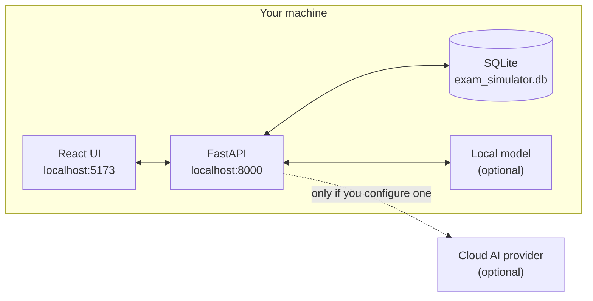

<div align="center">

# PrepBench

**Certification exams, architecture decision practice, system design and interview grading, and curriculum tracking — running entirely on your own machine.**

[](https://github.com/getnimishk/PrepBench/actions/workflows/ci.yml)
[](LICENSE)
[](https://python.org)
[](https://nodejs.org)
[](#how-offline-actually-works)

</div>

PrepBench is a local-first study platform built around one question: **would you pass?** You run mock exams, argue architecture decisions against a graded rubric, get feedback on written system design answers and spoken interview responses, track any syllabus as a visual roadmap, and explore how agile delivery metrics move — all from a single SQLite file on your laptop.

There is no account, no telemetry, and no subscription. A network connection is optional, and only if *you* choose to route AI grading through a cloud provider instead of a model on your own machine.

<!--
  SCREENSHOTS GO HERE — the highest-value addition left to this README.

  Capture these four routes at ~1440px wide, save to docs/screenshots/,
  then delete this comment and uncomment the block below:

    /            home.png            the verdict, its evidence, and one action
    /exam/:id    exam.png            an exam in progress
    /analytics   analytics.png       score trend + domain mastery
    /chart-sandbox  sandbox.png      the sandbox in Learn mode

  | | |
  |---|---|
  |  |  |
  |  |  |
-->

---

## What you can do with it

| | |
|---|---|
| **Readiness, not a score** | Every subject reports whether you would actually pass, computed from **full mocks only** — with the evidence beside it. Three mocks minimum, three consecutive at the pass mark, no weak domain, recent. Zero mocks reads *"needs evaluation"*, never `0%` |
| **Five exam modes** | **Practice** (instant explanations) · **Timed** (real exam conditions) · **Custom** (pick topics, difficulty, count) · **Weak Topic Focus** (auto-targets domains you keep failing) · **Spaced Repetition** (only what is due today) |
| **Spaced repetition** | The SM-2 algorithm that powers Anki. Every answer updates that question's interval and ease factor, so a question comes back just before you would have forgotten it |
| **Design Review** | Two defensible architectures for one requirement. Pick one and say why — or refuse to pick and say what you would ask first. What is graded is whether your reasoning found the axis the decision turns on, not which option you chose |
| **System design practice** | Write answers to real prompts and get graded across a six-category rubric — scores, strengths, and specific improvements, calibrated to your target role |
| **Interview practice (audio)** | Record spoken answers across four rounds — HR screening, hiring manager, system design, behavioral. Scored on **what you said** (content) and **how you said it** (pacing, filler words, clarity) |
| **Chart Sandbox** | 27 agile metric views over one executable model. Change a WIP limit and watch cycle time, defect escape, and deployment risk move together — with a guided track that teaches you to read each chart before asking you to explain one |
| **Learning roadmaps** | Import any syllabus (`.xlsx` / `.json` / `.md` / `.csv`) and track it in three views: a table for editing, a journey map for orientation, and a Gantt schedule that projects your finish date |
| **Analytics** | A tab per practice mode — score trends with rolling averages, domain mastery, per-category breakdowns, and your weakest area called out by name |
| **Question bank** | Full CRUD editor, bulk import from JSON/CSV/Excel/Markdown, advanced search, and a pre-import audit that validates a batch before it touches your database |
| **Reports** | Export any exam session as a formatted PDF or a multi-sheet Excel workbook |

> [!IMPORTANT]
> **PrepBench never invents a score.** If AI grading is unavailable, you see *"Not Graded"* — not a fabricated number. Percentages that cannot be computed render as `—`, never as a misleading `0%`.

**Built for** certification candidates (PSM I, PSPO I, AWS SA, Kafka, or anything you can supply questions for) · engineers preparing for system design, architecture-decision and behavioural rounds · self-directed learners working through a syllabus who want a realistic finish date · anyone who would rather not paste their weak spots into someone else's cloud.

---

## Quick start

**Prerequisites:** [Python 3.14+](https://python.org/downloads) and [Node.js 22+](https://nodejs.org)

```bash
git clone https://github.com/getnimishk/PrepBench.git
cd PrepBench
```

Then run the launcher for your platform:

```bash
start_app.bat     # Windows
./start_app.sh    # macOS / Linux
```

It creates the Python virtualenv, installs both dependency sets, starts the API on `:8000` and the UI on `:5173`, and opens your browser. First run takes a few minutes; after that it is seconds.

Prefer to drive it yourself? See [Manual setup](#manual-setup).

---

## How offline actually works

Everything runs inside one boundary. The only path off your machine is a cloud AI provider, and it exists only if you deliberately configure one.



Exams, the question bank, roadmaps, analytics, the Chart Sandbox, spaced repetition, and PDF/Excel export never make a network call at all. Delete `backend/data/exam_simulator.db` and your study data is gone — nobody else has a copy.

---

## Subjects and readiness

Home is organised by **subject** — the thing you are preparing for — and each one reports the same thing: whether you would pass, and the evidence for saying so.

Two rules make that number worth trusting.

**Only full mocks count.** A drill is untimed, unpressured and usually shorter, so averaging the two produces a figure that cannot answer "would I pass". The exclusion is enforced in the query that fetches the evidence, not by convention somewhere upstream.

**Never claim more than the evidence supports.** Zero mocks reads *"needs evaluation"* — not zero per cent. A subject with no pass mark can never be *"ready"*, because there is nothing to be ready against.

| State | Means |
|---|---|
| **Needs evaluation** | No mock taken yet. An absence of measurement, not a bad one |
| **Developing** | Working, not close |
| **Almost there** | Last three mocks averaging within 5 points of the pass mark |
| **Plateau** | Four mocks clustered at the line and not moving — the state that stops you practising forever at 85% |
| **Ready** | Three consecutive mocks at the pass mark, no weak domain, and recent |

Readiness never appears without what it rests on: the mock count, the recent scores, the weakest domain by name, whether the evidence has gone stale, and — when a trend is computable — roughly how many points a mock you are gaining.

> [!NOTE]
> **Only a full paper counts.** Exam setup starts mocks, and refuses to when the subject has no exam profile or the bank cannot fill the paper — a short mock is a drill wearing a measurement's label, which is worse than no measurement at all. Historical papers that were sat at full length before the browser could say "mock" are recognised at startup from the shape of the row itself, never from a guess about intent.

Each subject page also shows **coverage** — every practice format, including the ones with nothing in them. An empty row is the only way the app can tell you that a subject has ten design reviews and zero exam questions.

---

## Design Review

Two defensible architectures for one requirement. You pick one and say why.

What is graded is not which option you picked — often either is right — but whether your reasoning named **the axis the decision actually turns on**. That single narrowing is what makes the format work: it turns grading into one answerable question instead of a judgement about your whole design, and the thing being graded is the thing worth learning.

- **Both options are real.** Every option states when it holds and when it breaks. An option with no failure mode is the right answer wearing a disguise, and a review built from one stops teaching the moment you notice the pattern.
- **"Neither — I would ask first" is a first-class answer.** Refusing to commit until you know something is frequently the correct professional move. It has one condition: you have to say what you would ask.
- **The reveal is earned.** The deciding axis, what actually separates the two options, and what you should have asked are all stripped server-side until you have committed to an answer.
- **It tracks which axes you keep missing.** Cost, freshness, governance, late data, schema evolution — named in words, not scored as a percentage. A partial credit is not counted as a hit, because half credit would flatter you on exactly the axes you most need to revisit.

Ten built-in reviews ship, all data-platform scenarios. Without an AI provider the verdict reads *"Not graded"* — the attempt still saves and the reveal still shows.

Open it at **`/design-reviews`**.

---

## The Chart Sandbox

A delivery simulator built for people who have to *explain* metrics, not just read them.

Four coupled models — flow, quality, deployment, reliability — plus team health run over a scenario you control. Move one slider and every downstream chart responds, because they are all reading the same executable model rather than 27 hand-drawn pictures.

What makes it unusual:

- **Every relationship is declared.** A coupling ledger types each edge as **arithmetic** (Little's Law cannot be wrong), **assumption** (a behavioural claim the sandbox is making), or **convention**. The UI shows you which kind you are looking at, so you never mistake a modelling choice for a law.
- **No fabricated constants.** Calibration coefficients are labelled as teaching constants chosen to make an effect visible — never presented as industry-measured values.
- **A guided track, not a tutorial.** Recognize → Commit → Act → Compare → Explain → Generalise. The question comes first — the framing is a disclosure underneath it, for anyone who wants it — and the explanation stays on screen until you move on. You predict before you observe, and the explanation is earned rather than handed over. Counterfactual pairs present the same visible symptom with different underlying mechanisms.
- **Nothing is gated.** A concept whose prerequisites you have not met shows what it builds on and stays open. If you already know Little's Law, start at the bottleneck work.

Open it at **`/chart-sandbox`**.

---

## Learning roadmaps

Drop a syllabus into **Roadmaps → Import Roadmap**. PrepBench reads `.xlsx`, `.json`, `.md`, and `.csv`.

Spreadsheets are detected **by column shape, not sheet name**, so any workbook with a Phase/Topic-style table imports without renaming anything.

<details>
<summary><b>Recognised columns</b></summary>

| Column (any of these names) | Becomes |
|---|---|
| Phase / Module / Section | The phase a topic belongs to |
| Topic / Title / Skill | The topic itself |
| Learning Objective / Goal | What you are aiming to understand |
| Success Criteria / Outcome | How you will know you have it |
| Est. Hours / Effort | Feeds the projected schedule |
| Status / Progress % | Existing progress, if you have been tracking already |

Narrow two-to-four column sheets (CLI cheat sheets, glossaries, mental models) are preserved as **Reference** tabs rather than discarded, and trailing `TOTAL` rows are recognised as summaries rather than imported as a phantom topic.

</details>

**Three views:** a **table** to change status and add evidence notes inline · a **journey** map with a "you are here" marker for phase-level orientation · a **schedule** projecting a Gantt from estimated hours ÷ your weekly study budget.

> [!TIP]
> The schedule forecasts remaining work from **today**, not from your original start date — so when you fall behind it shows where you will actually land, instead of a plan you have already missed.

<details>
<summary><b>Markdown roadmap format</b></summary>

```markdown
# Kubernetes Mastery
## Fundamentals
- [x] Pods and Deployments (3h)
- [ ] Services and Ingress (4h)
## Operations
- [ ] Observability (5h)
```

</details>

---

## AI setup (optional)

PrepBench works with no AI at all. AI adds exactly four things: system design grading, design review grading, interview recording analysis, and question generation. Everything else runs without it.

You choose who runs the model. Open **Settings → AI Providers**.

**On your own machine.** Click *Set up a local model*. The wizard reads how much memory you have, recommends a model your hardware can actually run *well* (not the largest one that technically fits), shows the exact command to start it, and can save you a start script.

> [!NOTE]
> PrepBench never downloads a model and never launches a server for you — you do that yourself, deliberately. With a local model, AI grading works with the Wi-Fi off like everything else.

**Or a cloud API.** Gemini, OpenAI, Anthropic, or anything OpenAI-compatible — Groq, Together, DeepSeek, vLLM, LM Studio. Adding a vendor PrepBench does not ship a profile for takes a JSON file, not a code change.

Routing is **per task**, so you can grade system design on a local model and send only audio to a cloud one.

**Keys are stored by reference.** The database holds a pointer, never the secret itself, and no endpoint ever returns a key. The pointer resolves one of three ways: `env:` (left in your `.env` where it already was), `keyring:` (Windows Credential Manager, macOS Keychain, or Secret Service — used when the `keyring` package is installed), or `file:` as a fallback.

> [!WARNING]
> The `file:` fallback is **obfuscation, not encryption**. Its key sits beside the data, so anyone who can read one can read the other. What it genuinely prevents is casual leakage — a key surfacing in a screenshot, a support log, a backup, or a shared `.env`. Install `keyring` if you want a real credential store.

<details>
<summary><b>Environment variables (all optional)</b></summary>

Copy `backend/.env.example` to `backend/.env` if you want to set any of these. None are required.

| Variable | Description | Default |
|---|---|---|
| `GEMINI_API_KEY` | Legacy, still supported. If set on first start with no provider configured, it is imported as a provider named "Gemini (from environment)". The key stays in `.env` — only a reference is stored | `None` |
| `LOG_LEVEL` | `DEBUG` · `INFO` · `WARNING` · `ERROR` | `DEBUG` |
| `DATABASE_PATH` | Path to the SQLite file | `data/exam_simulator.db` |

Exam defaults — passing percentage, duration, question count — are **not** environment variables, and they are no longer settings either. A mock takes its shape from the subject's exam profile, because the real exam does not let you choose; a drill takes its shape from the screen you start it on. The six `app_settings` columns that once held them were dropped: nothing read them, and the value one of them did hold (95%) had been stamped onto six real papers and made an 87.5% pass read as a failure.

</details>

---

## Importing questions

Drop a file into **Question Bank → Bulk Import**. JSON, CSV, Excel, and Markdown are supported.

<details>
<summary><b>JSON format</b></summary>

```json
[
  {
    "text": "What is the Sprint Goal?",
    "question_type": "single_choice",
    "difficulty": "medium",
    "domain": "Agile & Scrum",
    "topic": "Sprint",
    "certification": "PSM I",
    "explanation": "The Sprint Goal is the single objective for the Sprint.",
    "options": [
      { "option_text": "A commitment by the Developers", "is_correct": true },
      { "option_text": "A list of Product Backlog items", "is_correct": false }
    ]
  }
]
```

</details>

<details>
<summary><b>CSV format</b></summary>

See [`data/template_import.csv`](data/template_import.csv) for the full column structure.

```
text, question_type, difficulty, domain, topic, certification, explanation,
option_1, option_1_correct, option_2, option_2_correct, ...
```

</details>

Pre-seeded packs cover **PSM I**, **PSPO I**, **AWS Solutions Architect**, **Kafka**, and **System Design** — but PrepBench is certification-agnostic. Import your own and prepare for anything.

---

## Development

### Tech stack

```
Backend    Python 3.14 · FastAPI · SQLAlchemy 2 · Pydantic v2 · SQLite (WAL mode)
Frontend   React 19 · TypeScript 5.9 · Vite 8 · Material UI 9 · Chart.js 4
Storage    One local SQLite file at backend/data/exam_simulator.db
```

### Manual setup

```bash
# Backend
cd backend
python -m venv .venv
.venv/Scripts/activate          # Windows
source .venv/bin/activate       # macOS / Linux
pip install -r requirements.txt
uvicorn app.main:app --host 127.0.0.1 --port 8000 --reload
```

```bash
# Frontend
cd frontend
npm install
npm run dev
```

Three dependency files, for three different jobs:

| File | Contains |
|---|---|
| `requirements.txt` | What the app needs to run |
| `requirements-dev.txt` | The above, plus the test runner |
| `requirements.lock` | Every version including transitives, known to work together |

To reproduce a known-good environment exactly, install `requirements.lock` instead of `requirements.txt`.

### Tests

```bash
cd backend && pip install -r requirements-dev.txt && python -m pytest -q
```

```bash
cd frontend && npm test && npm run typecheck && npm run lint
```

342 backend tests and 411 frontend tests at time of writing. CI runs all of it, plus `tsc` and ESLint, on every push and pull request.

### Project layout

```
PrepBench/
├── backend/
│   ├── app/
│   │   ├── api/v1/          # FastAPI routers
│   │   ├── core/            # Config, DB setup, exceptions, logging
│   │   ├── models/          # SQLAlchemy ORM models
│   │   ├── repositories/    # Data access layer
│   │   ├── schemas/         # Pydantic request/response models
│   │   ├── services/        # Business logic
│   │   └── utils/           # PDF/Excel generators, seed data
│   └── tests/
├── frontend/
│   └── src/
│       ├── components/      # Reusable UI components
│       ├── pages/           # Route-level pages
│       ├── services/        # API client, metrics + learning models
│       ├── types/           # TypeScript interfaces
│       └── context/         # React context
├── data/                    # Sample question packs
├── docs/
│   ├── wiki/                # Wiki sources — mirrored by scripts/sync-wiki.sh
│   └── proposals/           # Architecture proposals
├── start_app.bat            # Windows launcher
└── start_app.sh             # macOS / Linux launcher
```

### API reference

Interactive Swagger docs live at **http://localhost:8000/docs** once the backend is running.

<details>
<summary><b>Endpoint summary</b></summary>

| Endpoint | Method | Description |
|---|---|---|
| `/api/v1/questions` | GET / POST | List, search, or create questions |
| `/api/v1/questions/{id}` | PUT / DELETE | Edit or delete a question |
| `/api/v1/exams` | POST | Start a new session — `session_kind` is `mock` or `drill` |
| `/api/v1/exams/{id}/answer` | POST | Save an answer (autosave) |
| `/api/v1/exams/{id}/finish` | POST | Submit and score |
| `/api/v1/exams/{id}/answers/{qid}/reviewed` | POST | Mark a wrong answer as reviewed |
| `/api/v1/subjects` | GET | Every subject with its readiness and evidence |
| `/api/v1/home` | GET | Home summary — resumable session, mock totals, outstanding review |
| `/api/v1/home/activity` | GET | One timeline across every practice format |
| `/api/v1/home/other-preparation` | GET | What is going on outside the primary subject |
| `/api/v1/home/subjects/{id}/coverage` | GET | Every format for a subject, including the empty ones |
| `/api/v1/review/queue` | GET | Today's unread misses — capped at 20, newest mock first |
| `/api/v1/design-reviews` | GET | List design reviews, filtered by domain, axis, or difficulty |
| `/api/v1/design-reviews/{id}` | GET | The brief and both options — never the answer |
| `/api/v1/design-reviews/attempts` | POST | Commit an answer and unlock the reveal |
| `/api/v1/design-reviews/analytics` | GET | Which deciding axes get named and which get missed |
| `/api/v1/analytics/dashboard` | GET | Insights totals — every session, drills included |
| `/api/v1/analytics/score-trends` | GET | Score history |
| `/api/v1/analytics/domain-performance` | GET | Domain accuracy breakdown |
| `/api/v1/imports/file` | POST | Bulk upload JSON/CSV/Excel |
| `/api/v1/export/pdf/{id}` | GET | Download a PDF report |
| `/api/v1/export/excel/{id}` | GET | Download an Excel report |
| `/api/v1/settings` | GET / PUT | App settings |
| `/api/v1/roadmaps` | GET / POST | List or create roadmaps |
| `/api/v1/roadmaps/{id}` | GET / PUT / DELETE | Roadmap detail with phases and topics |
| `/api/v1/roadmaps/{id}/topics/{tid}` | PATCH | Update a topic's status, progress, or notes |
| `/api/v1/roadmaps/{id}/schedule` | GET | Derived Gantt schedule and projected finish |
| `/api/v1/roadmaps/import/validate` | POST | Preview a roadmap file before importing |
| `/api/v1/roadmaps/import/confirm` | POST | Commit the reviewed roadmap |
| `/api/v1/system-design/attempts` | GET | System design attempt history |
| `/api/v1/recordings` | GET | Interview recordings and analyses |

</details>

### Documentation

The [wiki](https://github.com/getnimishk/PrepBench/wiki) holds what would bloat this README — how the layers fit together, why certain things are built the way they are, and how to extend them.

| Page | Covers |
|---|---|
| [Architecture](https://github.com/getnimishk/PrepBench/wiki/Architecture) | Backend layering, the 24 tables, the seed ledger, why there is no Alembic |
| [Readiness](https://github.com/getnimishk/PrepBench/wiki/Readiness) | Subjects, why a drill never counts as a mock, the five states and their thresholds |
| [Design Review](https://github.com/getnimishk/PrepBench/wiki/Design-Review) | The deciding axis, the grading contract, and how to write a review |
| [Chart Sandbox](https://github.com/getnimishk/PrepBench/wiki/Chart-Sandbox) | The executable delivery model, the coupling ledger, the guided track |
| [AI Providers](https://github.com/getnimishk/PrepBench/wiki/AI-Providers) | Task-level routing, local model setup, how keys are stored |
| [Importing Content](https://github.com/getnimishk/PrepBench/wiki/Importing-Content) | Question formats, roadmap column detection, the pre-import audit |
| [Development Guide](https://github.com/getnimishk/PrepBench/wiki/Development-Guide) | Setup, test suites, conventions, how to add an endpoint or chart |
| [Troubleshooting](https://github.com/getnimishk/PrepBench/wiki/Troubleshooting) | The failures people actually hit |

Sources live in [`docs/wiki/`](docs/wiki) and are mirrored to the wiki by [`scripts/sync-wiki.sh`](scripts/sync-wiki.sh), so documentation changes go through pull requests the way code does.

---

## FAQ

<details>
<summary><b>Is it really free?</b></summary>

Yes, for personal and other noncommercial use. No paid tier, no account, no usage limits. Commercial use is not permitted — see [License](#license).
</details>

<details>
<summary><b>Does it work without an internet connection?</b></summary>

Yes — that is the point. Exams, the question bank, roadmaps, analytics, the Chart Sandbox, and PDF/Excel export all run with the Wi-Fi off. So does AI grading, if you run a model locally. A network is needed only if you *choose* a cloud provider, and the app is fully usable with neither.
</details>

<details>
<summary><b>Is my study data sent anywhere?</b></summary>

No. Everything lives in one SQLite file on your machine. There is no telemetry, no analytics SDK, and no account system.
</details>

<details>
<summary><b>Do I need an API key?</b></summary>

No. The AI features need *a model*, not a cloud account — Settings → AI Providers walks you through running one locally. Connect a cloud key instead if you want sharper feedback and do not mind the round trip. With neither, those three features report "unavailable" rather than inventing a score, and everything else works normally.
</details>

<details>
<summary><b>How is this different from Anki?</b></summary>

Anki is a general-purpose flashcard tool. PrepBench uses the same SM-2 algorithm but is built around exam preparation specifically: timed mock exams with pass/fail scoring, weak-domain detection, PDF score reports, graded system design and interview answers, and curriculum roadmaps with projected finish dates.
</details>

<details>
<summary><b>Does it run on macOS and Linux?</b></summary>

Yes. Use `start_app.sh`. The stack is Python and Node, both cross-platform.
</details>

<details>
<summary><b>Can I self-host it for my team?</b></summary>

It is designed as a single-user local app — there is no authentication or multi-tenancy. You can run it on a shared machine, but everyone would see the same study data.
</details>

---

## What's next

- [ ] Start a full mock from the UI, so readiness moves without going through the API
- [ ] Design reviews carrying a `subject_id` of their own, rather than being mapped onto a subject by domain
- [ ] Spoken explanation practice in the Chart Sandbox — reason aloud about a chart and get feedback on the argument, not just the answer
- [ ] Flow Efficiency and Aging WIP as guided sandbox concepts
- [ ] AI-generated explanations for imported questions that arrive without one
- [ ] PDF and image question import with OCR
- [ ] Flashcard mode built from missed questions
- [ ] Mobile-responsive PWA
- [ ] Tauri desktop build (native Windows and macOS app)

---

## License

[PolyForm Noncommercial License 1.0.0](LICENSE).

**Free for any noncommercial purpose.** Personal study, hobby projects, research and experiment, and use by schools, charities, public research bodies and government institutions are all permitted. You may modify it and share your changes under the same terms.

**Commercial use is not permitted** under this licence. Commercial rights are reserved by the copyright holder — if you want to use PrepBench, or any part of it, commercially, open an [issue](https://github.com/getnimishk/PrepBench/issues) and we'll talk about a separate licence.

Contributing? [CONTRIBUTING.md](CONTRIBUTING.md) covers the licence terms that apply to contributions.
