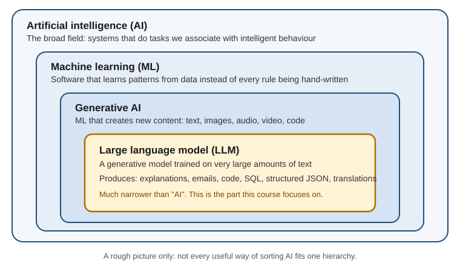
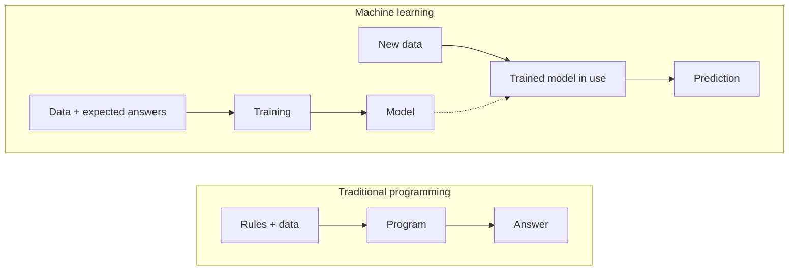
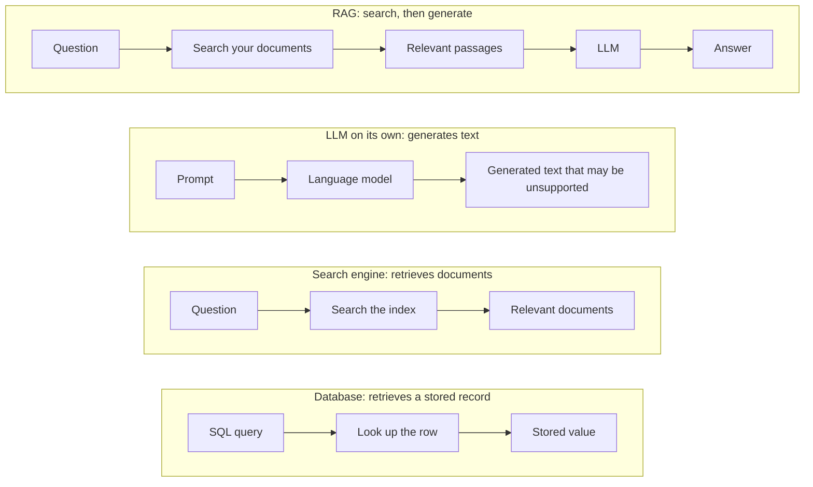
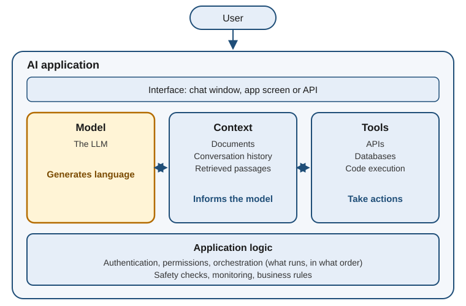
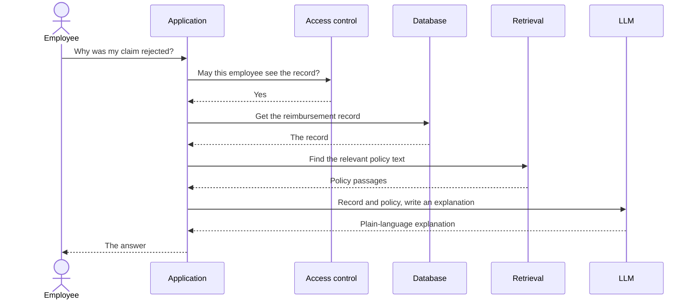

# What AI, ML and LLMs actually are

**Course:** Agentic AI, from first principles to production · Module 1 Foundations · lesson 1 of 77 · **about 2 hours** · paper draft for review.  
**Success criterion:** Test A, explain: explain AI, ML, generative AI and an LLM to a non-technical person in 2 minutes or less. Test B, decompose: given a real AI product, identify the model, the application logic, the data and context, the external tools and systems, and what the model generated versus what another part retrieved or executed.

> Sources (read 2026-09-29 and 2026-09-30; details and gaps in docs/research/agentic-ai): Google, Machine Learning intro 'What is ML?' (definition of ML, the four families, the rainfall example); Anthropic docs 'Context windows' (working memory is separate from training data); Kalai et al., 'Why Language Models Hallucinate' (arXiv 2509.04664). Points marked 'background' are general knowledge, not from those sources. Second source: Claude Academy 'AI Capabilities and Limitations', lesson 2 (generative models create content, while spam filters and recommenders classify or rank) and lesson 6 (knowledge cutoff).

---

## Part 1 · Why this chapter matters

Before agents, RAG, tool calling or model selection you need one basic answer: what exactly is the 'AI' in an AI application?

A lot of confusion comes from treating these as the same thing: AI, machine learning, generative AI, an LLM, ChatGPT, search and a database. They are related but not interchangeable.

The skill this chapter builds is separation. Given an application, you should be able to say which part is the model, which is the data, which is the application logic, which are the tools, and which information came from an outside system. That separation is one of the foundations of agent design.

**Check yourself.** Name the five parts you should be able to separate when you look at an AI application.

Model answer (write yours first)

The model, the data, the application logic, the tools, and the information retrieved from external systems.

---

## Part 2 · AI, machine learning, generative AI and LLM

Artificial intelligence (AI) is the broadest label: building systems that do tasks we normally associate with intelligent behaviour, such as recognising an image, translating text or detecting fraud. It is a goal or category, not one technology. Some AI uses hand-written rules, some uses machine learning, and much of it combines learning with search, databases and ordinary software. (This general definition is background knowledge; the sources used here define ML precisely and do not define 'AI'.) So 'AI is machine learning' is wrong: ML is one important way to build AI.

Machine learning (ML) is training a piece of software, called a model, to make useful predictions or generate content from data. Google's course contrasts this with normal programming using a rainfall example: the traditional way is to write down the physics equations, and the ML way is to let the system learn the relationship from past weather data.

Generative AI is ML that creates new content (text, images, audio, video, code) by learning to mimic the data it was trained on.

A large language model (LLM) is a generative model trained on very large amounts of text, so what it creates is language. That definition is built from the two above, not quoted: none of the sources defines 'LLM' in one line. The nesting, roughly: AI contains ML, which contains generative AI, which contains LLMs. Do not take the picture too literally, because not every useful way of sorting AI fits one hierarchy. The point is that 'LLM' is much narrower than 'AI'.

The next figure contrasts writing the rules yourself with letting a model learn them from examples.

**Worked example**

Traditional programming: you write the rules ('if the amount is over 100,000 and the country is unusual and the account is new, flag it'). Machine learning: you show the system many past transactions labelled fraud or not fraud, and it learns the pattern itself. Nobody wrote every rule, and that is why ML suits problems where the rules are hard to describe, such as which pixels mean 'cat'.

**Common mistake**

Using 'AI', 'GenAI' and 'LLM' as three names for one thing. They are different levels of abstraction.

**Check yourself.** What is the relationship between AI, machine learning and LLMs? Answer in three sentences.

Model answer (write yours first)

AI is the broad field of building systems that perform tasks associated with intelligence. Machine learning is one way to build them, where a model learns patterns from data instead of every rule being hand-written. An LLM is a much narrower thing: a generative ML model trained on language, so it produces language.

---

## Part 3 · The four families of ML

Google's course names four families, and knowing them helps you place any tool you meet. (This is Google's introductory grouping. It mixes how a model learns with what it produces, so treat the four as a practical map, not four exclusive technical categories.)

Supervised learning trains on examples that already have the right answer attached. It covers regression (predict a number, such as rainfall or a house price) and classification (choose a category, such as spam or not spam).
Unsupervised learning finds patterns in data with no answers attached. Clustering, grouping similar items, is the main example.
Reinforcement learning learns from rewards and penalties for actions in an environment. Google mentions robots and AlphaGo.
Generative AI creates new content by learning to mimic the data it was trained on.

**Worked example**

Group 10,000 unlabelled support tickets into themes: unsupervised. Predict next month's sales: supervised regression. Learn a game by winning and losing: reinforcement. Draft an email reply: generative.

**Common mistake**

Assuming all AI works the same way. The family tells you what data it needs: labelled examples, raw data, a reward signal, or a large body of content to imitate.

**Check yourself.** A spam filter learns from emails people marked as spam or not spam. Which family is it, and is it generative?

Model answer (write yours first)

Supervised learning (classification). It is not generative: it labels an email rather than creating new content.

---

## Part 4 · What an LLM does, and why it is not a database or a search engine

At the simplest useful level, an LLM is trained to recognise patterns in language and generate a continuation. Given 'The capital of France is', it can generate 'Paris'. Given 'Explain why Paris is the capital', it can generate a long explanation, because it has learned patterns of language, explanation, style and fact. The answer comes from what it learned plus what you put in the current request. That is not the same as searching a database and finding the answer.

Not a database. A database stores and retrieves records. You ask 'SELECT balance FROM customer WHERE customer_id = 1021' and it returns a stored value. You do not query an LLM that way. Its training taught it patterns, not a table you can look up. Anthropic's docs make the same separation for the model's working memory, which is 'different from the large corpus of data the language model was trained on'. This is why an LLM can give a fluent, specific and wrong answer. A database query can also be wrong (bad SQL, stale data), but for different reasons. With an LLM the generated answer itself can be unsupported. A 2025 paper argues that when a model cannot tell right from wrong in its training data it tends to guess rather than say it does not know. That is one research group's argument, not settled fact.

Not a search engine. A search system takes a question, looks in an index and returns relevant documents. An LLM alone takes a prompt and generates a response. It does not fetch live pages or read your company's files unless the application does that and puts the result in front of it. Real products often combine the two: search the company documents, hand the relevant passages to the LLM, and let it write the answer. That pattern is called retrieval-augmented generation (RAG), which you will build later.

The figure compares the four flows side by side.

**Worked example**

Fictional. Ask 'What is Acme Bank's refund policy?'. As a database it would need Acme's actual policy, which it may never have seen, so it may write a plausible-sounding one. As a search engine it would need to fetch Acme's page, which it cannot do unless a tool is connected. The safe design gives it Acme's real policy text and asks it to answer only from that.

**Common mistake**

Trusting the confident tone. Fluent, specific language is the model's default output, so it is not evidence that anything was looked up or checked.

**Check yourself.** Why is an LLM not simply a database, and why is it not simply a search engine?

Model answer (write yours first)

It generates text from learned patterns instead of retrieving a stored record, so its answer can sound right and be unsupported. It does not by itself search an index or fetch live or private documents. An application has to add that.

---

## Part 5 · The model is one part of an AI application

ChatGPT is not simply 'an LLM'. A modern AI product has layers, and the model is one of them. Around it an application can add conversation history, file processing, web search, retrieval, tool execution, safety controls, permissions, monitoring and business logic. (This layered view is background knowledge, and it is the frame the rest of this course uses.)

A mental model to carry through the roadmap: the model generates. Context gives the model information (documents, history). Tools let the application act (APIs, databases, code). Later we add retrieval, memory, agents, evaluation, permissions and orchestration on top.

This matters when someone says 'the LLM did that'. Sometimes the model generated the text. Sometimes the application retrieved the information. Sometimes a tool ran code, or a database returned the answer, or several of these happened together. As a product or program lead you need to know which component actually did the work.

The reimbursement question below shows the same idea as a sequence. Only one step is done by the LLM.

**Worked example**

Fictional employee-support assistant. An employee asks 'Why was my reimbursement rejected?'. The application authenticates the employee, finds the reimbursement record, retrieves the company policy, gives the relevant record and policy text to the LLM, and returns the LLM's explanation. Who did what? The database stored the record. The retrieval system found the policy. The access-control system checked the employee may see this data. The LLM wrote the explanation in plain language. The application orchestrated all of it.

**Common mistake**

Thinking the LLM is the application. It is one generation component inside one. If someone says 'let's put all our company knowledge into the LLM', ask: how will it be updated, how will permissions work, how will relevant information be retrieved, how will we know an answer is correct, and what happens when the information changes? Those are application and system-design questions.

**Check yourself.** If an AI assistant gives a customer their account balance, which components might actually be involved?

Model answer (write yours first)

Authentication (who is asking), an access check, a database or API that holds the balance, the application logic that fetches it, and the LLM that words the reply. The number should come from the system of record, not from the model's memory.

---

## Part 6 · What an LLM does not guarantee

An LLM does not automatically give you: truth (a generated statement can be wrong); current information (a model has a knowledge cutoff: what it learned in training and what is true today are separate problems); access to your private company data (the application must supply authorised data); the same output every time (results can vary with the model and settings); knowledge of your organisation's rules (it does not know your business rules unless told); or safe action (generating a tool call does not mean the action should run).

(This list is background knowledge, presented as the reasons for what follows. It is not a quote from the sources.)

Each gap is why later phases exist: retrieval, tools, structured output, evaluation, guardrails, permissions, observability and human approval.

**Check yourself.** Pick three things an LLM does not guarantee and name the part of an application that addresses each.

Model answer (write yours first)

For example: truth, addressed by retrieval with citations and evaluation; access to private data, addressed by an authorised data connection with permissions; safe action, addressed by guardrails and human approval before a tool runs.

---

## Part 7 · Interview check

Imagine the question: 'Explain the difference between AI, machine learning and an LLM to a business stakeholder.' A strong answer has a clear shape. Do not memorise the words. Understand the structure: the broad field, then one way of building it, then the narrow thing, then where it sits in a real application.

**Check yourself.** Explain the difference between AI, machine learning and an LLM to a business stakeholder, in under a minute.

Model answer (write yours first)

AI is the broad field of building systems that perform tasks we associate with intelligence. Machine learning is one way of building those systems, where the model learns patterns from data instead of every rule being explicitly programmed. An LLM is a type of machine-learning model designed to work with language and generate language-based output. In a real enterprise application the LLM is only one component. The application may also use databases, retrieval, APIs, tools, permissions and business logic.

---

## Part 8 · Mini exercise and key takeaway

Pick a familiar product, such as ChatGPT, GitHub Copilot, an enterprise support chatbot or a Databricks assistant. Draw five boxes: user, application, model, data and context, tools. Write one sentence for what each box does. The aim is not neat drawing. It is to stop thinking of 'AI' as one black box.

Key takeaway: AI is the broad field. Machine learning is one way to build AI. Generative AI creates content. An LLM is a language-focused generative model. An AI product is the larger system around the model, and that last distinction is the one you will use throughout the roadmap.

**Check yourself.** For your chosen product, which of your five boxes generates, which retrieves, and which acts?

Model answer (write yours first)

The model generates. Data and context (and any retrieval step) supply information. Tools act. The application decides when each is used and enforces rules. If you cannot separate those, do not move on.

---

## Do it: lab

1. Explain AI, ML, generative AI and an LLM to a non-technical person in 2 minutes or less. Record it. This is Test A.
2. Pick a real AI product. Draw the five boxes (user, application, model, data and context, tools) and write one sentence for each.
3. For one specific thing the product does, say what the model generated versus what another system retrieved or executed. This is Test B.
4. Have someone who does not work in tech listen to Test A and repeat back the two 'it is not' points (not a database, not a search engine).

**Done when:** you pass both tests without notes. If you cannot separate model, application, data and tools, do not move on, because the next chapters depend on this mental model.

---

## Evidence to keep

Keep three things: your 2-minute recording (Test A), your five-box drawing of one real product with a sentence per box, and your written answer to what the model generated versus what another part retrieved or executed (Test B). They open your first case study.

---
