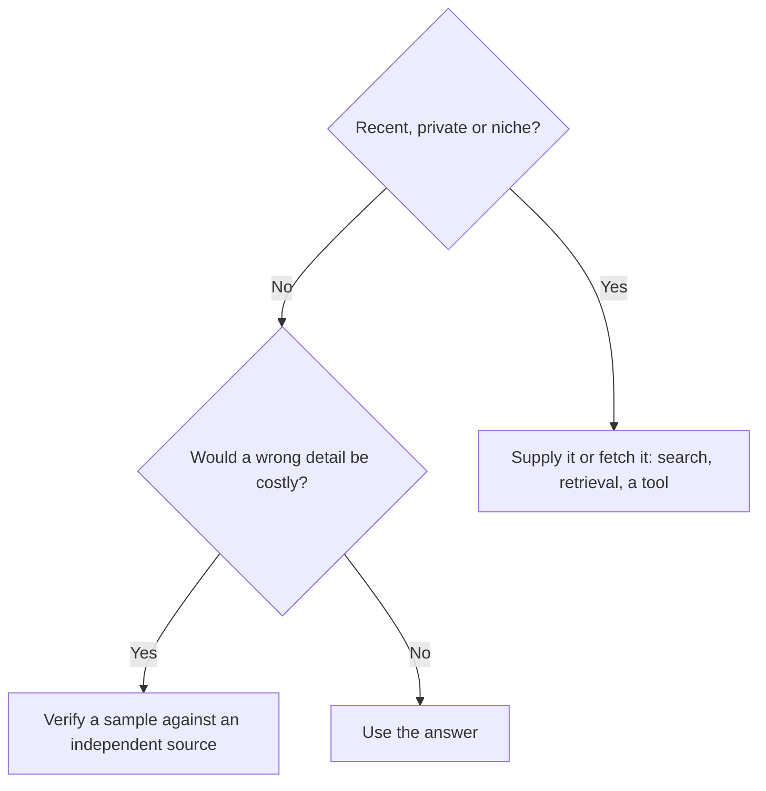

# Knowledge and its limits

**Course:** Agentic AI, from first principles to production · Module 1 Foundations · lesson 6 of 77 · **about 2 hours** · paper draft for review.  
**Success criterion:** For 4 questions, say whether the model can be trusted alone, needs current or private information supplied, or needs checking, and name the failure mode (staleness, uneven coverage, inherited bias, unknown source). Test one recent-event question and one niche-domain question on a model and record what it did.

> Sources (read 2026-09-29 and 2026-09-30; details and gaps in docs/research/agentic-ai): Anthropic docs 'Models overview' (knowledge cutoff rows, read 2026-09-29); OpenAI 'Models' page (cutoff range, read 2026-09-29, via a page summary); Claude Academy 'AI Capabilities and Limitations' lesson 6 (capability and limitation zones, the four failure modes, mitigations) and lesson 12 (fabricated citations as two properties meeting), read 2026-09-30 through page summaries. The mapping from each failure mode to a fix, and every example, are ours. Unverified: cutoff dates change with every model and were read from vendor pages, one of them through a summary.

---

## Part 1 · Why this matters

A model's own knowledge comes from what its training gave it (an application can add more at question time, as you will see). That is a fixed store, and it has an edge: a date after which the model has seen nothing. Many 'the AI got it wrong' stories are really 'the AI never had it': a policy written last month, a customer's record, a niche field. This lesson gives you names for the ways knowledge fails and a fix for each, and it explains why retrieval (RAG) exists, which you build in Module 5.

**Check yourself.** What is the difference between a model not knowing something and getting something wrong?

Model answer (write yours first)

Not knowing: the information was never in its training because it is new, private or niche. Getting it wrong: the model had a pattern and produced a plausible but incorrect continuation. Both can sound equally confident, so the tone does not tell you which one you are looking at. You have to know which zone the question is in.

---

## Part 2 · What a model knows, and where it stops

A model's knowledge comes from the text it was trained on. It ends at a cutoff date, and the model has no live access to anything after it unless a search or another tool is connected.

Vendors publish these dates, and Anthropic's models page separates two: a 'reliable knowledge cutoff' (where knowledge is most extensive and reliable) and a broader 'training data cutoff'. On 2026-09-29 it listed June 2026 for both on Fable 5.1, Opus 5.5 and Sonnet 5.5, and February 2025 (reliable) and July 2025 (training data) on Haiku 4.5. OpenAI's models page listed knowledge cutoffs between April and May 2026 for its flagship models. These are dated facts that change with every model, so read the page for the model you use.

The Claude Academy Capabilities course describes a capability zone (topics that are frequent, recent within the training data and consistent across sources) and a limitation zone (rare, after the cutoff, niche, local or contested).

**Worked example**

Fictional. A model with a June 2026 cutoff is asked in October 2026 about a regulation that took effect in August. It has no knowledge of it. It may answer from an older version of the rule or invent a plausible one, and the reply sounds the same either way.

**Common mistake**

Assuming a recent model knows recent things. A model's cutoff is earlier than the day you use it, sometimes by many months, so anything newer is invisible to it.

**Check yourself.** A model has a June 2026 cutoff. Name two kinds of question it cannot answer reliably even though it is fluent.

Model answer (write yours first)

Anything after the cutoff, such as news, new rules and current prices, and anything it never saw, such as your company's private documents or a customer's record. Niche topics with thin coverage are a third.

---

## Part 3 · Four ways knowledge fails

The names below come from the Claude Academy Capabilities course; the explanations and examples are ours.

- **Staleness:** old information presented as current.
- **Uneven coverage:** strong on common topics, thin on specialised, local or rare ones.
- **Inherited bias:** assumptions about what is normal, picked up from the text it saw and from later tuning.
- **Source amnesia:** it generally cannot reliably tell you where a fact came from.

**Worked example**

Staleness: quoting last year's tax rate as current. Uneven coverage: a detailed answer about a mainstream framework and a vague one about an obscure internal tool. Inherited bias: assuming the 'typical' customer lives in one country. Source amnesia: asked 'where did you get that?', it produces a plausible citation that may not exist.

**Common mistake**

Asking a model for its source and trusting the citation. Unless the answer was built from documents you supplied, a citation is generated text like any other and has to be opened and checked.

**Check yourself.** Give one example of each failure mode from a job you know.

Model answer (write yours first)

Any four honest examples: an outdated figure (staleness), a weak answer about your own niche tool or region (uneven coverage), an assumption about a 'normal' user or process that is not true for you (inherited bias), and a confident reference you cannot find (source amnesia).

---

## Part 4 · What fixes each one

Most fixes follow one rule: if the model should not be relying on its memory, put the information in front of it or send it to fetch it. The course names web search, retrieval-augmented generation (RAG) and other tools as the mitigations. Matching each failure mode to a fix is our own synthesis:

- Staleness: search or retrieval of current sources.
- Uneven coverage: supply the domain documents, and have an expert check.
- Inherited bias: state who and what you mean, and ask for alternatives.
- Source amnesia: answer only from documents you supplied and require a quote you can open.

**Worked example**

Fictional. Question: 'What is our travel reimbursement limit?'. It is private, so the answer has to come from the policy document. Retrieve the policy, give it to the model, and ask it to quote the line that states the limit.

**Common mistake**

Using search or retrieval and then never checking what it returned. Fetching fixes what the model lacks, not what the source gets wrong.

**Check yourself.** Choose a fix for each: yesterday's exchange rate; an obscure internal tool; 'where did you read that?'.

Model answer (write yours first)

Exchange rate: fetch it with a tool or a live source. Internal tool: supply its documentation and have someone who knows it check the answer. 'Where did you read that?': answer only from documents you supplied and require a quote you can open, since the model cannot recall a source on its own.

---

## Do it: lab

1. Pick a field you know well. Write 5 questions, each with a correct answer and a source you can point to: 2 mainstream, 2 niche or local, and 1 about something recent that should fall after the model's cutoff (look up the model's cutoff on its vendor page and note it).
2. Ask a model all five and score each answer: right, partly right, wrong, or unsupported (not backed by a source you checked; do not call an answer invented just because you do not know it).
3. For each problem, name the failure mode: staleness, uneven coverage, inherited bias or unknown source.
4. Supply a short, correct paragraph for the worst answer and ask again. Note whether and how the answer changed.
5. If your tool has web search, ask the recent question with search on and off and note the difference.
6. Write 5 sentences: which questions you would never ask a model alone from now on, and what you would do instead.

**Done when:** you have a table of 5 questions with score, failure mode and fix, plus your 5-sentence conclusion.

---

## Interview check

**Question.** A stakeholder wants the assistant to answer questions about our latest HR policy. What could go wrong, and how would you design it? (Include how you would make sure the policy it quotes is the current, authoritative version.)

A strong answer has this shape

1. The model has a knowledge cutoff and has never seen a private, recent policy, so it may answer from general knowledge or invent something plausible, in the same confident tone.
2. Design: keep the policy in one authoritative place, retrieve the relevant passages at question time, tell the model to answer only from them and to quote the line, and to say so when the policy does not cover the question.
3. Add access control so people see only what they may, and an update path so the index changes when the policy does.
4. Evaluate on real questions before launch, and keep a person on anything high-stakes.

---

## Evidence to keep

Keep the scored table and the 5-sentence conclusion. You will reuse your three worst questions as the first test cases in Module 3.

---
