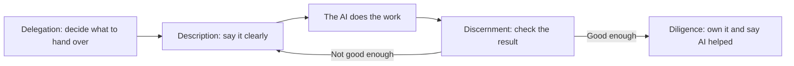

# Working with AI on purpose: four properties and the 4Ds

**Course:** Agentic AI, from first principles to production · Module 1 Foundations · lesson 8 of 8 · **about 2 hours** · paper draft for review.  
**Success criterion:** Take one real task of your own and produce a one-page plan: where it sits on each of the four properties, what you will delegate, how you will describe it, how you will check the result, and what you will disclose.

> Sources (read 2026-09-29 and 2026-09-30; details and gaps in docs/research/agentic-ai): Claude Academy 'AI Fluency: Framework and Foundations' lessons 1 to 3, 6, 8 and 10 to 12 (the 4Ds and three modes) and 'AI Capabilities and Limitations' lessons 1, 2, 10, 12 and 13 (four properties, steerability, property pairs), read 2026-09-30 through page summaries; lessons 5, 7 and 11 of the second course did not load. Only AI Fluency lesson 1 was read from a transcript, which the user supplied. These are one vendor's courses. The table of fixes and the mapping from property pairs to the 4Ds are our own synthesis.

---

## Part 1 · Why this matters

Lessons 2 to 6 described how a model behaves. This lesson adds the other half: what you do about it. The machine side is four properties. The human side is four skills. Together they let you decide what to hand to an AI, how to ask, how to check, and what you still own. It is also the review you will end every build with.

**Check yourself.** Why is knowing how the model behaves not enough to work well with it?

Model answer (write yours first)

Because the results depend on your choices as well: what you delegate, how clearly you describe it, how you check the output and whether you take responsibility for it. A model can be strong on a task and still give a poor result if the task is unclear or unchecked.

---

## Part 2 · The machine side: four properties

The Claude Academy Capabilities course describes generative AI by four properties, each a spectrum rather than a switch: the same mechanism gives both the strength and the limit. The fixes in the last column are consistent with our earlier lessons.

| Property | Strong when | Weak when | Typical fix |
|---|---|---|---|
| Next-token prediction | Well-worn patterns: summarising, reformatting, explaining common ideas | Specifics: names, dates, numbers, citations | Verify specifics; ground answers in supplied documents |
| Knowledge | Common, recent-within-training, consistent topics | Rare, niche, local, contested or after the cutoff | Supply it or fetch it: search, retrieval, tools |
| Working memory | Material fits and the important part sits at the edges | Very long inputs, buried details, expecting memory across sessions | Curate context, restate key points, summarise, retrieve |
| Steerability | Short, concrete, checkable instructions | Long chains of reasoning, vague goals | Structured output, checkpoints, state the goal |

Steerability deserves one more sentence. The course says instruction-following is pattern matching, tight for short concrete instructions and loose for long reasoning. Two typical failures are reasoning drift (an early error carries through every later step) and letter over spirit (the instruction is met literally but not what you meant). The fix for the second is to state the goal as well as the instruction.

**Worked example**

Fictional. 'Summarise this meeting' is strong on all four: a common pattern, general knowledge, short input and a short instruction. 'Compute quarterly revenue by region from this 80-page export' is weak on three at once: numbers, a long input and a long chain of steps.

**Common mistake**

Treating an AI as either reliable or unreliable everywhere. It is strong and weak along four predictable axes, so trust has to be set task by task.

**Check yourself.** Place 'draft a polite refusal email' and 'list the three most cited papers on topic X with page numbers' on the four properties.

Model answer (write yours first)

The email is strong on all four: a common pattern, general knowledge, a short input and a concrete instruction. The citation list is weak on next-token prediction (specific titles, counts and page numbers invite fabrication) and on knowledge (which papers are most cited may be niche or after the cutoff), so it needs verification against a real source.

---

## Part 3 · The human side: the 4Ds

The Claude Academy AI Fluency course names four skills. The definitions below are our paraphrase.

- **Delegation:** deciding what you do and what the AI does. It has three parts: problem awareness (know your goal and the work), platform awareness (know what this system can and cannot do) and task delegation (split the work).
- **Description:** saying clearly what you want: the product (the output), the process (how to approach it) and the performance (how the AI should behave with you).
- **Discernment:** judging what came back: the product, the process (the steps, evidence and tool calls you can actually see) and the performance.
- **Diligence:** owning the outcome: choosing tools responsibly, being open about where AI helped, and verifying and vouching for what you share.

The course also names three modes: automation (the AI runs a defined task), augmentation (you and the AI work as partners) and agency (you set the rules and the AI works autonomously). Agents live in the third.

**Worked example**

Fictional. Delegation: the AI drafts the first version of a status report; you decide what to escalate. Description: audience, format, what to leave out, how blunt to be. Discernment: check every number against its source. Diligence: note that AI drafted it.

**Common mistake**

Working only on the prompt and the check. People skip Delegation (what to hand over at all) and Diligence (who owns the result).

**Check yourself.** Which D is missing here: 'I asked for a summary, it looked good, and I sent it to the client without saying AI wrote it'?

Model answer (write yours first)

Diligence is missing (nothing was disclosed and nobody vouched for the content), and Discernment was thin because 'it looked good' is not a check. Delegation may also have been skipped: was a client summary the right thing to hand over?

---

## Part 4 · Putting them together: name the pair, pick the D

The Capabilities course says real failures are usually two properties meeting, and that naming the pair points to the fix. Its two examples: next-token prediction plus knowledge gives fabricated specifics and citations; working memory plus steerability gives drift over long conversations. Linking each pair to a D is our own synthesis:

1. What went wrong, in one sentence?
2. Which two properties met?
3. Which D fixes it? Verification is Discernment; restating the goal or re-supplying context is Description; deciding a step should not be the AI's at all is Delegation.

The course calls the aim calibrated trust: place the task on each property and match how much you check to where it sits.

**Worked example**

Fictional. Forty messages into a long chat, an assistant ignores your formatting rule. Working memory (the rule is far back) met steerability (it follows instructions by pattern). Fix it through Description: restate the rule and the goal, or start a fresh session with a summary.

**Common mistake**

Rewording the prompt for every failure. Name the pair first; sometimes the fix is a check, or handing a step to code.

**Check yourself.** Name the pair and a fix: the assistant states a confident but wrong statistic with a citation that does not exist.

Model answer (write yours first)

Next-token prediction met knowledge. Fix through Discernment: open the cited source and check the number, or supply the source yourself and require a quote from it. Do not accept a specific figure you cannot trace.

---

## Do it: lab

1. Choose one real task you do at work, not a toy.
2. Place it on each of the four properties as strong, middle or weak, with one line of reason each. Rule of thumb: strong means a short, concrete, checkable task on common material; weak means it depends on recent, private or niche facts, needs long unchecked reasoning, or a mistake would be costly; middle is anything in between.
3. Write your delegation: what the AI does, what you do, what you review.
4. Write the description in three lines: the product, the process and the performance.
5. Say how you will check the result (product, process, performance) and what would make you re-describe.
6. Write the one sentence you would give if someone asked whether AI was involved.
7. Run it once with a model, then write a short review: what worked, what failed, and which pair of properties collided.

**Done when:** you have a one-page plan and a one-paragraph review, and the review names a failure with the pair-and-fix method (or says why there was none).

---

## Interview check

**Question.** How do you decide what to hand to an AI agent and what to keep?

A strong answer has this shape

1. Start from the problem and the work, and know what this system can and cannot do: where it is strong and weak on the four properties for this task.
2. Hand over well-patterned, checkable steps where a mistake is cheap. Keep decisions, judgment and anything irreversible, and put a person on approval for risky actions.
3. Describe the product, the process and the behaviour you want, clearly.
4. Decide in advance how you will check the output and the steps.
5. Record AI's part, disclose it where needed, and own the result.
6. Match the mode to the task: automation for a defined task, augmentation as partners, agency only with limits and gates.

---

## Evidence to keep

Keep the one-page plan and the review. It is the template for the 4D review that closes every build in this course.

---
