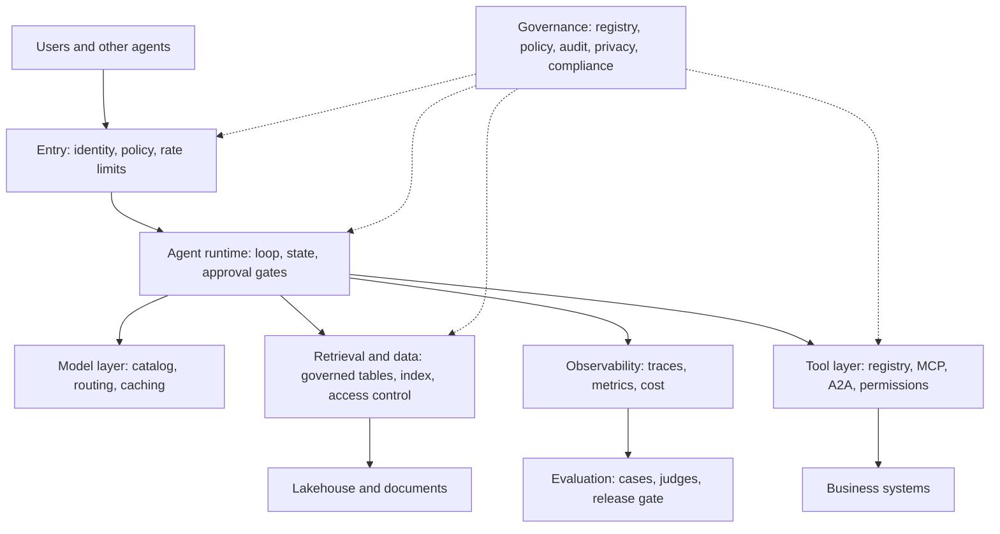

# Data platform agent reference architecture

**Course:** Agentic AI, from first principles to production · Module 11 Azure and Databricks · lesson 59 of 77 · **about 4 hours** · paper draft for review.  
**Success criterion:** Draw a reference architecture (data, retrieval, agent runtime, identity, evaluation, observability, governance) and defend three design choices in an interview-style walkthrough.

> Sources (read 2026-10-02 and 2026-10-03; details and gaps in docs/research/agentic-ai): Synthesis of lessons 27 to 58 of this course and the sources cited there; in particular Microsoft's 'AI agent orchestration patterns' (2026-02-12), the Foundry Agent Service and Databricks Agent Bricks overviews (read 2026-10-03), the Azure AI Search and Databricks AI Search pages (lessons 27, 29, 32), the OpenTelemetry GenAI conventions (lesson 47), the MCP and A2A specifications (lessons 38 to 42) and the SDLC Playbook (lessons 35, 53). The architecture, the layer table and the three defended choices are ours, not a vendor's reference design. NOTHING IN THIS LESSON WAS RUN ON AZURE OR DATABRICKS BY US: we have no accounts there and creating one is a step you must do yourself. Every platform statement is from the vendor page named, as read on the date given, and these products and their limits change quickly. Unverified: that the combination works as drawn on both platforms (nothing was deployed); every product name and limit, which change.

---

## Part 1 · The layers, one diagram

A governed agent platform is a stack of layers, each with an owner and a control. Here is the reference architecture, platform-neutral, with Azure and Databricks pieces named where we read them.

| Layer | Job | Course lessons | Azure example (as read) | Databricks example (as read) |
|---|---|---|---|---|
| **Data** | Governed sources, quality, freshness, access | 32 | OneLake, Blob, SharePoint through knowledge sources | Delta tables in Unity Catalog with change data feed |
| **Retrieval** | Chunking, hybrid search, security trimming | 27 to 31 | Azure AI Search | AI Search (Delta Sync index) |
| **Model layer** | Choose, call, cache, route, cost | 7, 12, 49 | Foundry model catalog | Foundation model serving |
| **Tool layer** | Registry, schemas, permissions, MCP and A2A | 22, 38 to 42, 52 | Toolboxes behind an MCP endpoint | Unity Catalog functions, MCP servers; EXECUTE |
| **Agent runtime** | The loop, state, checkpoints, approval gates | 21 to 25, 33 to 37, 43 to 45 | Prompt or hosted agents | Custom agents on Databricks Apps; Supervisor Agent |
| **Identity** | Who the agent is and acts as | 51 | Entra agent identity, managed identity, RBAC | Service principals, on-behalf-of, Unity Catalog grants |
| **Evaluation** | Cases, judges, gates | 18, 31, 46 | Foundry evaluators | MLflow evaluation |
| **Observability** | Traces, metrics, audit | 47 | Foundry tracing, Application Insights | MLflow Tracing and monitoring |
| **Governance** | Policy, privacy, compliance, human oversight | 48, 53 to 55 | Guardrails, private networking, RBAC | Unity Catalog, budgets, gateway |

**Worked example**

Trace one request through the diagram. A user asks the DataOps agent about a failing load: it enters through the gateway (identity checked, rate limit applied), the runtime restricts the tool set by tier, retrieval reads the runbook with security trimming, a proposed write waits at the approval gate, the audit log records the decision, the trace records tokens and time, and the evaluation set that gates releases includes this case.

**Common mistake**

Drawing boxes for products and not for controls. The architecture is the controls: where identity is checked, where approvals happen, where data is trimmed, where evaluation gates a release.

**Check yourself.** Name the nine layers of the reference architecture.

Model answer (write yours first)

Data, retrieval, model, tool, agent runtime, identity, evaluation, observability and governance (governance spans the others).

---

## Part 2 · Defending three design choices

Your criterion asks you to defend three design choices in an interview-style walkthrough. Here are three, in the form 'the choice, the alternative, why, the cost, what would change my mind', each tied to evidence from this course.

**1. Approval gates and tool limits in code, not in prompts.**
- *Alternative:* instruct the model not to act without approval.
- *Why:* a fooled model can be told anything; our four injection attempts failed because a tool was not offered, a person denied, a schema rejected the argument and an output check blocked a link, with an obedient model (lesson 48). The CI check blocked four bad policy changes (lesson 53).
- *Cost:* more code and a human step, so slower and more engineering.
- *Would change my mind:* if every action were reversible and low value, a lighter gate would do.

**2. Evaluate before and after every change, with must-pass cases and repeated trials.**
- *Alternative:* spot-check and ship.
- *Why:* our 25-case set found a planted regression (trial pass rate 96 to 88 percent, pass^5 88 to 64 percent, seven must-pass cases broken), and the gate blocked it (lesson 46); a model choice is a money decision that depends on a measured success rate (lesson 49, break-even 93 percent).
- *Cost:* building and maintaining cases; model calls for each run.
- *Would change my mind:* a very small, low-stakes internal helper may not justify a gate.

**3. Governed retrieval with the access control enforced before ranking, and per-audience indexes where the platform cannot do row-level rules.**
- *Alternative:* one index for everyone and a prompt that hides restricted text.
- *Why:* a prompt is advice; in our demo the same question returned 'Not in the documents' for one caller and the restricted answer for another because the filter ran before ranking (lesson 27), and the Databricks index page says row-level permissions are not supported (lesson 32).
- *Cost:* more indexes and sync work.
- *Would change my mind:* if the platform adds row-level permissions on the index, I would re-test and consolidate.

Other candidates if you prefer: a single agent with a router before multi-agent (lesson 43); idempotency keys derived from the action (lesson 33); a short-lived credential per run (lesson 53); or cost per successful task including people (lesson 49). The pattern matters more than the pick: **evidence from your own runs, an honest cost, and the condition that would change your answer.**

**Worked example**

A closing line for the walkthrough: 'None of these is vendor-specific. The same design runs on Foundry with a hosted agent and Entra identity, or on Databricks with a custom agent, a service principal and Unity Catalog; what I verified in each platform is in my notes, and what I only read is marked.'

**Common mistake**

Defending a choice with 'it is best practice'. Cite what you measured, what it costs, and when you would choose differently.

**Check yourself.** What are the five parts of a defended design choice in this lesson?

Model answer (write yours first)

The choice, the alternative, why (with evidence), the cost, and what would change my mind.

---

## Part 3 · Drawing it and presenting it

**Draw it** on one page for a specific system (the DataOps agent, or your own). Use the nine layers, name a concrete product or component in each, and mark the controls (gateway checks, approval gates, trimming, evaluation gate, audit). Mark every product you only read about with an R and every one you ran with an X, as in lesson 57: a reviewer should see which parts are proven.

**Then rehearse the walkthrough** in six minutes: a minute on the problem and users, two on the diagram following one request, three on your three defended choices. Practise with someone who will interrupt with the questions an interviewer asks:

- What happens when the model provider is down? (lesson 50)
- How do you know it is working after a change? (lesson 46)
- How does a user's access limit what the agent can see? (lessons 27, 32, 51)
- What is your cost per successful task, and what drives it? (lesson 49)
- How would a regulator or auditor reconstruct a decision? (lessons 47, 53, 54)
- What did you not verify? (the R marks)

Keep the diagram, the three choices and the six answers as the centrepiece of your portfolio walkthrough (Module 13), and update it when a product name or limit changes.

**Worked example**

A good test: hand the diagram to a colleague who has not seen the course and ask them to find where a write is approved, where data is trimmed by user, and where a release is blocked. If they cannot find all three in under a minute, redraw it.

**Common mistake**

A slide of logos. If every box is a product and none is a control, it does not answer the questions an architect is asked.

**Check yourself.** What do the R and X marks on your diagram tell a reviewer?

Model answer (write yours first)

R marks components you only read about; X marks those you ran. They show which parts are proven and which need verification.

---

## Do it: lab

1. Draw a reference architecture for your DataOps agent (or another agent) with the nine layers: data, retrieval, model, tool, agent runtime, identity, evaluation, observability and governance. Name a concrete component in each and mark the controls.
2. Mark each platform component R (read) or X (ran), with the page and date for the R ones.
3. Choose three design choices and write each as: the choice, the alternative, why with evidence from your own runs, the cost, and what would change your mind.
4. Rehearse a six-minute walkthrough with someone who interrupts with the six questions in section 3. Record where you hesitated.
5. Fix the weakest answer: run or build the missing evidence if you can, or mark it honestly as not verified.

**Done when:** your diagram covers the nine layers with controls and R or X marks, you have three defended choices with evidence, cost and what would change your mind, and you have rehearsed the walkthrough and fixed your weakest answer.

---

## Interview check

**Question.** Walk me through the architecture of a governed AI agent platform.

A strong answer has this shape

1. A request enters through a gateway that checks identity and applies policy and rate limits, then reaches an agent runtime with state, checkpoints and approval gates.
2. The agent uses a model layer, a tool layer with a registry and permission levels (MCP and A2A where needed), and retrieval over governed data with access control enforced before ranking.
3. Identity is per agent with least privilege; observability records traces and cost; evaluation with must-pass cases gates every release; governance covers policy, privacy, audit and compliance across all layers.
4. I would defend three choices with evidence: controls in code, evaluation before every change, and governed retrieval; and say what I verified versus only read, because platform features change.

---

## Evidence to keep

Keep the diagram with its marks, the three defended choices, the rehearsal notes and the fixes. They are the architecture centrepiece for your portfolio and interviews.

---
