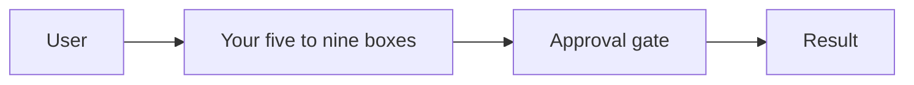

# Write up 2-3 case studies with evidence

**Course:** Agentic AI, from first principles to production · Module 14 Interviews · lesson 72 of 77 · **about 8 hours** · paper draft for review.  
**Success criterion:** Each case study has an architecture diagram, a tradeoff record, evaluation results, a cost calculation, one failure case, a production decision and a 2-minute spoken version.

> Sources (read 2026-10-03; details and gaps in docs/research/agentic-ai): Your own builds from lessons 43 to 55 and 69 to 71, whose evidence you already hold; Anthropic AI Fluency framework (Diligence: recording and disclosing); Google SRE book on blameless postmortems (the failure-case section). Management practice is less settled than engineering. Where a source supports a statement we cite it; where a lesson gives our own practice we say 'our practice' and do not borrow authority for it. The reference code for this module was written by us and run on Python 3.14.7: the product, migration, drills and deploy folders have 8, 7, 9 and 6 passing tests, and the RAG evidence report generator runs on the lesson 27 to 31 build. Nothing here ran against a real embedding model, a real LLM, a real legacy database or a cloud account. The structure below is our practice for interview preparation, not drawn from a source. The template contains no invented project: you write your case studies from your own evidence. Unverified: that interviewers will respond to this format; it is designed to be checkable.

---

## Part 1 · Choose the projects and the shape

Pick **two or three** projects, not all of them. You have, by now, at least these candidates with real evidence: the **DataOps agent** (modules 6 to 9: 25-case evaluation, pass^5, the gate, traces, the cost model, the outage simulation), the **governed RAG build** (lesson 69), the **migration harness** (lesson 70), the **governed multi-agent triage** (module 8), and the **deployed agent** (lesson 71). Choose for the roles you target: for product and program roles, the DataOps agent and the business case; for data platform roles, the migration harness and the RAG build.

The criterion lists seven required parts, and our `check_case_study()` checks they are present:

| Part | What goes in it |
|---|---|
| **Architecture diagram** | A real diagram (Mermaid or an image), five to nine boxes, with the trust boundaries marked |
| **Tradeoff record** | The decision, the alternatives, why you chose, the cost, and what would change your mind |
| **Evaluation results** | The numbers with sample size and intervals or trials |
| **Cost calculation** | Per successful task, with assumptions and the date of prices |
| **One failure case** | What went wrong, how you found it, what you changed |
| **Production decision** (a hypothetical recommendation unless you operated the system) | Would you ship it, to whom, with what limits, and the evidence you would want first |
| **2-minute spoken version** | About 280 words, with a clear opening, three points and a close |

The checker also counts numbers (at least ten) and wants a statement of what you did **not** verify. That last item is the one that makes interviewers trust the rest.

**Worked example**

````python
def check_case_study(text: str) -> list[str]:
    t = text.lower()
    f = [f'missing section: {s}' for s in CASE_SECTIONS if s not in t]
    if '```mermaid' not in t and '![' not in t:
        f.append('the architecture diagram must be an actual diagram or image')
    ...
````

**Common mistake**

Choosing the most impressive-sounding project instead of the one with the most evidence you can defend.

**Check yourself.** Name the seven required parts of a case study.

<details><summary>Model answer (write yours first)</summary>

Architecture diagram, tradeoff record, evaluation results, cost calculation, one failure case, production decision, and a 2-minute spoken version.

</details>

---

## Part 2 · A case study template, built from evidence

Here is the template, **with instructions rather than invented content**. Copy it for each project and fill it from your own files. We deliberately do not fill in a sample as if it were your project (our course's rule: no invented results presented as yours).

````markdown
# <Project name>: case study

## Context
One paragraph: the problem, who it is for, and the measured baseline (lesson 60).

## Architecture diagram


## Tradeoff record
- Decision: ...
- Alternatives considered: ...
- Why this one: ... Cost of this choice: ...
- What would change my mind: ...

## Evaluation results
- Set: N cases, how they were chosen. Trials: k per case.
- Result: pass rate and pass^k, with the interval or the repeat count.
- What the evaluation does not cover: ...

## Cost calculation
- Per successful task: model, tools, people taking over failures. Prices dated.
- Range (low, likely, high) and what moves it most.

## Failure case
- What happened, how I found it (trace, evaluation), the root cause, what I changed, and the test I added.

## Production decision (hypothetical unless you operated it)
- Ship / ship with limits / do not ship. To whom. Evidence needed first. Rollout phases and the rollback.

## What I did not verify
- ...

## Two-minute spoken version
(about 280 words)

````

The quality of a case study is mostly in three places:

1. **The tradeoff record is specific.** 'We chose a single agent over multi-agent because the evaluation showed 24.19 seconds against 3.59 after trimming tool results, and nothing in the failures needed a split' beats 'we chose the simplest approach'. Use your own numbers.
2. **The failure case is real.** Pick something that actually went wrong: the interrupted node that re-ran on resume, the approval that was not persisted, the outage simulation where the naive version completed 464 of 600. Interviewers like failures that were found by a test you wrote.
3. **The production decision takes a position.** 'I would ship to eight engineers read-only, with the guardrail metric, and widen when the criteria are met; I would not ship writes until X.'

**Worked example**

Run `check_case_study()` on your draft. It is a structural lint: passing it does not mean the case study is good, truthful or complete (an empty diagram and ten digits pass). It will find a missing section, a missing diagram, too few numbers, or no statement of what you did not verify.

**Common mistake**

Writing the case study from memory. Open the evaluation files and traces and copy the numbers; do not recall them.

**Check yourself.** What three places decide the quality of a case study?

<details><summary>Model answer (write yours first)</summary>

A specific tradeoff record with your own numbers, a real failure case that a test found, and a production decision that takes a position.

</details>

---

## Part 3 · The two-minute spoken version

You will say this aloud, so write it for the ear: short sentences, one number per sentence, no jargon you cannot explain. About 280 words is two minutes at a comfortable pace; **time yourself**, because most people run long.

A structure that works:

1. **Open (15 seconds):** the problem and why it mattered, with the baseline number.
2. **What I built (30 seconds):** the architecture in one breath, naming the control you are proudest of (the approval gate, the evaluation gate).
3. **Evidence (30 seconds):** two numbers from evaluation and one from cost, with the sample size.
4. **A failure (30 seconds):** what went wrong and what the test caught.
5. **Decision and limit (15 seconds):** would you ship it, and what you did not verify.

Rehearse until you can say it without notes **and** can answer the three follow-ups you dread. Write those follow-ups, usually 'why not X?', 'how do you know?', and 'what would you do at ten times the size?', and write your answers.

A rule for honesty in the room: separate **what you ran** from **what you read**. 'I built and tested this; I read about that but did not run it' is a strong sentence, not a weak one.

**Worked example**

Fictional opener: 'On-call engineers spent a median 38 minutes per failed pipeline finding the cause. I built an agent that diagnoses first and asks before it changes anything.'

**Common mistake**

Reading the written version aloud. Written text is too long and too dense; rewrite it for the ear.

**Check yourself.** What is the structure of the two-minute version, and what rule for honesty applies?

<details><summary>Model answer (write yours first)</summary>

Open with the problem and baseline, what you built, evidence, a failure, then decision and limits. Separate what you ran from what you read.

</details>

---

## Do it: lab

1. Choose two or three projects and say why for your target roles.
2. Copy the template for each and fill every section from your own files, copying numbers from the evaluation and trace files.
3. Draw each architecture diagram in Mermaid, mark the trust boundary and the approval gate, and render it to check.
4. Run `check_case_study()` on each and fix what it finds.
5. Write the 280-word spoken version for each, time yourself and trim to two minutes.
6. Write the three follow-up questions you dread for each and your answers; practise them aloud.

**Done when:** you have two or three case studies, each with all seven parts and a stated unverified list, passing the checker, plus a timed spoken version and written answers to three hard follow-ups.

---

## Interview check

**Question.** Tell me about a project you are proud of and what you would do differently.

<details><summary>A strong answer has this shape</summary>

1. Open with the problem and the measured baseline, then the architecture in one breath.
2. Give two numbers from the evaluation with the sample size, and one from the cost model.
3. Tell one real failure, how a test found it and what I changed.
4. Say whether I would ship it, to whom, with what limits, and what I did not verify.

</details>

---

## Evidence to keep

Keep the case studies in the repository next to the projects, with the evaluation and trace files they cite.

---
