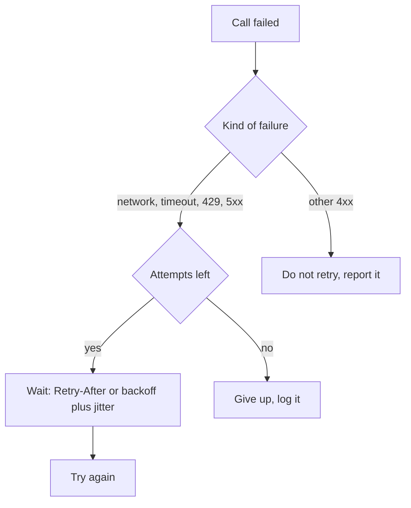

# Async, HTTP and APIs in Python

**Course:** Agentic AI, from first principles to production · Module 2 Developer Toolkit · lesson 11 of 77 · **about 4 hours** · paper draft for review.  
**Success criterion:** Call a public API 20 times concurrently with a timeout and retry, and show the log proving that failures were retried and the rate limit was respected.

> Sources (read 2026-10-02; details and gaps in docs/research/agentic-ai): Python documentation 'Coroutines and Tasks' (asyncio.run, TaskGroup, gather, timeout, to_thread; TaskGroup and timeout added in Python 3.11); HTTPX documentation 'Timeouts' and 'Async Support' (default timeout, the four timeout types, client reuse); Anthropic documentation 'Errors' and 'Rate limits' (429 and 5xx handling, retry-after, token bucket), all read 2026-10-02 through page summaries. The local test server and retry client on this page were written by us and run on Python 3.14.7 with httpx 0.28.1; the log excerpt is from that run (20 results, 5 retried). The retry design (which statuses to retry, backoff with jitter, a concurrency cap) is our synthesis of those pages with common practice. Unverified: the exact numbers in the example (5 in flight, a 4-attempt cap) are our choices for a polite demonstration, not vendor guidance.

---

## Part 1 · What async is for

Calling a model or an API mostly means waiting for the network. A normal script waits for one call, then starts the next. Asynchronous code uses `async def` functions called coroutines, and `await` to say 'I am waiting; let something else run'. One thread runs an event loop that switches between tasks while they wait.

The shape you will use most: `asyncio.run(main())` starts everything. Inside, `asyncio.TaskGroup()` (added in Python 3.11) starts several tasks and waits for all of them; if one fails, the group cancels the rest. `asyncio.gather(*calls)` returns all results in order. The documentation's example of two tasks that each wait one and two seconds finishes in about two seconds, not three, because they overlap.

Async helps with waiting, not with computing. A long calculation inside a coroutine blocks the loop and everything else stops. For a blocking, IO-bound function you cannot rewrite, `await asyncio.to_thread(fn)` runs it on a worker thread.

**Worked example**

Fictional. Fetching 20 ticket details at 300 ms each takes about 6 seconds one by one. Sent 4 at a time, the same work takes about 1.5 seconds, as the run later on this page shows.

**Common mistake**

Calling a normal blocking function, such as `requests.get` or `time.sleep`, inside an async function. It freezes the loop. Use an async client and `await asyncio.sleep`.

**Check yourself.** Why does gathering 20 network calls speed things up, but gathering 20 heavy calculations does not?

<details><summary>Model answer (write yours first)</summary>

Network calls spend almost all their time waiting, so many can wait at once on one thread. Heavy calculation keeps the thread busy, so the tasks cannot overlap.

</details>

---

## Part 2 · HTTP clients: timeouts and reuse

Use an async HTTP client such as HTTPX's `AsyncClient`, opened with `async with` so it closes cleanly. Two points from its documentation:

- **Timeouts are on by default.** HTTPX raises a timeout error after 5 seconds of network inactivity. There are four kinds, each with its own exception: connect, read, write and pool. Set them per request (`timeout=10.0`), per client (`httpx.Client(timeout=10.0)`) or in detail (`httpx.Timeout(10.0, connect=60.0)`).
- **Reuse one client.** The docs warn against creating a new client inside a hot loop, because the client keeps a pool of open connections and a new one throws that away.

A timeout per request is not a deadline for the whole job. `async with asyncio.timeout(30):` around the whole group sets an overall limit and raises `TimeoutError` when it passes.

Model calls are slower than ordinary API calls, so the default 5 seconds is often too short for them. Anthropic's Python SDK, for example, defaults to 10 minutes, which is the opposite problem for a user waiting on a screen. Choose deliberately; you will in lesson 12.

**Worked example**

Fictional. A report job calls a slow internal service. With the default 5-second read timeout it fails on every large report. Raising only the read timeout for that client fixes it without hiding connection problems.

**Common mistake**

Setting `timeout=None` to make errors go away. A hung call now hangs the whole agent forever.

**Check yourself.** What is the difference between a per-request timeout and `asyncio.timeout`?

<details><summary>Model answer (write yours first)</summary>

The request timeout limits one network operation. `asyncio.timeout` wraps a block of work, such as the whole batch, and cancels it when the total time is up.

</details>

---

## Part 3 · Retries and rate limits

Some failures are temporary and some are not. Retry only the temporary ones.

- **Retry:** network errors and timeouts, `429` (rate limited), and `5xx` server errors. Anthropic's own SDK retries connection errors, 408, 409, 429 and 5xx twice by default.
- **Do not retry:** other `4xx` errors such as `400` (your request is wrong), `401` (bad key) and `404`. Sending the same wrong request again cannot succeed.
- **Honour `Retry-After`.** A `429` response often says how many seconds to wait. Earlier retries will fail. One trap from Anthropic's documentation: a 429 caused by a monthly spend cap carries no `retry-after` header and keeps failing until access resumes, so retrying forever is wrong there.
- **Back off.** Without a header, wait longer each time: for example 0.4, 0.8, 1.6 seconds, plus a small random amount (jitter) so many clients do not retry in step.
- **Cap attempts and concurrency.** Anthropic's limits are measured per minute in requests and tokens and use a token-bucket scheme, so capacity refills continuously; short bursts can still trigger errors. A semaphore that limits how many calls are in flight is the simplest way to stay inside a limit.

Retrying a request that changes something (a payment, a ticket created) can do it twice. Reads are safe to retry; writes need the idempotency idea in lesson 25.



**Worked example**

Fictional. A batch of 200 requests hits a 429. Without a cap, all 200 retry together after one second and trip it again. With 4 in flight and jitter, they trickle through.

**Common mistake**

Retrying every error the same way, including a bad key, 4 times with delays. That only makes the real error appear later.

**Check yourself.** A call returns 401 and another returns 503. Which do you retry, and why?

<details><summary>Model answer (write yours first)</summary>

Retry the 503, a temporary server problem. Do not retry the 401: the key is wrong and will be wrong every time. Report it so a person fixes the key.

</details>

---

## Part 4 · A working example you can run

Rather than aim 20 concurrent calls at someone else's server, run this local server. It answers `/item/N`, fails with `500` the first time for every item divisible by 4, and returns `429` with `Retry-After: 1` if more than 5 requests are in flight at once.

```python
# mock_api.py - a local API that misbehaves on purpose
import json, threading, time
from http.server import BaseHTTPRequestHandler, ThreadingHTTPServer

seen, in_flight, lock = {}, 0, threading.Lock()
MAX_IN_FLIGHT = 5

class Handler(BaseHTTPRequestHandler):
    def do_GET(self):
        global in_flight
        item = int(self.path.rsplit('/', 1)[-1])
        with lock:
            seen[item] = seen.get(item, 0) + 1
            attempt = seen[item]
            in_flight += 1
            over = in_flight > MAX_IN_FLIGHT
        try:
            time.sleep(0.15)
            if over:
                return self.reply(429, {'error': 'too many at once'}, {'Retry-After': '1'})
            if item % 4 == 0 and attempt == 1:
                return self.reply(500, {'error': 'temporary failure'})
            return self.reply(200, {'item': item, 'attempt': attempt})
        finally:
            with lock:
                in_flight -= 1

    def reply(self, status, body, headers=None):
        data = json.dumps(body).encode()
        self.send_response(status)
        self.send_header('Content-Type', 'application/json')
        self.send_header('Content-Length', str(len(data)))
        for k, v in (headers or {}).items():
            self.send_header(k, v)
        self.end_headers()
        self.wfile.write(data)

    def log_message(self, *args):
        pass

if __name__ == '__main__':
    ThreadingHTTPServer(('127.0.0.1', 8765), Handler).serve_forever()
```
And a client with a timeout, a retry rule, a concurrency cap and an overall deadline (it needs `pip install httpx`):

```python
# client.py
import asyncio, logging, random
import httpx

logging.basicConfig(level=logging.INFO, format='%(message)s')
log = logging.getLogger('client')
BASE, MAX_ATTEMPTS, CONCURRENCY = 'http://127.0.0.1:8765/item/', 4, 4
RETRYABLE = {429, 500, 502, 503, 504}

async def fetch(client, gate, item):
    for attempt in range(1, MAX_ATTEMPTS + 1):
        try:
            async with gate:
                resp = await client.get(BASE + str(item))
            if resp.status_code == 200:
                if attempt > 1:
                    log.info('item %s ok on attempt %s', item, attempt)
                return resp.json()
            if resp.status_code not in RETRYABLE:
                resp.raise_for_status()
            wait = float(resp.headers.get('Retry-After', 0.2 * 2 ** attempt + random.random() * 0.1))
            log.info('item %s got %s, retry %s in %.2fs', item, resp.status_code, attempt, wait)
        except (httpx.TimeoutException, httpx.TransportError) as exc:
            wait = 0.2 * 2 ** attempt + random.random() * 0.1
            log.info('item %s %s, retry %s in %.2fs', item, type(exc).__name__, attempt, wait)
        await asyncio.sleep(wait)
    raise RuntimeError(f'item {item} failed after {MAX_ATTEMPTS} attempts')

async def main():
    gate = asyncio.Semaphore(CONCURRENCY)
    async with httpx.AsyncClient(timeout=httpx.Timeout(5.0)) as client:
        async with asyncio.timeout(30):
            results = await asyncio.gather(*(fetch(client, gate, i) for i in range(1, 21)))
    log.info('done: %s results, %s needed a retry', len(results), sum(r['attempt'] > 1 for r in results))

asyncio.run(main())
```
Start the server in one terminal (`python mock_api.py`) and run the client in another. On Python 3.14.7 with httpx 0.28.1 our run finished in about 4 seconds, and the log ended with `item 4 got 500, retry 1 ...`, `item 4 ok on attempt 2`, the same for 8, 12, 16 and 20, and `done: 20 results, 5 needed a retry`. HTTPX also prints its own `HTTP Request` lines at INFO level; that is normal.

**Worked example**

Fictional change to try: set CONCURRENCY to 10. The server now sees more than 5 in flight and answers some calls with 429 and `Retry-After: 1`. Your log should show the client waiting one second and then succeeding.

**Common mistake**

Building the client inside `fetch`, so every call opens a new connection pool.

**Check yourself.** In the example, what two settings keep the client inside the server's limit, and what does each do?

<details><summary>Model answer (write yours first)</summary>

`CONCURRENCY = 4` with the semaphore keeps at most 4 requests in flight, under the server's limit of 5. `Retry-After` handling makes the client wait the stated time after a 429 instead of retrying at once.

</details>

---

## Do it: lab

1. Save `mock_api.py` and `client.py` from the lesson, install `httpx`, start the server and run the client. Keep the log.
2. Change `CONCURRENCY` to 10 and run again. Find the log lines that show a 429 and the wait. Explain in one sentence why the semaphore at 4 avoided them.
3. Add one more guard of your own: a per-request timeout of 0.1 seconds, which will fail every call. Show that the retries happen and that the job ends with a clear error after 4 attempts, not a hang.
4. Optionally repeat the original exercise on a public API you are allowed to use, at low concurrency, keeping to its published limits.
5. Write 5 sentences on what you retried, what you refused to retry, and why.

**Done when:** your log proves three things: failures were retried, a 429 was waited out as the server asked, and the job gave up cleanly when it could not succeed.

---

## Interview check

**Question.** An integration calls a model API for 500 documents and starts failing with errors. How do you make it reliable, and what do you tell the business about the trade-off?

<details><summary>A strong answer has this shape</summary>

1. Classify errors: retry network errors, timeouts, 429 and 5xx with backoff and jitter; do not retry other 4xx; read `Retry-After`.
2. Cap concurrency and total attempts, and set both a per-request timeout and an overall deadline.
3. Make retried writes safe so nothing is done twice.
4. Log every retry with the request id so failures can be traced.
5. Business trade-off: reliability costs time and money. Retries lengthen the job and every attempt may be billed. Agree a maximum run time and cost, and what happens to documents that still fail (a queue for review, not silent loss).

</details>

---

## Evidence to keep

Keep both scripts, the log from the first run, and your 5 sentences. The retry rules will be reused in the Module 4 assistant and in Production Reliability later.

---
