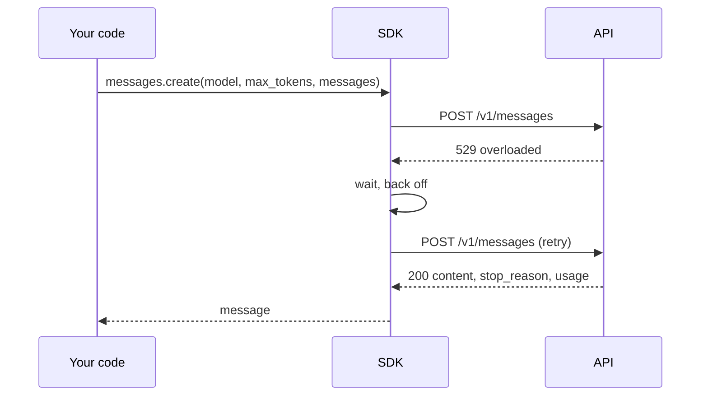

# Your first LLM API call

**Course:** Agentic AI, from first principles to production · Module 2 Developer Toolkit · lesson 12 of 77 · **about 3 hours** · paper draft for review.  
**Success criterion:** A script that sends a prompt and prints the reply and token usage, with a spending cap set, no key in source code, and the failure case (bad key) handled.

> Sources (read 2026-10-02; details and gaps in docs/research/agentic-ai): Anthropic documentation 'Get started with Claude' (environment variable, Python quickstart), 'Messages API' reference (endpoint, required headers, request and response fields, stop reasons, usage), 'API errors' (status codes, error shape, request id, long requests), 'Rate limits' (limits and spend caps) and the Python SDK page (installation, async client, retries, timeouts, exceptions), all read 2026-10-02 through page summaries. Vendor-specific: everything on this page is for Anthropic's API and SDK as documented on that date; other providers use different names but the same ideas. No API call was made while writing this lesson, because that needs a key, so the example code is taken from the documentation and has not been run by us. The model name is left as a placeholder because current names change; take one from the vendor's models page. Unverified: SDK defaults (2 retries, 10-minute timeout) and the tool-level behaviour may change with new releases.

---

## Part 1 · What a request actually is

Behind the SDK, a call to a model is one HTTP request. For Anthropic's Messages API it is a `POST` to `https://api.anthropic.com/v1/messages` with two required headers, `x-api-key` and `anthropic-version`, and a JSON body. The body has three required fields: `model`, `max_tokens` (the most it may generate) and `messages` (a list of turns, each with a role and content). A separate optional `system` field carries instructions.

```text
POST /v1/messages
x-api-key: <your key>          anthropic-version: 2023-06-01
{ "model": "<model id>", "max_tokens": 1024,
  "messages": [ { "role": "user", "content": "Hello, Claude" } ] }
```
The reply is JSON too. The parts you need: `content`, a list of blocks (a text block holds the answer), `stop_reason`, and `usage` with `input_tokens` and `output_tokens`. Documented stop reasons are `end_turn` (finished naturally), `max_tokens` (cut off at your limit), `stop_sequence` and `tool_use` (the model wants to call a tool; lesson 22). Every response also has a `request-id` header, which you log so a failure can be traced.

Models are stateless. Each request must contain the whole conversation you want it to consider; this is the 'desk' from Module 1.

**Worked example**

Fictional. A reply has `stop_reason: "max_tokens"`. The answer stops mid-sentence. The cause is your `max_tokens` setting, not the model failing, and the fix is a bigger limit or a shorter request.

**Common mistake**

Reading only the text and ignoring `stop_reason`. A cut-off answer looks like a finished one until a person reads the last line.

**Check yourself.** Which two fields of a response tell you what the call cost and whether the answer was complete?

<details><summary>Model answer (write yours first)</summary>

`usage` (input and output tokens, which give the cost with the price list) and `stop_reason` (`end_turn` means finished; `max_tokens` means cut off).

</details>

---

## Part 2 · Keys, safely

An API key is a password that spends your money. Rules:

1. **Never put it in source code**, and never commit it. Anyone who sees the repository sees the key.
2. **Keep it in an environment variable.** Anthropic's quickstart uses `ANTHROPIC_API_KEY`, which its SDKs read automatically. Set it in your shell (`export ANTHROPIC_API_KEY=...` on Linux and macOS, `setx` or the system settings on Windows) or keep it in a local `.env` file that is listed in `.gitignore`. The SDK page suggests the python-dotenv package for this.
3. **Set a spend limit.** Anthropic lets an organisation set its own monthly limit below the tier cap in the console's billing page; when it is reached, requests return HTTP 400 with `invalid_request_error`. Set a small limit while you learn.
4. **If a key leaks, revoke it at once** and make a new one. Do not rely on deleting the commit; copies remain.

Because this key belongs to you, never paste it into chat, a shared notebook, a screenshot or a ticket. This course will ask you to describe your setup, never to share the key.

**Worked example**

Fictional. A learner commits `client = Anthropic(api_key='sk-...')`. A scanner finds it within minutes of the push. The key must be revoked, and the old commit is still in the history.

**Common mistake**

Putting the key in a notebook cell 'just for now' and sharing the notebook later.

**Check yourself.** Name the two protections to set up before the first call, one in code and one in the console.

<details><summary>Model answer (write yours first)</summary>

In code: read the key from an environment variable and keep any `.env` file out of git. In the console: set a low monthly spend limit.

</details>

---

## Part 3 · The first call, with the SDK

Install the official Python SDK inside your project's environment (lesson 10): `pip install anthropic`. It needs Python 3.10 or later. The documented example, with a placeholder model name:

```python
import anthropic

client = anthropic.Anthropic()        # reads ANTHROPIC_API_KEY from the environment

message = client.messages.create(
    model="<a current model id from the models page>",
    max_tokens=300,
    messages=[{"role": "user", "content": "Explain what a token is in two sentences."}],
)

for block in message.content:
    if block.type == "text":
        print(block.text)

print(message.stop_reason, message.usage)      # for example: end_turn Usage(input_tokens=..., output_tokens=...)
print(message._request_id)                     # log this
```
To get the cost, multiply `usage.input_tokens` and `usage.output_tokens` by the per-million-token prices on the vendor's pricing page for your model and divide by one million. You did this arithmetic by hand in lesson 3; now the numbers come from a real call. The SDK also has `client.messages.count_tokens(...)` to measure a request before sending it.

There is an async client, `AsyncAnthropic`, used with `await client.messages.create(...)`, which fits the patterns from lesson 11.

**Worked example**

Fictional run: 14 input tokens and 52 output tokens. At a hypothetical 3 dollars per million input and 15 per million output, the call costs 14 x 3 / 1,000,000 + 52 x 15 / 1,000,000 = 0.000042 + 0.00078 = 0.000822 dollars. These prices are invented for the arithmetic; use your model's real ones.

**Common mistake**

Printing the whole response object and never looking at `usage`. You will not notice a cost problem until the bill.

**Check yourself.** What are the three lines you always want from a first call besides the answer?

<details><summary>Model answer (write yours first)</summary>

`stop_reason` (was it complete), `usage` (tokens, so cost), and the request id (so a failure can be traced).

</details>

---

## Part 4 · When the call fails, and how the SDK helps

Anthropic's documented error codes include `400 invalid_request_error`, `401 authentication_error` (bad or revoked key), `403 permission_error`, `404 not_found_error`, `413 request_too_large`, `429 rate_limit_error`, `500 api_error`, `504 timeout_error` and `529 overloaded_error`. Errors come back as JSON with a `type`, a `message` and a `request_id`.

The Python SDK turns them into exception classes: `AuthenticationError` for 401, `RateLimitError` for 429, `InternalServerError` for 5xx, `APIStatusError` for the other non-success codes and `APIConnectionError` when the server cannot be reached; a timeout raises `APITimeoutError`. Catch the specific classes, most specific first.

```python
try:
    message = client.messages.create(...)
except anthropic.AuthenticationError:
    print("The key is wrong or revoked. Fix the key; retrying will not help.")
except anthropic.RateLimitError:
    print("Rate limited. The SDK already retried; back off or lower concurrency.")
except anthropic.APIConnectionError as e:
    print("Could not reach the API:", e.__cause__)
except anthropic.APIStatusError as e:
    print("API error", e.status_code)
```
**Retries and timeouts are built in.** By default the SDK retries connection errors, 408, 409, 429 and 5xx twice with a short exponential backoff, and honours `retry-after`. Change this with `max_retries`. The default request timeout is 10 minutes, so for anything a person is waiting on, set a shorter `timeout` (for example `Anthropic(timeout=30.0)`). Because timed-out requests are also retried twice, a 30-second timeout can mean about 90 seconds before you see an error.


A caution: a 429 can also mean your organisation reached its monthly spend cap. That response has no `retry-after`, and retrying, including the SDK's automatic retries, keeps failing until access resumes.

**Worked example**

Fictional. A script with a revoked key prints 'The key is wrong or revoked' on the first call and exits, instead of retrying three times and printing a stack trace.

**Common mistake**

One broad `except Exception` that prints 'something went wrong'. It hides whether to fix the key, wait, or shorten the request.

**Check yourself.** Your script hangs for minutes when the network is poor. Which two SDK settings do you look at?

<details><summary>Model answer (write yours first)</summary>

`timeout` (default 10 minutes) and `max_retries` (default 2). A long timeout multiplied by retries can mean a very long wait; set both to suit the user.

</details>

---

## Do it: lab

1. In the project from lesson 10, install the SDK and set `ANTHROPIC_API_KEY` in your environment. Confirm that `.env` (if you use one) is in `.gitignore` and that `git status` shows no key anywhere.
2. In the vendor's console, set a small monthly spend limit and note its value.
3. Write `first_call.py`: send one prompt of your choice, print the reply, `stop_reason`, the token usage and the request id.
4. Compute the cost of that call from `usage` and the vendor's price page. Write the prices and the date you read them.
5. Handle failure: run the script once with a wrong key on purpose and make it print a clear, specific message and exit without a stack trace.
6. Set `timeout` and `max_retries` deliberately for a screen a person is waiting on, and write the worst-case wait that results.

**Done when:** your script prints reply, stop reason, usage and request id; a spend limit is set; no key appears in your code or repository; and a wrong key produces one clear message.

---

## Interview check

**Question.** A colleague wants every team to call a model API directly with their own keys. What controls would you ask for first?

<details><summary>A strong answer has this shape</summary>

1. Keys in a secrets manager or environment, never in code; scanning to catch leaks; a way to rotate and revoke quickly.
2. A spend limit per workspace or team, plus alerts, so one bug cannot spend the budget.
3. Logging of request ids, token usage and cost per call, so spend can be attributed.
4. Sensible timeouts and bounded retries, so a stuck call cannot run for ten minutes unseen.
5. A decision on whether teams call the vendor directly or through a shared gateway, which centralises keys, limits and logging at the cost of one more thing to run.

</details>

---

## Evidence to keep

Keep the script, its output, the cost calculation with the price date, the spend-limit setting (a screenshot with the key hidden is fine) and your written worst-case wait.

---
