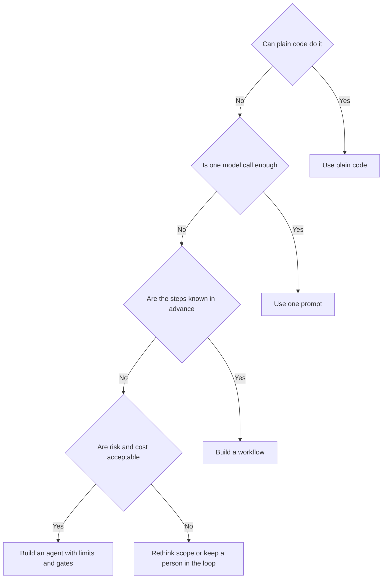

# Workflows versus agents

**Course:** Agentic AI, from first principles to production · Module 4 Agent Core · lesson 20 of 77 · **about 2 hours** · paper draft for review.  
**Success criterion:** For one business process, produce a decision matrix (determinism, autonomy, latency, cost, safety, observability, failure recovery), select an architecture and defend it in 5 minutes, and say which of the three modes your process is in.

> Sources (read 2026-10-02; details and gaps in docs/research/agentic-ai): Anthropic Engineering, 'Building effective agents' (the workflow patterns and the advice to start simple); Microsoft Learn 'Microsoft Agent Framework overview' (agent or workflow table); Claude Academy AI-native SDLC Playbook (tiered autonomy, approval gates); Claude Academy AI Fluency lesson 2 (modes), read 2026-10-02 through page summaries. The decision matrix, the scoring scale and the worked example are ours and fictional. Unverified: the cost and reliability differences between workflows and agents depend heavily on the task; Anthropic's article says agents cost more and can compound errors but gives no figures, and we have none either.

---

## Part 1 · Start with the simplest thing that works

Anthropic's advice is to begin with a single, well-optimised model call, with retrieval and good examples, and add complexity only when it demonstrably improves results. A workflow adds predictability and testability; an agent adds flexibility at the price of higher cost, slower responses and the risk that errors compound over many steps. Microsoft's guidance agrees: if a function can do it, use the function.

Think of it as a ladder. At each rung, move up only when the rung below fails a measured test:

1. Plain code (no model).
2. One model call.
3. A workflow of several calls and fixed steps.
4. An agent that chooses its own steps.

**Worked example**

Fictional. Routing refund emails: plain keyword rules handle 70 percent, a single classification call handles 95 percent, and no agent is needed. A cross-system invoice investigation is where an agent earns its cost.

**Common mistake**

Starting with an agent because it is exciting, then spending months debugging non-determinism that a three-step workflow would not have.

**Check yourself.** Order these from simplest to most flexible: agent, one model call, workflow, plain code.

Model answer (write yours first)

Plain code, one model call, workflow, agent.

---

## Part 2 · Five workflow patterns

Anthropic's article names five patterns that use fixed code paths. Knowing them keeps you from reaching for an agent too early:

- **Prompt chaining:** a task split into sequential steps, each call using the previous output; good when the subtasks are fixed.
- **Routing:** classify the input and send it to a specialised handler.
- **Parallelisation:** run calls at the same time, either on separate parts (sectioning) or several attempts to vote.
- **Orchestrator-workers:** a central model breaks down a task and hands parts to worker calls; sits between a workflow and an agent because the split is decided at run time.
- **Evaluator-optimiser:** one call generates, another critiques, in a loop; good when there are clear criteria and iterating helps.

Most of the business value in early agentic projects comes from chains, routing and parallelisation, which are easier to test than open-ended agents.

**Worked example**

Fictional. A contract review: split into clause types (sectioning), review each in parallel, then merge. Predictable, testable, no agent.

**Common mistake**

Treating the patterns as agent designs. Four of the five have code control the route.

**Check yourself.** Which pattern fits 'draft, check against criteria, improve, repeat'?

Model answer (write yours first)

Evaluator-optimiser (generate, critique, refine), or the self-correction chain from the prompting guide.

---

## Part 3 · When an agent is justified, and a matrix to decide

Use an agent when the steps cannot be known in advance, fixed paths will not cover the cases, and you can accept higher cost, trust the model with decisions in a bounded space, and test it in a sandbox. Score your process on seven criteria. For each, mark which side favours a workflow and which an agent:

| Criterion | Favours a workflow | Favours an agent |
|---|---|---|
| **Determinism** | Same input should give the same steps | Steps depend on what is found along the way |
| **Autonomy needed** | A person or code can direct each step | The system must decide what to do next |
| **Latency** | Fast answers needed | Minutes are fine |
| **Cost** | Tight cost per task | Value per task is high |
| **Safety** | Actions are sensitive, need predictable control | Actions are reversible or read-only |
| **Observability** | Auditors want fixed, explainable steps | Traces can be reviewed after the fact |
| **Failure recovery** | Failures need defined handling | Self-correction through retry is acceptable |

**Worked example**

Fictional process: 'handle invoice exceptions'. Determinism: low (each exception differs), autonomy: medium, latency: minutes ok, cost: value per case is high, safety: reads ERP data, writes only after approval, observability: traces plus audit log, recovery: retry then escalate. Verdict: an agent for investigation, with a workflow around it for the approval and the write.

**Common mistake**

Choosing one architecture for the whole process. Often the investigation is an agent and the write-back is a fixed workflow with a human gate.

**Check yourself.** A process needs exact, auditable steps and has a tight cost per task. Which architecture?

Model answer (write yours first)

A workflow (or plain code): it favours determinism, observability and low cost per task.

---

## Part 4 · Defend it in five minutes

The success criterion asks you to defend your choice out loud in five minutes. A structure that works:

1. **The process** in one sentence, and who uses it (30 seconds).
2. **The options considered:** plain code, one call, workflow, agent, and why each does or does not fit (90 seconds).
3. **The matrix:** the two or three criteria that decided it (60 seconds).
4. **Controls:** what the system can do alone, what needs approval, what stops it (60 seconds).
5. **How you will know it works:** the test set and the numbers you will watch (60 seconds).

Also say which mode it is in (automation, augmentation or agency), because that is how the business will experience it.

**Worked example**

Fictional close: 'I would ship the chained workflow first, measure the 12 percent it cannot handle, and only then add an agent for that slice.'

**Common mistake**

Defending only the technology and not the controls and the evidence.

**Check yourself.** What are the five parts of a five-minute defence?

Model answer (write yours first)

The process, the options considered, the deciding criteria from the matrix, the controls, and how you will measure success.

---

## Do it: lab

1. Choose one real business process (your own work, or invoice exceptions, onboarding, incident triage).
2. Fill the seven-criterion matrix, with a sentence of evidence for each, then pick an architecture: code, one call, workflow or agent. Note if different parts of the process deserve different answers.
3. Name the mode (automation, augmentation or agency) and the human role.
4. Prepare the five-part defence and deliver it aloud in five minutes, recording yourself.
5. Write the three questions a sceptical stakeholder would ask and your answers.

**Done when:** you have the completed matrix, a named architecture and mode, a recorded five-minute defence, and three stakeholder questions with answers.

---

## Interview check

**Question.** When would you choose an agent over a workflow for a business process?

A strong answer has this shape

1. Only when the steps cannot be known in advance, fixed paths would not cover the cases, and the value per task is high enough to pay for extra cost and latency.
2. When the actions can be bounded (read-only, reversible, or approval-gated) and the system can be tested in a sandbox.
3. Otherwise prefer plain code, one model call or a workflow: more predictable, cheaper, easier to test and audit.
4. Often the best design mixes them: an agent investigates, a fixed workflow with a human gate writes.
5. Measure first on a simpler version and add autonomy only where a measured gap remains.

---

## Evidence to keep

Keep the matrix, the architecture decision with its reasons and the recording. It becomes the architecture page of your first case study.

---
