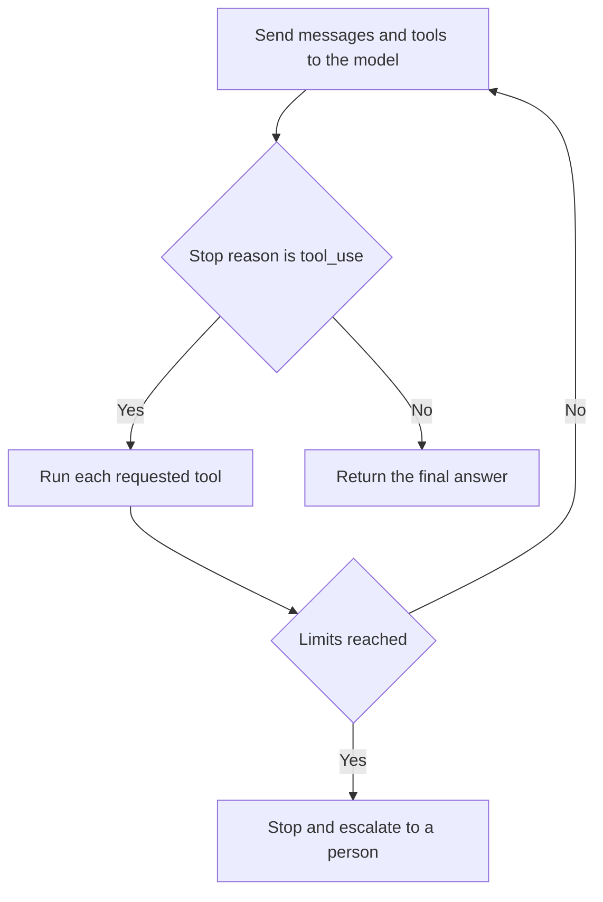

# The agent loop

**Course:** Agentic AI, from first principles to production · Module 4 Agent Core · lesson 21 of 77 · **about 3 hours** · paper draft for review.  
**Success criterion:** Write the loop as pseudocode and explain 3 ways it can run away or get stuck, with one guard for each.

> Sources (read 2026-10-02; details and gaps in docs/research/agentic-ai): Anthropic documentation 'How tool use works' (the loop keyed on stop_reason, the exit stop reasons, the iteration limit of server-side loops and pause_turn), 'Handle tool calls' and 'Messages API' (stop reasons, usage), read 2026-10-02 through page summaries and full page text. The reference code on this page was written by us and run on Python 3.14.7 with Pydantic 2.13.4 and pytest 9.1.1 against a scripted stand-in for the model (11 tests passed). It uses the same message shapes as Anthropic's documented Messages API, but it has not been run against the real API, because that needs a key and spends money. The runaway guards (a turn limit, a token budget, a repeated-call detector) are our design; Anthropic's pages describe the loop and do not prescribe these limits. Unverified: sensible values for the limits depend on your task; the numbers in the code are examples.

---

## Part 1 · The loop in plain words

An agent is a loop. Anthropic's documentation gives its canonical shape for client-executed tools, keyed on the `stop_reason` of each reply:

1. Send a request with your tools and the user's message.
2. If the reply's stop reason is `tool_use`, it contains one or more tool requests. Run each one and collect the results.
3. Send a new request with the original messages, the model's reply, and a user message holding the results.
4. Repeat while the stop reason is `tool_use`.

Any other stop reason ends the loop: `end_turn` (the model has finished), `max_tokens` (it was cut off), `stop_sequence` or `refusal`. Your code must handle each of them, because a cut-off or refused reply is not a finished answer.


In pseudocode: `while turns < MAX: reply = model(messages); if reply is not asking for tools: return it; results = run tools; messages += reply, results`.

**Worked example**

Fictional. 'What is the status of ticket 101?' takes two turns: turn 1 the model asks for `lookup_ticket(101)`; your code runs it; turn 2 the model reads the result and answers.

**Common mistake**

Looping forever on `while True` and trusting the model to say it is done.

**Check yourself.** Which stop reason keeps the loop going, and name two that end it.

<details><summary>Model answer (write yours first)</summary>

`tool_use` keeps it going. `end_turn`, `max_tokens`, `stop_sequence` and `refusal` end it; `max_tokens` and `refusal` mean the answer may be incomplete.

</details>

---

## Part 2 · The reference loop

Here is a complete, small loop with its guards, taken from the files we ran. It works with the real Anthropic client or anything with the same `messages.create` shape. Lessons 22, 23 and 25 add the pieces it calls (`execute`, the approval gate, idempotency).

```python
"""The agent loop. It works with the real Anthropic client or any object with the same messages.create shape."""
import json

from pydantic import ValidationError


class AgentStopped(Exception):
    pass


def final_text(resp) -> str:
    return "".join(b.text for b in resp.content if b.type == "text")


def execute(block, registry, gate):
    """Run one tool_use block and return a tool_result block. Never raises: errors go back to the model."""
    def result(text, is_error=False):
        r = {"type": "tool_result", "tool_use_id": block.id, "content": text}
        if is_error:
            r["is_error"] = True
        return r

    tool = registry.get(block.name)
    if tool is None:
        return result(f"Unknown tool {block.name!r}. Available tools: {sorted(registry)}", True)
    try:
        args = tool.model.model_validate(block.input)
    except ValidationError as e:
        return result("Invalid input: " + "; ".join(f"{'.'.join(map(str, x['loc']))}: {x['msg']}" for x in e.errors()), True)
    if tool.writes and not (gate and gate.approve(tool.name, args.model_dump())):
        return result("A person did not approve this action, so it was not run. Tell the user and stop.", True)
    try:
        return result(json.dumps(tool.fn(args, block.id)))
    except Exception as e:                  # the tool failed: tell the model what happened and what to try
        return result(f"{type(e).__name__}: {e}", True)


def run_agent(client, model, system, registry, user_text, *, gate=None, max_turns=8, max_total_tokens=20000,
              max_same_call=3, on_event=print):
    tools = [t.spec() for t in registry.values()]
    messages = [{"role": "user", "content": user_text}]
    spent, seen = 0, {}
    for turn in range(1, max_turns + 1):
        resp = client.messages.create(model=model, max_tokens=1024, system=system, tools=tools, messages=messages)
        spent += resp.usage.input_tokens + resp.usage.output_tokens
        messages.append({"role": "assistant", "content": resp.content})
        if resp.stop_reason != "tool_use":
            return final_text(resp), messages
        if spent > max_total_tokens:
            raise AgentStopped(f"token budget exceeded: {spent} > {max_total_tokens}")
        results = []
        for b in resp.content:
            if b.type != "tool_use":
                continue
            sig = (b.name, json.dumps(b.input, sort_keys=True))
            seen[sig] = seen.get(sig, 0) + 1
            if seen[sig] >= max_same_call:
                raise AgentStopped(f"stuck: {b.name} called {seen[sig]} times with the same input")
            r = execute(b, registry, gate)
            on_event(f"turn {turn}: {b.name}({json.dumps(b.input)}) -> {'ERROR ' if r.get('is_error') else ''}{r['content'][:70]}")
            results.append(r)
        messages.append({"role": "user", "content": results})
    raise AgentStopped(f"no final answer after {max_turns} turns")
```
Things to notice: the message list grows each turn (this is the 'desk' from Module 1, so cost and context both grow); the loop returns on any stop reason that is not `tool_use`; and three guards raise `AgentStopped`.

**Worked example**

Fictional. With `max_turns=8`, a task that should take 3 turns but loops reaches the limit at turn 8 and stops, instead of spending without end.

**Common mistake**

Putting a limit on turns but not on tokens. Eight turns with ever-larger messages can cost far more than eight small ones.

**Check yourself.** Why does an agent's cost grow faster than its number of turns?

<details><summary>Model answer (write yours first)</summary>

Each request resends the whole conversation, which grows every turn, so the input tokens of later turns are larger than those of earlier ones.

</details>

---

## Part 3 · Three ways it runs away, and a guard for each

1. **Never finishing:** the model keeps asking for tools. **Guard:** a turn limit (`max_turns`).
2. **Stuck:** the model repeats the same call with the same input, hoping for a different result. **Guard:** count identical calls and stop at a small number (`max_same_call`).
3. **Runaway cost:** many turns, or large tool results, push the tokens up. **Guard:** a total token budget (`max_total_tokens`), checked from each reply's `usage`.

Other guards worth adding: a wall-clock deadline for the whole run, a cap on how large any tool result may be before it is trimmed, and an explicit path to a person when a guard fires.

Our scripted run of a model that never stops asking for the same ticket printed:

```text
turn 1: lookup_ticket({"ticket_id": 101}) -> {"id": 101, "title": "VPN drops every hour", "status": "open", "commen
turn 2: lookup_ticket({"ticket_id": 101}) -> {"id": 101, "title": "VPN drops every hour", "status": "open", "commen
stopped: stuck: lookup_ticket called 3 times with the same input
```
(The output lines are cut at 70 characters by the demo.) When a guard fires, do not retry silently: log the full message history, tell the user plainly what happened, and route the task to a person.

**Worked example**

Fictional. A search tool returns an empty list; the model calls it again with the same query, again and again. The repeated-call guard stops it on the third call, and the log shows the query.

**Common mistake**

Treating a guard as a failure to hide. A fired guard is information: record it and use it to improve the prompt or the tool.

**Check yourself.** Name the three runaways and the guard for each.

<details><summary>Model answer (write yours first)</summary>

Never finishing: turn limit. Stuck repeating a call: repeated-call counter. Runaway cost: total token budget (plus a wall-clock deadline for time).

</details>

---

## Part 4 · What to log

An agent you cannot replay is an agent you cannot fix. For every run, log: the run id, the model and settings, the system prompt version, each turn's tool requests and results, token usage per turn, the stop reason, which guard fired if any, and the final answer. In the reference loop, the `on_event` hook prints one line per tool call; in a real system write structured records. Module 9 builds tracing on top of exactly this.

**Worked example**

Fictional. A user reports a wrong answer. With the log you see turn 2 read ticket 102 instead of 101 because the model misread the question, which tells you whether to fix the prompt or the tool.

**Common mistake**

Logging only the final answer. The mistake is almost always in a middle step.

**Check yourself.** Why log every tool request and result, not just the answer?

<details><summary>Model answer (write yours first)</summary>

Errors happen in the middle steps; the log lets you replay a run, see which step went wrong, and add it to your test set.

</details>

---

## Do it: lab

1. Write the loop as pseudocode from memory, then compare with the reference loop. Note anything you missed.
2. Save the reference files from this lesson and lessons 22 and 23 (`tools.py`, `gate.py`, `loop.py`, `fake_model.py`) into a folder and run `pytest` to see the tests pass.
3. Add one new runaway guard of your own, for example a wall-clock deadline, and write a test that makes it fire.
4. Explain in your own words three ways a loop can run away or get stuck and the one guard for each.
5. If you have a key, replace the scripted model with the real client for one question, and print the stop reason and token usage per turn.

**Done when:** your pseudocode matches the loop's structure, three runaways each have a guard, your own guard has a passing test, and you can show a log of a run with a fired guard.

---

## Interview check

**Question.** What stops an AI agent from running forever or spending a fortune?

<details><summary>A strong answer has this shape</summary>

1. Hard limits in code, not in the prompt: a maximum number of turns, a total token or cost budget, a wall-clock deadline, and a detector for repeated identical calls.
2. Limits on tool results (trimmed) and on what the agent may do (permissions, approvals).
3. A defined path when a limit fires: log everything, tell the user, hand to a person.
4. Monitoring of cost and turns per task, with alerts, and tests that make each guard fire.
5. Business view: set the maximum cost per task and agree what happens when it is hit.

</details>

---

## Evidence to keep

Keep the pseudocode, the guard you added with its test, and a log of a run where a guard fired.

---
