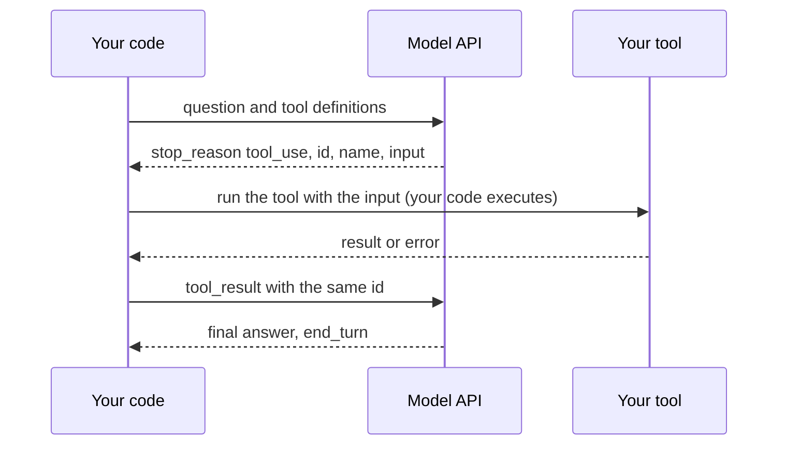

# Function and tool calling

**Course:** Agentic AI, from first principles to production · Module 4 Agent Core · lesson 22 of 77 · **about 3 hours** · paper draft for review.  
**Success criterion:** Draw the request/response cycle end to end, mark who actually executes the tool, and show one failed tool call and how the model is told about it.

> Sources (read 2026-10-02; details and gaps in docs/research/agentic-ai): Anthropic documentation 'Tool use with Claude' (the round trip, client and server tools, tool_choice, pricing of tool tokens), 'Define tools' (definition fields, description guidance, tool_choice restrictions on current models), 'Handle tool calls' (tool_use and tool_result fields, ordering rules, is_error, untrusted content) and 'How tool use works', all read 2026-10-02 through page summaries and full page text. The reference code on this page was written by us and run on Python 3.14.7 with Pydantic 2.13.4 and pytest 9.1.1 against a scripted stand-in for the model (11 tests passed). It uses the same message shapes as Anthropic's documented Messages API, but it has not been run against the real API, because that needs a key and spends money. Vendor-specific: field names, restrictions and the tool-use token overhead (286 tokens on two current models, per the pricing table on 2026-10-02) are Anthropic's and change. Unverified: how any one model chooses between tools on your task; test it.

---

## Part 1 · The contract: the model asks, your code acts

Anthropic's guide states it directly: the model never executes anything on its own. It emits a structured request; your code (or, for server tools, the vendor's servers) runs the operation, and the result flows back into the conversation. You treat it like any typed interface: define the schema, handle the callback, return a result.


The pieces, with the documented field names: a `tool_use` block has an `id`, a `name` and an `input` (a JSON object matching the tool's schema). Your reply is a `user` message whose content has a `tool_result` block with the same `tool_use_id`, a `content` and, if it failed, `is_error: true`.

**Worked example**

Fictional. The model returns `tool_use` with id `toolu_01`, name `lookup_ticket`, input `{"ticket_id": 101}`. You look up ticket 101 and return a `tool_result` for `toolu_01` containing its title and status.

**Common mistake**

Thinking the model has looked something up. Until your code returns a result, nothing happened.

**Check yourself.** In the cycle, who executes the tool, and how does the model learn the result?

<details><summary>Model answer (write yours first)</summary>

Your code executes it. The model learns the result from the `tool_result` block you send in the next request, matched by `tool_use_id`.

</details>

---

## Part 2 · Defining a tool the model can use well

A user-defined tool has a `name` (letters, digits, underscores and hyphens, up to 128 characters), a `description` and an `input_schema` (JSON Schema). Anthropic says the description is 'by far the most important factor' in tool performance and asks for at least 3 to 4 sentences: what the tool does, when to use it and when not to, what each parameter means, and its limits. More guidance from the same page:

- **Consolidate** related operations into fewer tools with an `action` parameter, which reduces selection confusion.
- **Namespace** names when tools span services (`github_list_prs`, `slack_send_message`).
- **Return only high-signal data** with stable ids; bloated results waste context.
- For complex inputs, add `input_examples`.
- If a parameter asks for the model's reasoning, ask for a short explanation instead.

Generate the schema from a Pydantic model so the definition and the validation cannot drift apart. These are the tools used throughout this module:

```python
"""Tools for a small ticket assistant. One read-only tool, one write tool."""
from dataclasses import dataclass
from typing import Callable

from pydantic import BaseModel, Field

TICKETS = {
    101: {"title": "VPN drops every hour", "status": "open", "comments": []},
    102: {"title": "Printer on floor 3 offline", "status": "open", "comments": []},
}
APPLIED = {}          # idempotency key -> result, so a retried write is not applied twice


class LookupTicket(BaseModel):
    ticket_id: int = Field(description="Numeric ticket id, for example 101")


class AddComment(BaseModel):
    ticket_id: int
    text: str = Field(min_length=3, max_length=500)


def lookup_ticket(args: LookupTicket, key: str) -> dict:
    t = TICKETS.get(args.ticket_id)
    if t is None:
        raise KeyError(f"No ticket {args.ticket_id}. Known ids: {sorted(TICKETS)}")
    return {"id": args.ticket_id, **t}


def add_comment(args: AddComment, key: str) -> dict:
    if key in APPLIED:                      # same key seen before: return the earlier result
        return APPLIED[key]
    TICKETS[args.ticket_id]["comments"].append(args.text)
    result = {"ok": True, "ticket_id": args.ticket_id, "comments": len(TICKETS[args.ticket_id]["comments"])}
    APPLIED[key] = result
    return result


@dataclass
class Tool:
    name: str
    description: str
    model: type
    fn: Callable
    writes: bool = False

    def spec(self) -> dict:
        return {"name": self.name, "description": self.description, "input_schema": self.model.model_json_schema()}


REGISTRY = {t.name: t for t in [
    Tool("lookup_ticket",
         "Look up one support ticket by its numeric id and return its title, status and comments. Read-only. "
         "Use it whenever the user asks about a specific ticket. It does not search by text.",
         LookupTicket, lookup_ticket),
    Tool("add_comment",
         "Add a comment to one ticket. This changes data and needs a person's approval. Use it only when the user "
         "explicitly asks to add a comment, and never to close or reassign a ticket.",
         AddComment, add_comment, writes=True),
]}
```
Note the descriptions: `lookup_ticket` says what it does, that it is read-only, when to use it, and that it does not search by text; `add_comment` says it changes data, needs approval, and what it must not be used for.

**Worked example**

Fictional. A tool description that just says 'Gets tickets.' leaves the model guessing whether it can search by text. Adding 'It does not search by text; it needs a numeric id' prevents wrong calls.

**Common mistake**

One-line tool descriptions. The model knows only what you write.

**Check yourself.** Name three things a good tool description states.

<details><summary>Model answer (write yours first)</summary>

What the tool does, when to use it (and when not to), and what each parameter means or any limits. Also what it does not return.

</details>

---

## Part 3 · Handling calls and failures

Rules from the documentation for what you send back:

- The `tool_result` must immediately follow the `tool_use` message, and in the user message the `tool_result` blocks must come first, before any text. Getting the order wrong returns a 400 error.
- If the tool fails, return the error message with `is_error: true` and make it **instructive**: 'Rate limit exceeded. Retry after 60 seconds.' beats 'failed'.
- If the model sends invalid input (a missing parameter), you can return that as an error and the model will usually retry; the docs say it tries 2 to 3 times with corrections before apologising. To avoid invalid calls entirely, set `strict: true` so inputs always match the schema.
- **Treat tool results as untrusted.** They can carry web pages, emails and API responses, any of which may hold instructions aimed at the model (indirect prompt injection). Keep them inside `tool_result` blocks, never in the system prompt. Module 9 covers defences.

Here is the part of the reference loop that does this. It validates the input, enforces the gate for writes (lesson 23), runs the tool, and always returns a result block, never an exception:

```python
def execute(block, registry, gate):
    tool = registry.get(block.name)
    if tool is None:
        return result(f"Unknown tool {block.name!r}. Available tools: {sorted(registry)}", True)
    try:
        args = tool.model.model_validate(block.input)
    except ValidationError as e:
        return result("Invalid input: " + "; ".join(...), True)
    if tool.writes and not (gate and gate.approve(tool.name, args.model_dump())):
        return result("A person did not approve this action, so it was not run. Tell the user and stop.", True)
    try:
        return result(json.dumps(tool.fn(args, block.id)))
    except Exception as e:
        return result(f"{type(e).__name__}: {e}", True)
```
(Shortened; the full version is in lesson 21.) A scripted run in which the model first asks for a ticket that does not exist, is told so, and tries again printed:

```text
turn 1: lookup_ticket({"ticket_id": 999}) -> ERROR KeyError: 'No ticket 999. Known ids: [101, 102]'
turn 2: lookup_ticket({"ticket_id": 101}) -> {"id": 101, "title": "VPN drops every hour", "status": "open", "commen
Ticket 101: VPN drops every hour (open).
```
The error message names the problem and lists valid ids, so the model can recover. (In this script the model's replies are scripted by us; a real model's recovery is not guaranteed.)

**Worked example**

Fictional. A 'create_user' tool fails with 'email already exists'. Returning that text with `is_error` lets the model tell the user, rather than inventing a success.

**Common mistake**

Letting a tool exception crash the loop, or returning an empty result for an error. The model then believes the tool worked.

**Check yourself.** Why return an error as a tool_result with is_error instead of raising an exception?

<details><summary>Model answer (write yours first)</summary>

So the model learns what happened and can adapt or tell the user. An exception ends your run, and an empty result hides the failure.

</details>

---

## Part 4 · Choosing when to call, and what it costs

`tool_choice` controls whether the model must call a tool: `auto` (the default, the model decides), `any` (must use some tool), `tool` (must use a named tool) and `none` (no tools). Restriction to know, as documented on 2026-10-02: several current models, including Claude Opus 5.5 and Sonnet 5.5, reject `any` and `tool` with a 400 error. On those, use `auto` with `strict` tools to guarantee valid inputs, or structured outputs when you need a fixed reply shape, and steer with the system prompt ('Use the tools to investigate before responding').

Parallel calls: the model may request several tools in one reply, and you return all their results in the same user message. `disable_parallel_tool_use` limits it to one.

**Cost.** Tool use is billed as ordinary tokens: the tool definitions you send count as input tokens on every request, as do `tool_use` and `tool_result` content, and the API adds a fixed tool-use system prompt (286 tokens on Opus 5.5 and Sonnet 5.5 per the vendor's table; other models differ). Many large tool definitions on every turn is a real cost, which is why lesson 16 asked you to keep the tool set small.

**Worked example**

Fictional. 12 tools with 150-token definitions add 1,800 input tokens to every request. Over 6 turns that is 10,800 tokens before the conversation itself.

**Common mistake**

Forcing a tool with `tool_choice` on a model that rejects it, and reading the 400 as a bug in your tool.

**Check yourself.** Why does a long tool list increase cost even if the tools are rarely used?

<details><summary>Model answer (write yours first)</summary>

Every request sends all the tool definitions as input tokens, whether or not a tool is called.

</details>

---

## Do it: lab

1. Draw the request and response cycle from memory for one tool, and mark who executes the tool at each step.
2. Write a tool of your own with a description that states what it does, when to use it and when not to. Generate its schema from a Pydantic model.
3. Run it with the scripted model so that one call fails. Show the error message returned to the model and the model's next call.
4. Rewrite the error message two ways, vague and instructive. Explain which would help the model recover and why.
5. Count the tokens of your tool definitions with a token counter and compute their cost per request at your model's input price (date the price).
6. If you have a key, run the real model on the same question and compare its choice of tool with the scripted one.

**Done when:** your diagram marks who executes the tool, one failed tool call is shown with the exact message the model receives, and tool-definition tokens are counted and costed with a dated price.

---

## Interview check

**Question.** How does an LLM 'call a function', and what can go wrong?

<details><summary>A strong answer has this shape</summary>

1. It does not execute anything. It returns a structured request (tool name and JSON input). Your code validates and runs it, then returns the result in the next request.
2. Things that go wrong: the model picks the wrong tool or invents parameters (mitigate with clear descriptions, strict schemas and validation), the tool fails (return an instructive error), the input is malicious or the result carries injected instructions (treat tool results as untrusted), and loops run away (limits).
3. For actions that change things: permissions, approval and idempotency (lessons 23 and 25).
4. Cost: definitions and results are tokens on every request.

</details>

---

## Evidence to keep

Keep the diagram, the tool with its schema, the failed-call log and the token count. They go into your Module 4 build.

---
