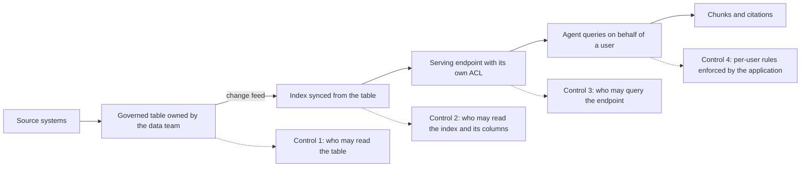

# Data foundations for agents

**Course:** Agentic AI, from first principles to production · Module 5 RAG and Data · lesson 32 of 77 · **about 4 hours** · paper draft for review.  
**Success criterion:** Sketch how governed lakehouse tables become a retrieval source, naming who controls access, freshness and lineage at each step.

> Sources (read 2026-10-02; details and gaps in docs/research/agentic-ai): Databricks documentation 'AI Search' (shown under that name; the course roadmap and older pages say Mosaic AI Vector Search; page updated 2026-09-14: Delta Sync and direct access indexes, managed and self-managed embeddings, Unity Catalog governance, endpoint ACLs, limits including no row-level or column-level permissions) and 'Create and query an index' (updated 2026-09-14: change data feed required on the source table for standard endpoints; continuous and triggered sync; only indexed columns can be returned or used as filters); Microsoft Learn 'RAG and generative AI - Azure AI Search' (page dated 2026-08-04, updated 2026-09-17: permission-aware knowledge, Entra ID permission metadata, Foundry IQ); Microsoft Learn 'Chunk documents' (2026-06-08). Read 2026-10-02 through page summaries. The flow diagram and the ownership table are ours, assembled from those pages. Unverified: whether Unity Catalog lineage records the link from a source table to its vector index (we did not find it stated); how metadata filters interact with Unity Catalog permissions (the page we read gives no syntax); Databricks' product naming, which was in transition in the pages we read; and every limit and price, which move.

---

## Part 1 · Why agent quality is a data quality problem

An agent is only as good as what it can read and what it is allowed to do with it. For a retrieval agent the data properties that decide quality are not exotic:

- **Correctness and completeness:** missing rows, wrong units, truncated documents. The model cannot tell a wrong number from a right one.
- **Freshness:** an answer built from last quarter's table is wrong in a way no prompt can fix. Freshness is a measurable promise (for example 'a change in the source table is searchable within 15 minutes'), and you should test it.
- **Duplicates and versions:** two near-identical documents compete for the same slot, and a superseded policy can outrank the current one (our demo's 20-day-leave failure).
- **Definitions:** 'active customer' means different things in different tables. If the definition is not in the data or the documents, the agent will guess.
- **Access:** who may see which rows, files and columns; this must survive the trip into an index (lesson 27).
- **Ownership:** a named person who answers 'is this table right and who changes it'.

None of these is solved by a better model. They are the work of the data platform team, which is why a product or program owner for an agent must ask data questions early: *who owns this source, how fresh is it, what are its definitions, who may see it, and how will I know when it is wrong?*

**Worked example**

Fictional. A finance assistant answers 'what was last month's revenue?' from a table that is refreshed weekly and has two columns, revenue and net_revenue, with no description. It will confidently quote the wrong one. The fix is in the table's documentation and the semantic layer, not in the prompt.

**Common mistake**

Treating the data as a given and the model as the variable. In most failing agents, the first thing to change is the data contract, not the model.

**Check yourself.** Name three data properties that decide whether a retrieval agent answers correctly, and one question to ask the data team about each.

Model answer (write yours first)

Freshness (how long until a source change is searchable?), versions and duplicates (which document is current?), and access (who may see which rows or files, and how is that enforced in the index?). Also definitions, ownership and correctness.

---

## Part 2 · From lakehouse tables to a retrieval source

In a lakehouse the governed data lives in tables. Here is the path from a table to an answer on Databricks, with who controls what at each step. The shape on Azure AI Search is similar (indexers and permission metadata instead of Delta Sync), and the table below covers both.

| Step | What happens | Who controls access | Who controls freshness | Lineage and audit |
|---|---|---|---|---|
| Source tables (bronze, silver, gold) | Raw to cleaned to curated data | Table permissions in Unity Catalog (Databricks) or the source's own rules | The pipeline owner's schedule and quality checks | Table lineage is a Unity Catalog feature; we did not verify anything beyond tables |
| Prepare text | Choose the columns or documents to index, chunk, add titles and dates | The data team decides what is indexable | Rerun when sources change | Keep the chunking code and its version |
| Index | **Delta Sync**: the index follows the source table (needs change data feed or row tracking), with managed or self-managed embeddings | Index governed through Unity Catalog; only the columns you index can be returned or filtered | **Continuous** (seconds of latency, costs more) or **triggered** (you start each sync) | The index is a governed object; whether lineage links it to its source table was not verified |
| Endpoint | Hosts the index and serves queries | Endpoint access list | Capacity and sync mode | Query logs, if enabled |
| Agent | Queries on behalf of a user and builds the answer | Your application: identity, per-user filters | Not applicable | Your own audit log (lessons 24 and 37) |

The key design constraint from the pages we read: the Databricks AI Search documentation says row-level and column-level permissions are not supported on the index. If different users may see different rows, you have three options: a **separate index per audience** (simple, more storage and sync work), a **metadata column plus an application filter** (flexible, but the application, not the platform, enforces it and you must test it), or **do not index** the sensitive rows. On Azure AI Search the documentation describes document-level security trimming using permission metadata, including Microsoft Entra ID permission metadata for some sources.

**Worked example**

Fictional. A governed table of 3 million support-ticket summaries, with a region column and teams that may only see their own region. Option 1: one index per region (three indexes). Option 2: one index with a region column and an application filter that always adds the caller's region from their verified identity. The test: a user in region A must never see a region B chunk, in 100 trial questions.

**Common mistake**

Assuming the index inherits the table's row rules. On the platform we read, it does not; check the current documentation and test the behaviour with two users before you rely on it.

**Check yourself.** A table has region-level access rules and the index does not support row-level permissions. Give two designs and the test for either.

Model answer (write yours first)

One index per region, or one index with a region column and an application filter that uses the caller's verified identity. Test: as a user in one region, ask many questions and confirm no chunk from another region ever appears.

---

## Part 3 · Freshness, quality gates and what to ask the data team

Three practices turn the diagram into a dependable service.

1. **Set and test a freshness target.** Decide the promise ('searchable within 15 minutes of a change', or 'next morning'), choose continuous or triggered sync to match it, and test it: change a row, time how long until a question about it returns the new text. Continuous sync costs more, which is a product trade-off to put in front of the owner.
2. **Gate what enters the index.** Run data quality checks on the table before sync: no empty text, no duplicates beyond a limit, dates present, a version or 'supersedes' field. Fail the sync or quarantine the rows rather than index bad data. This is a plain-code control, in the spirit of the DataOps detection tiers you build in lesson 37.
3. **Keep the chain accountable.** Name an owner for each source and for the index, record which table and version each chunk came from, and log which chunks went into which answer so a wrong answer can be traced back (lesson 31).

Questions a product or program owner should be able to put to the data team in a first meeting:

- Who owns each source, and what is their change process?
- How fresh is it today, and how would we notice if it went stale?
- What are the definitions of the key fields, written where?
- Who may see which rows and columns, and how does that carry into the index?
- What quality checks run before data reaches the index, and who is alerted?
- What is the cost of keeping the index in sync at the freshness we want?
- Can we trace an answer back to the rows it came from?

**Worked example**

Fictional. A freshness test on a triggered-sync index: row changed at 10:00; the nightly trigger runs at 02:00; the answer is wrong for 16 hours. The owner either accepts that, or pays for continuous sync, or triggers on change. The test turned a vague 'it should be fresh' into a number to decide on.

**Common mistake**

Promising 'real time' to users because the platform supports continuous sync, without checking the source pipeline, which may refresh the table itself only nightly.

**Check yourself.** Why can continuous sync still give stale answers?

Model answer (write yours first)

It only keeps the index current with the source table. If the pipeline that fills the table runs nightly, the index is as stale as the table. Freshness is limited by the slowest stage.

---

## Do it: lab

1. Pick a real or realistic data source from your work (a table of tickets, a document library, a runbook set). Write down its owner, refresh schedule, definitions, and who may see which parts. Mark each as known or unknown.
2. Draw the path from that source to a retrieval agent in the shape of the diagram: source, governed table, prepared text, index, endpoint, agent. Under each box write who controls access, who controls freshness, and what is logged.
3. Choose how you would handle per-user access given that the platform's index may not support row-level rules. State the design and write the two-user test.
4. Choose a freshness promise and the sync mode that delivers it. Write the freshness test (what you change, what you ask, what time you accept) and its cost trade-off in a sentence.
5. List the 7 questions for the data team and mark which of them you could not answer for your source. Those gaps are your risks.

**Done when:** you have a sketch with owners, access, freshness and logging named at every step, an access design with a two-user test, a freshness promise with a test, and a list of unanswered data-team questions.

---

## Interview check

**Question.** We want a chat agent over our lakehouse data. What do you need to know before we build it?

A strong answer has this shape

1. What data and who owns it: tables, documents, their quality and definitions.
2. Who may see what, and how that carries into the index. On some platforms an index has no row-level permissions, so I would plan separate indexes or an application filter, and test it with two users.
3. How fresh the answers must be and how fresh the pipeline actually is; continuous sync cannot beat a nightly source.
4. What quality gates run before indexing, and who is alerted when they fail.
5. How we trace an answer back to its source rows, and what we log.
6. The cost of embedding, storage, sync and queries at our scale, and who pays.
I would not start building before I could answer the ownership, access and freshness questions.

---

## Evidence to keep

Keep the sketch, the access design and its test, the freshness promise and test, and the list of gaps. They feed the Databricks and Azure architecture work in Module 11.

---
