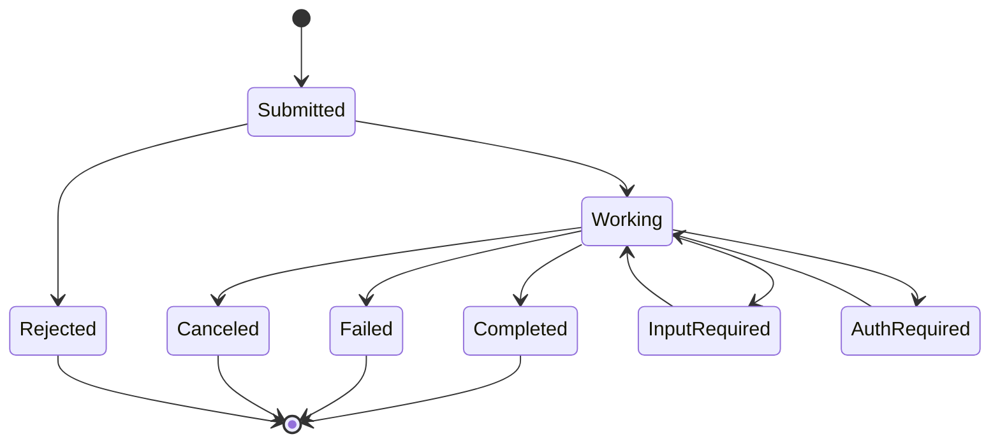

# A2A fundamentals

**Course:** Agentic AI, from first principles to production · Module 7 MCP and A2A · lesson 41 of 77 · **about 2 hours** · paper draft for review.  
**Success criterion:** Produce a table of MCP vs A2A (what each connects, who calls whom, when to use each) and mark any claim you could not verify in the specification.

> Sources (read 2026-10-02; details and gaps in docs/research/agentic-ai): Agent2Agent (A2A) Protocol specification, version 1.0.0 (a2a-protocol.org/latest/specification), read 2026-10-02 through page summaries: Agent Card at /.well-known/agent-card.json, tasks and their states, messages, parts and artifacts, the three bindings, streaming, push notifications, authentication, the A2A-Version header, error names; official a2a-sdk 1.2.1, installed and run; Model Context Protocol specification 2026-07-28 (for the comparison); Microsoft Azure Architecture Center 'AI agent orchestration patterns' (2026-02-12). The code on this page was written by us and run on Python 3.14.7 with the official a2a-sdk 1.2.1 (A2A protocol 1.0). Agent B is served with the SDK; Agent A is plain httpx. We checked our JSON against the SDK's own protobuf types, ran both agents against each other on localhost, and ran 7 tests, which passed. The exact JSON shapes below come from that running server, not from the specification text: a page summary of the specification suggested the SendMessage result was a bare Task, and the running server wrapped it as {"task": ...}. Where they differ, we trust the running server and say so. Unverified in this lesson: the specification text itself beyond the summaries (so the comparison table marks which rows we confirmed by running code); signed Agent Cards; streaming and push notifications; the gRPC and REST bindings; how the Linux Foundation or any vendor governs the protocol (we did not read that); production adoption claims.

---

## Part 1 · What A2A is for

MCP connects an agent to **tools and data**. A2A connects an agent to **another agent**, possibly one built by a different team or company, on a different stack, that you cannot see inside. The specification describes it for agents that carry out **stateful tasks**: work that can take a long time, ask for more input partway and return results later. That is different from calling a function, which returns at once.

The core ideas, each in plain words:

- **Agent Card:** a JSON document, served at `/.well-known/agent-card.json`, that describes an agent: its name and description, version, the endpoints and bindings it supports, its capabilities (streaming, push notifications), its skills, the content types it accepts, and the security schemes it requires. It is how one agent discovers another.
- **Task:** the unit of work, with an id the server generates. A task has a life (below) and produces **artifacts**, the outputs.
- **Message:** one turn of communication, with a role (user or agent) and **parts**: text, a file reference, or structured data.
- **Context:** a `contextId` groups related tasks and messages into one conversation.

The 'client agent' sends a message to the 'server agent'; the server agent may answer directly with a message or create a task and work on it. Agents stay **opaque**: A sees only B's card, messages and artifacts, never B's prompts, tools or memory.

The Agent Card our test agent serves (checked against the SDK's own `AgentCard` type, which accepted these field names):

```json
{
  "name": "Runbook agent",
  "description": "Looks up the runbook entry for a pipeline error code.",
  "version": "1.0.0",
  "supportedInterfaces": [{"url": "http://127.0.0.1:9101/a2a", "protocolBinding": "JSONRPC", "protocolVersion": "1.0"}],
  "capabilities": {"streaming": false, "pushNotifications": false},
  "defaultInputModes": ["text/plain"],
  "defaultOutputModes": ["text/plain"],
  "skills": [{"id": "runbook-lookup", "name": "Runbook lookup", "tags": ["runbook", "pipeline"], "description": "..."}]
}
```

**Worked example**

Fictional. Your DataOps agent needs a legal check on a data-sharing request. A separate legal-review agent, run by another team, publishes an Agent Card at its domain. Your agent reads the card, sees a skill 'contract-clause-review' that accepts text and files, sends a message, and later receives an artifact with findings. It never sees how the legal agent reasons or what tools it has.

**Common mistake**

Thinking an A2A agent is a tool. A tool is called and returns; an A2A agent is an independent party with its own goals, state and pace that you delegate work to.

**Check yourself.** What does an Agent Card let a client agent learn before it sends anything?

<details><summary>Model answer (write yours first)</summary>

Who the agent is, which endpoints and protocol bindings it supports, its capabilities (streaming, push), its skills, the content types it accepts, and how it must be authenticated.

</details>

---

## Part 2 · Tasks have a life

A task moves through states. The specification lists them; three are terminal in the sense that the work is over, and two are **interrupted**, meaning the agent needs something from the client before it can go on.

| State | Meaning | Kind |
|---|---|---|
| `TASK_STATE_SUBMITTED` | Acknowledged, not yet processing | Active |
| `TASK_STATE_WORKING` | Being processed | Active |
| `TASK_STATE_COMPLETED` | Finished successfully | Terminal |
| `TASK_STATE_FAILED` | Finished with an error | Terminal |
| `TASK_STATE_CANCELED` | Canceled before completion | Terminal |
| `TASK_STATE_REJECTED` | The agent declined to run it | Terminal |
| `TASK_STATE_INPUT_REQUIRED` | Waiting for the user or client to supply more | Interrupted |
| `TASK_STATE_AUTH_REQUIRED` | Authentication needed to continue | Interrupted |



The diagram shows the typical flow only. We did not read the specification's full transition rules, so treat it as an orientation, not a state machine to implement from.

How the client **learns** the state: the specification gives three ways, each needing a matching capability. **Polling** with `GetTask` is the simplest and has higher latency. **Streaming** (`SendStreamingMessage`, `SubscribeToTask`) keeps a connection open and delivers status and artifact events in order, when the card says `capabilities.streaming` is true. **Push notifications** make the server POST updates to a webhook the client registered, for long tasks without a held connection, when `pushNotifications` is true. We ran only the simple request and polling-style calls (`SendMessage`, `GetTask`); streaming and push are untested here.

The *interrupted* states are what make A2A different from a function call: a task can stop and ask a question ('which environment?') and continue when the client answers. That mirrors the human-approval pause in your own agents (lessons 23 and 33), but between two systems.

**Worked example**

Our runbook agent's real responses (from the running server): a known code ends `TASK_STATE_COMPLETED` with an artifact named `runbook-entry`; an unknown code ends `TASK_STATE_FAILED` with a status message 'No runbook entry found for that request.'; `GetTask` on an unknown id returns an error with code -32001 ('Task not found').

**Common mistake**

Assuming every A2A call finishes in one round trip. Handle `INPUT_REQUIRED`, `AUTH_REQUIRED` and long-running `WORKING` states explicitly, with timeouts.

**Check yourself.** Which two task states mean the agent cannot continue without the client, and which three mean the work is over?

<details><summary>Model answer (write yours first)</summary>

`INPUT_REQUIRED` and `AUTH_REQUIRED` are interrupted (they need the client). `COMPLETED`, `FAILED`, `CANCELED` (and `REJECTED`) are terminal.

</details>

---

## Part 3 · A2A and MCP: what each connects

The two protocols are complements, and mixing them up is a common mistake. This is the comparison table your criterion asks for. The last column says how we know each row: **R** means we ran it and saw it, **S** means we read it in a specification page (through a summary for A2A), **N** means it is our analysis.

| | MCP (2026-07-28) | A2A (1.0.0) | How we know |
|---|---|---|---|
| What it connects | An application or agent to **tools and data** (functions, resources, prompts) | An agent to **another agent** that does work | S |
| Who calls whom | A host's client calls a server's tools; the model decides, the host runs | A client agent sends messages and tasks to a server agent; the server agent decides how to do the work | S |
| Unit of work | A tool call that returns a result | A **task** with states, artifacts and a context | R |
| Discovery | `tools/list` from a connected server (we also saw `server/discover`) | Agent Card at `/.well-known/agent-card.json` | R |
| Messages | JSON-RPC 2.0 with `_meta` on each request | JSON-RPC 2.0 (also gRPC and HTTP+JSON bindings per the spec) with an `A2A-Version` header | R for JSON-RPC; S for the others |
| State | Stateless requests; explicit handles if a server needs state | Tasks and contexts hold state; interrupted states pause for input | R |
| Long-running work | An extension (Tasks) for async operations | Native: polling, streaming, push notifications | S |
| Opacity | The model sees tool names, descriptions and results | The client sees only the card, messages and artifacts of the other agent | S |
| Versioning | `_meta` carries the protocol version; unsupported versions are rejected | `A2A-Version` header on every request; we saw a missing or wrong header rejected (error -32009) | R |
| Auth | OAuth 2.1 for HTTP servers (lesson 40) | Schemes declared in the Agent Card (API key, HTTP, OAuth 2.0, OpenID Connect, mutual TLS) | S |
| Typical use | Give an agent hands: query a database, file a ticket | Give an agent colleagues: delegate a review, a purchase, a research task | N |

**Claims we could not verify**, which your criterion asks you to mark: how signed Agent Cards work in practice; whether streaming and push notifications behave as the page describes (not run); the gRPC and REST bindings (not run); the precise allowed task-state transitions; any statement about adoption or governance of either protocol. Mark them the same way in your own table.

When to use which: if the thing on the other side is a function with a fixed input and output, it is a **tool** (MCP, or a plain function). If it is a party that plans, may need clarification, takes time and might refuse, it is an **agent** (A2A). Many systems use both: an agent uses MCP to reach its tools and A2A to reach other agents.

**Worked example**

Fictional. A DataOps agent uses MCP to read pipeline logs (a tool call that returns a result), and uses A2A to hand a schema-change request to a data-owner agent, which may come back with INPUT_REQUIRED ('which table?'), later COMPLETED with an approval artifact.

**Common mistake**

Choosing A2A for everything because 'agents talk to agents'. If a plain function or tool suffices, an agent is more cost, latency and risk than you need (lesson 20).

**Check yourself.** A service takes a SQL query and returns rows. A service takes 'investigate this outage' and takes an hour, asking questions on the way. Which is better modelled with MCP and which with A2A?

<details><summary>Model answer (write yours first)</summary>

The SQL service is a tool: MCP (or a plain API). The outage investigation is a long-running, interactive piece of work done by an independent agent: A2A.

</details>

---

## Do it: lab

1. Fetch a published Agent Card (ours, from the lesson 42 build, or a public example) and read each field. Write one line for what a client would decide from each: where to send, how to authenticate, what content it accepts, whether it can stream.
2. Fill in the MCP-versus-A2A table in your own words for the six rows: what each connects, who calls whom, unit of work, discovery, state, and when to use each.
3. In a last column mark each claim as R (you ran it), S (you read it in the specification, with the page and date) or N (your analysis). Mark every claim you could not verify.
4. For each of three systems from your work (a database, a code reviewer, a procurement approval), decide MCP, A2A or plain function, and give the one-sentence reason.

**Done when:** your table covers what each protocol connects, who calls whom, and when to use each, every claim is marked R, S or N, the claims you could not verify are listed, and your three system decisions have reasons.

---

## Interview check

**Question.** What is the difference between MCP and A2A, and when would you use each?

<details><summary>A strong answer has this shape</summary>

1. MCP connects an agent or application to tools and data: a model decides, the host's client calls a server's tool and gets a result. A2A connects an agent to another agent that does stateful work: tasks with states, artifacts, and pauses for input.
2. Use a tool (MCP or a plain function) when the other side is a function with a clear input and output. Use A2A when the other side is an independent party that plans, may ask questions, takes time or may refuse.
3. They combine: an agent uses MCP for its tools and A2A to delegate to other agents.
4. For either, the risks are the same family: untrusted text, identity and authorization, and what happens on failure. I would also ask who owns the other agent, how it authenticates and what it logs.

</details>

---

## Evidence to keep

Keep the Agent Card annotation, your marked comparison table with the unverified list, and the three decisions. They feed the A2A build in lesson 42.

---
