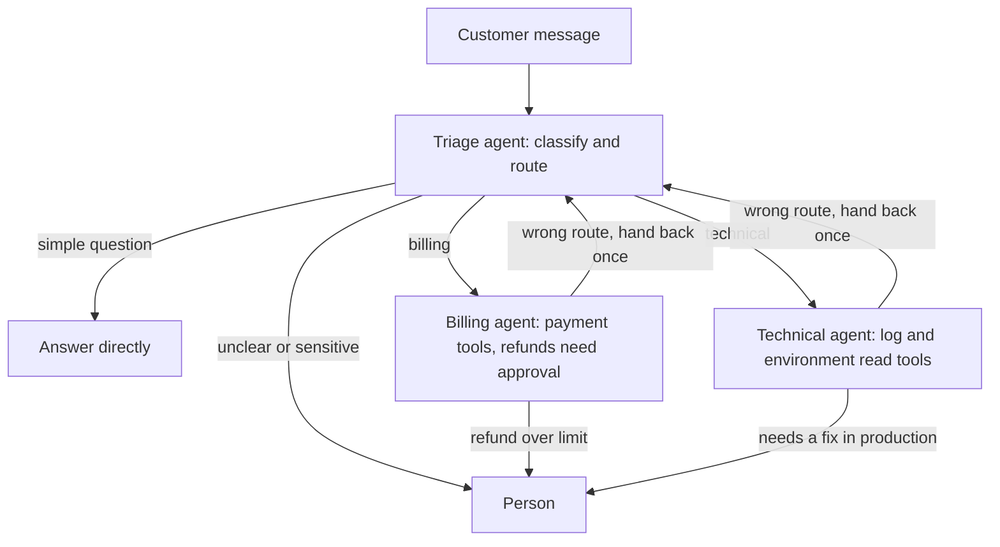

# Orchestration patterns

**Course:** Agentic AI, from first principles to production · Module 8 Multi-Agent · lesson 43 of 77 · **about 3 hours** · paper draft for review.  
**Success criterion:** Diagram which pattern fits a 3-agent support scenario and say why one agent would not do.

> Sources (read 2026-10-02; details and gaps in docs/research/agentic-ai): Microsoft Azure Architecture Center, 'AI agent orchestration patterns' (page dated 2026-02-12, updated 2026-09-21): the three levels of complexity, and the sequential, concurrent, group chat, handoff and magentic patterns with when to use and when to avoid each, plus considerations on context, reliability, security, cost, observability and human participation; Anthropic Engineering, 'How we built our multi-agent research system' (2025-06-13): the orchestrator-worker architecture, the reported 90.2 percent gain on an internal research evaluation, about 4 times the tokens of chat for an agent and about 15 times for a multi-agent system, and which tasks suit multi-agent; Anthropic Engineering 'Building effective agents' (via lesson 20); Claude Academy AI-native SDLC Playbook, 'Parallel sessions and subagents' (subagents are scoped helpers with their own context and tool limits), read 2026-10-02 through page summaries and, for the Microsoft page, in full. The names 'supervisor', 'hierarchical' and 'peer-to-peer' come from the roadmap and are not the sources' terms; the mapping to the sources' patterns in the table is ours. The code on this page (the multi folder) was written by us and run on Python 3.14.7; its 12 tests passed. The agents in it are plain functions and scripted stand-ins, with no real model, so it tests control logic and cost arithmetic, not the quality of any model's answers. Unverified: Anthropic's figures are their own, for research tasks, with the models of mid-2025; the cost model is a model, not a measurement; no claim here about a framework's implementation of a pattern.

---

## Part 1 · Start with one agent

Before you draw any boxes between agents, ask whether you need more than one. Microsoft's guide lays out a ladder you have already seen in lesson 20, and puts the multi-agent rung last:

| Level | When | Cost |
|---|---|---|
| Direct model call | One-step tasks: classify, summarise, translate | Least complex |
| Single agent with tools | Varied requests in one domain that need dynamic tool use. The guide says this is **often the right default for enterprise use cases** and tells you to set iteration limits against infinite tool-call loops | Simpler to debug and test |
| Multi-agent orchestration | Cross-domain problems, **distinct security boundaries** for each agent, or tasks that benefit from parallel specialisation | Adds coordination overhead, latency, and failure modes |

Its advice: **use the lowest level of complexity that reliably meets your requirements**, and justify the extra complexity because a single agent cannot reliably do the job, for one of three reasons: prompt complexity (one prompt cannot hold all the rules), tool overload (too many tools to choose among reliably), or security requirements (different parts must hold different permissions).

Anthropic's research-system write-up adds evidence from the other side. Its multi-agent system (a lead agent that spawns worker agents in parallel) beat a single agent by 90.2 percent on their internal research evaluation, and it cost far more: they report agents use about 4 times the tokens of a chat and multi-agent systems about 15 times. They say it pays off for high-value tasks with heavy parallelisation, information beyond one context window and many tools, and is a poor fit for tasks where all agents need the same context or depend heavily on each other, 'such as most coding tasks'. These are one company's results on one kind of task with the models of 2025, so read them as an illustration of the trade, not as a forecast for yours.

**Worked example**

Fictional. A support assistant that looks up orders, answers policy questions and drafts replies has three tools and one domain. A single agent with those tools is the default. Only if the billing tools need a different credential from the technical tools (a security boundary) does splitting begin to earn its cost.

**Common mistake**

Splitting into agents because the diagram looks organised. Each boundary adds a hand-off to test, a context to pass, a latency step and tokens to pay for.

**Check yourself.** What are the three reasons Microsoft's guide gives for moving from one agent to several?

Model answer (write yours first)

A single agent cannot reliably do the job because of prompt complexity, tool overload or security requirements (distinct permissions or boundaries).

---

## Part 2 · The patterns, and the names the roadmap uses

Microsoft's guide names five orchestration patterns. The roadmap's three words (supervisor, hierarchical, peer-to-peer) map onto them, loosely. The mapping below is **ours**, so check it against each source before you quote it.

| Pattern (Microsoft's name) | How it works | Routing decided by | Roadmap word (our mapping) | Best for | Watch out for |
|---|---|---|---|---|---|
| **Sequential** | A fixed pipeline: each agent takes the previous one's output | Code, in advance | none (a workflow) | Draft, review, polish; clear stage dependencies | Early errors propagate; no parallelism |
| **Concurrent** | Several agents work on the same input at once and results are combined | Code or dynamic selection | none (fan-out) | Independent perspectives, speed | Conflicting results need a rule; resource limits |
| **Group chat** | Agents contribute to a shared thread; a chat manager controls who speaks | Chat manager | peer-to-peer (with a moderator) | Brainstorming, maker-checker validation | Conversation loops; hard to control |
| **Handoff** | One active agent at a time; an agent transfers full control to a better-suited one | The agents | peer-to-peer (sequential delegation) | The right specialist emerges during the work | Infinite handoff loops; unpredictable paths |
| **Magentic** | A manager builds and updates a task ledger (a plan), assigns tasks to specialist agents, and checks progress | The manager | supervisor | Open-ended problems with no fixed plan | Slow to converge; stalls on vague goals |

The **orchestrator-worker** shape in Anthropic's system (a lead agent splits the task, spawns workers, collects and synthesises their results) is the supervisor idea in its simplest form. A **hierarchical** system is a supervisor whose workers are themselves supervisors of further workers. The guide notes agents in a pattern can invoke their own sub-orchestrations, which is how a hierarchy arises, and that you can **combine patterns**: sequential for early processing, then concurrent for parallelisable analysis. Do not force a workload with stages of different shapes into one pattern.

Both sources agree that most of these **cost more** (more model calls, more tokens, more latency) and that magentic orchestration is the **hardest to predict**, because the manager keeps iterating until it has a plan. And the guide's list of common pitfalls is worth remembering: using a complex pattern when sequential or concurrent would do, adding agents that do not provide real specialisation, ignoring the latency of multi-hop communication, and sharing mutable state between concurrent agents.

**Worked example**

Fictional. 'Review this contract' maps to **concurrent** (one agent per clause type, results merged). 'Fix this production incident, we do not know what is wrong' maps to **magentic** (a manager forms and revises a plan with diagnostics, infrastructure and communication agents, and stops for a person at risky steps). 'Triage this support email' is a **handoff** or even plain routing.

**Common mistake**

Choosing the most capable-sounding pattern (a manager that plans) for a problem with known steps. Known steps want a workflow; save planning agents for problems with no fixed plan.

**Check yourself.** A task has three known steps in a fixed order. Which pattern from the table, and is an agent needed at all?

Model answer (write yours first)

Sequential (a pipeline). Probably a workflow in code with a model call in each step; no planning agent is needed because the route is known.

---

## Part 3 · The 3-agent support scenario

Your criterion: diagram which pattern fits a 3-agent support scenario and say why one agent would not do. Here is a worked example you can adapt.

**Scenario (fictional).** A SaaS company's support line handles billing questions (refunds, invoices, plan changes) and technical questions (errors, outages, integrations). Billing tools can issue refunds and need payment-system credentials. Technical tools read logs and customer environments and need production read access. Some cases need a person.

**The pattern: handoff**, with a human as an explicit endpoint. The right specialist is not known until the message is read, only one agent works at a time, and full control moves with the case. Concurrent does not fit (no need to run billing and technical in parallel); sequential does not fit (the route differs by message); magentic is far too heavy.

**Why one agent would not do.** State it in terms of the three reasons, with honesty about which are strong:

1. **Security boundary (the strongest reason).** One agent with both the refund tool and production read access has the union of the permissions, so a successful injection through a customer message could reach both. Two agents, each with only its own tools and credentials, limit what any one compromise can do.
2. **Tool overload (medium).** With twenty billing tools and twenty technical tools, a single agent must choose among forty; splitting gives each a shorter, clearer list. Whether that matters depends on the model, and you should test it rather than assume.
3. **Prompt complexity (medium).** Billing policy and technical troubleshooting rules in one prompt may interfere. Again, test it.

If neither a security nor a measured quality reason holds, **one agent with a router in front is simpler and probably enough**. That is the honest answer to give in an interview: the multi-agent design must be justified, not assumed.

**Worked example**

Fictional cost view using our model from lesson 45: if each of the three agents holds a short context (a triage message, a billing history) instead of one agent carrying the whole conversation and all tool outputs, token use per case can fall; but each handoff adds a call and the packet must carry enough context. Whether the net is better depends on the case mix, which is a measurement, not an opinion.

**Common mistake**

Justifying the split with 'specialists are better'. Say what is different between them in a way you can test: permissions, tool lists, or measured accuracy.

**Check yourself.** Give the strongest reason a single agent might not do for the support scenario, and one reason to keep one agent.

Model answer (write yours first)

Strongest: a security boundary, since one agent would hold both payment credentials and production access. To keep one: tool overload and prompt complexity may be small and unproven, and a single agent with a router is simpler to test and cheaper.

---

## Part 4 · What to put in place whatever pattern you choose

Microsoft's guide ends with considerations that apply to every pattern. They are a good review checklist for a program owner:

- **Context and state.** Context windows grow fast because each agent adds reasoning, tool results and outputs. Decide what each next agent really needs: full raw context, a compact summary, or just a new instruction. Persist shared state outside memory for long tasks, scoped to the minimum.
- **Reliability.** Expect distributed-systems problems: failures, lost messages, cascades. Use timeouts and retries, degrade gracefully, surface errors rather than hiding them, **validate each agent's output before passing it on**, consider circuit breakers, and use checkpoints (lesson 33).
- **Security.** Authenticate between agents, apply least privilege, carry the user's identity across agents, and apply **security trimming in every agent** (lesson 27), because an intermediate agent with broad access must not return what the user cannot see. Apply content safety at several points: user input, tool calls, tool responses and final output.
- **Cost.** Every agent costs tokens for instructions, context and reasoning. Match model size to the task (classification and extraction can use smaller models) and measure tokens per agent and per run.
- **Observability and testing.** Instrument every handoff; track per-agent metrics; test agents individually and the whole flow; because outputs vary, use scoring rubrics or an LLM judge rather than exact matches.
- **Human participation.** Decide which points need a person (approval, feedback, escalation), whether they are mandatory, and persist state at each so the flow can resume without replaying work. You can place the gate on specific tool calls instead of whole outputs.

Anthropic's write-up adds two production notes: runs are stateful and errors compound, so resumable checkpoints matter; and you should start evaluating early with a small set (about 20 queries) instead of waiting for a large one.

**Worked example**

Fictional review question: 'When triage hands to billing, which parts of the conversation does billing receive?' If the answer is 'all of it', ask about cost and about leaking technical details; if 'a summary', ask who checked the summary kept the order number. Lesson 44 turns this into a tested packet.

**Common mistake**

Treating each agent as a separate small project. They share users, data and risk; identity, logging and approvals must be designed across them.

**Check yourself.** Name three considerations that apply to every orchestration pattern.

Model answer (write yours first)

Any three of: context and state passing, reliability (timeouts, validation of each agent's output, checkpoints), security (identity, least privilege, trimming in every agent), cost per agent, observability and testing, human approval points.

---

## Do it: lab

1. Take the 3-agent support scenario (or choose your own from work) and draw it as a diagram with the pattern named. Mark the human endpoints and which agent holds which permissions.
2. Write the answer to 'why would one agent not do?' using the three reasons, and mark each as strong, medium or unproven for your scenario. State how you would test the unproven ones.
3. Choose a pattern for two other cases from Microsoft's table (for example a contract review and an incident response) and say what each would cost relative to a single agent and why.
4. Use the cost model in lesson 45 to estimate the difference in tokens for your scenario for 10 and 100 cases a day. State the assumptions you made.
5. Write the checklist from section 4 for your scenario: how context is passed, how each agent's output is validated, which agent holds which credentials, and where a person approves.

**Done when:** your diagram shows which pattern fits a 3-agent scenario and where the humans are, you have written why one agent would not do (rated strong, medium or unproven, with tests for the unproven ones), and your checklist covers context, validation, credentials and approvals.

---

## Interview check

**Question.** When would you use multiple agents instead of one?

A strong answer has this shape

1. Only when one agent cannot reliably do the job: its prompt is too complex, it has too many tools to choose among, or different parts need different permissions or security boundaries; or the work parallelises across independent subtasks that exceed one context window.
2. Otherwise a single agent with tools is the default; it is simpler to build, test and debug.
3. I would pick the pattern from the shape of the work: sequential for fixed steps, concurrent for independent analyses, handoff when the right specialist emerges, a manager with a plan only for open-ended problems.
4. Multi-agent costs more tokens, latency and failure modes, so I would measure it against the single-agent version on the same cases before adopting it.

---

## Evidence to keep

Keep the diagram, the 'why not one agent' analysis with its strength ratings and tests, the two other pattern choices, the cost estimate with assumptions and the checklist. They feed lessons 44 and 45.

---
