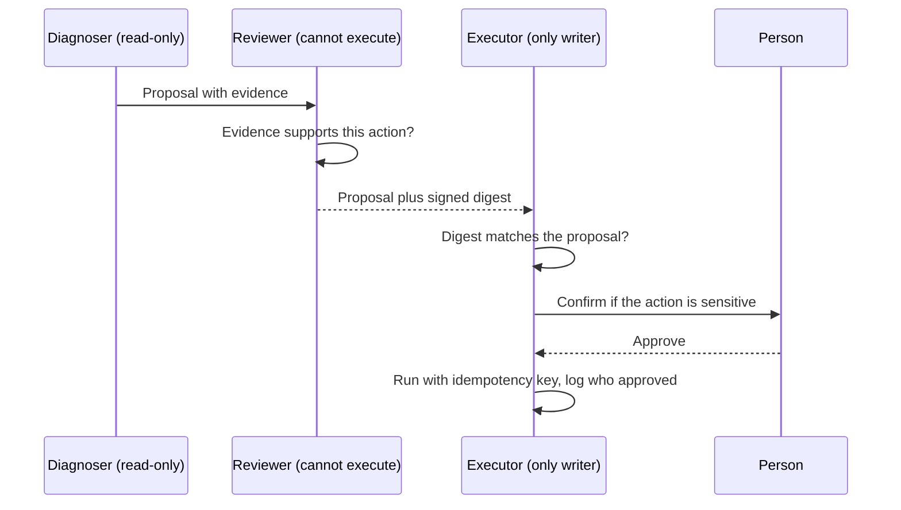

# Build: a multi-agent system

**Course:** Agentic AI, from first principles to production · Module 8 Multi-Agent · lesson 45 of 77 · **about 12 hours** · paper draft for review.  
**Success criterion:** The system completes a task that your single-agent version did worse; show the side-by-side result and the cost of each. Finish with a one-page 4D review: what you delegated, how you described it, how you checked the result, and what you recorded and disclosed.

> Sources (read 2026-10-02; details and gaps in docs/research/agentic-ai): Microsoft Azure Architecture Center 'AI agent orchestration patterns' (2026-02-12: start with the lowest complexity that works; magentic, handoff and concurrent patterns; cost, reliability, security and testing considerations); Anthropic Engineering 'How we built our multi-agent research system' (2025-06-13: lead agent and parallel workers; about 15 times the tokens of chat; token use explained about 80 percent of the variance in one browsing benchmark; effort-scaling rules; start evaluating with about 20 queries; LLM-as-judge; rainbow deployments), Claude Academy AI-native SDLC Playbook ('Parallel sessions and subagents': scoped helpers with their own context and tool limits; 'the agent cannot approve its own work' in the PR review lesson), read 2026-10-02 through page summaries; lessons 20, 23, 33, 37, 43 and 44 of this course. The code on this page (the multi folder) was written by us and run on Python 3.14.7; its 12 tests passed. The agents in it are plain functions and scripted stand-ins, with no real model, so it tests control logic and cost arithmetic, not the quality of any model's answers. The cost model's token counts are estimates at 4 characters per token over fixed fake tool output, so its ratios describe the model's assumptions, not any real system. Unverified: that a multi-agent version will beat your single-agent version. That is the measurement the build asks for, and the honest answer may be that it does not.

---

## Part 1 · What you are building, and a fair test of it

You will build a system of **two or three agents with a clear division of responsibility** and compare it, side by side and with costs, against your single-agent version of the same job. The criterion says the multi-agent system should complete a task your single-agent version did worse. Treat that as a hypothesis, not a promise: it is a fair outcome to find that it did not, and a report that says so, with the numbers, is a good result. Pick a task where the structure has a real chance to help. The three honest reasons to split (lesson 43) are a security boundary, parallel independent subtasks, and measured overload of tools or prompt.

A suggested build, on the DataOps agent from lesson 37 so you reuse its tools and tests, uses **separation of duties**: no agent both decides and acts.

| Agent | Can do | Cannot do |
|---|---|---|
| **Diagnoser** | Read logs and the runbook (read-only tools); produce a proposal with evidence | Change anything |
| **Reviewer** | Check the proposal's evidence against the runbook; approve or reject; sign the approved content | Execute; edit the proposal |
| **Executor** | Run an approved action with the write tool | Run anything without a reviewer's approval of exactly that content; choose what to do |



This is the SDLC Playbook's rule that an agent cannot approve its own work, built into the structure. It also has the security-boundary reason for splitting: the diagnoser has no write tool, and the executor has no reading of logs to be tricked by.

**Worked example**

Fictional task for the side-by-side: 'handle these 10 failed-pipeline tickets'. Single-agent version: one agent with all tools and one approval gate. Multi-agent version: diagnoser, reviewer, executor. Measure, for both, on the same 10 tickets: correct outcome, correct process (lesson 37), unsafe actions attempted, tokens, model calls and elapsed time.

**Common mistake**

Choosing a task that any single agent does perfectly, then splitting it for the portfolio. If the single agent already scores 10 of 10 on a fair set, the honest result is 'no benefit, higher cost'.

**Check yourself.** Name the three agents and the one thing each cannot do.

<details><summary>Model answer (write yours first)</summary>

Diagnoser (cannot change anything), reviewer (cannot execute or edit the proposal), executor (cannot run anything without a reviewer's approval of exactly that proposal).

</details>

---

## Part 2 · The control logic, tested

The separation of duties is plain code you can test without a model. The agents here are functions; in your build each becomes a model call with its own prompt and tool list, and the checks around them stay in code.

```python
"""Three roles with different powers, so no single agent can both decide and do.

  diagnoser : read-only. Produces a Proposal (an action, a target, evidence).
  reviewer  : checks the proposal against the runbook and approves or rejects. Cannot execute.
  executor  : the only role with a write tool, and it runs ONLY a proposal that carries a reviewer's approval
              for exactly that content (a hash). A proposal edited after approval is refused.

The roles here are plain functions so the control logic can be tested without a model. In the lab each role is a model call with its own prompt and tool list.
"""
import hashlib
import json

from pydantic import BaseModel


class Proposal(BaseModel):
    action: str            # 'rerun_job'
    target: str            # 'customers'
    reason: str
    evidence: list[str]    # the log lines or runbook entries the diagnoser relied on

    def digest(self) -> str:
        return hashlib.sha256(json.dumps(self.model_dump(), sort_keys=True).encode()).hexdigest()[:12]


RUNBOOK_ALLOWS = {"ERR-5102": "rerun_job"}          # which error code justifies which action


def diagnoser(log_line: str) -> Proposal | None:
    code = next((c for c in RUNBOOK_ALLOWS if c in log_line), None)
    if code is None:
        return None
    return Proposal(action=RUNBOOK_ALLOWS[code], target=log_line.split()[0], reason=f"{code} in the latest run", evidence=[log_line])


def reviewer(p: Proposal) -> dict | None:
    """Approve only if the evidence contains an error code whose runbook entry names this action. Returns a signed approval or None."""
    justified = any(RUNBOOK_ALLOWS.get(code) == p.action for code in RUNBOOK_ALLOWS if any(code in e for e in p.evidence))
    return {"digest": p.digest(), "by": "reviewer-agent"} if justified else None


def executor(p: Proposal, approval: dict | None, world: dict) -> str:
    if approval is None:
        return "refused: no approval"
    if approval["digest"] != p.digest():
        return "refused: the proposal changed after it was approved"
    world.setdefault("done", []).append((p.action, p.target))
    return f"executed {p.action} on {p.target} (approved by {approval['by']})"


def run_team(log_line: str, world: dict, tamper=None) -> str:
    p = diagnoser(log_line)
    if p is None:
        return "no proposal: nothing in the log matches a runbook entry"
    approval = reviewer(p)
    if tamper:
        p = tamper(p)
    return executor(p, approval, world)
```

Five tests pass:

| Test | What it proves |
|---|---|
| A justified proposal is executed | The whole path works |
| No runbook match means no proposal | The diagnoser stops instead of inventing an action |
| The executor refuses without approval | The executor cannot act on its own |
| The reviewer rejects an unjustified action | A rerun for a quota error, which the runbook does not support, is blocked |
| A proposal edited after approval is refused | The signed digest ties approval to exact content, so changing the target from `customers` to `payments` after review fails: 'the proposal changed after it was approved' |

The last test is the one to remember. It guards a quiet failure of multi-agent systems: an approval given for one thing being used for another because the content changed between agents. Binding approval to a hash of the exact content closes it. (In a real system the digest would be signed with a key only the reviewer holds. Ours is a hash, which shows the principle but would not stop an attacker who can compute it.)

**Worked example**

```text
run_team('customers FAILED ERR-5102 file arrived 06:42 UTC')  -> executed rerun_job on customers (approved by reviewer-agent)
run_team('refunds FAILED ERR-6001 warehouse quota exceeded')   -> no proposal: nothing in the log matches a runbook entry
run_team(..., tamper=change target to payments)               -> refused: the proposal changed after it was approved
```

**Common mistake**

Letting the reviewer also be able to execute 'to save a step'. The value of the structure is that no single compromised or mistaken agent can both decide and act.

**Check yourself.** Why does the approval carry a digest of the proposal, and what does the executor do with it?

<details><summary>Model answer (write yours first)</summary>

So the approval is tied to the exact content. The executor recomputes the digest of the proposal it holds and refuses if it differs, which stops an approved action being swapped for another.

</details>

---

## Part 3 · Cost: a model, and why you must measure

The criterion asks for the cost of each version, so build the measurement in from the start: tokens in and out per agent, model calls, elapsed time, and a rough cost from the current price page. Here is a small cost **model** to show how the numbers can behave, and where it cannot be trusted. It compares one agent investigating several failing pipelines in one conversation with an orchestrator that gives each pipeline to a worker with its own short conversation, using fixed fake tool output of about 400 tokens per pipeline:

```text
single agent : 7 model calls in sequence,   5869 input tokens, 69 output tokens
orchestrator : 8 model calls (4 on the longest path),   2097 input tokens, 65 output tokens
input tokens, multi / single: 0.36x   model calls, multi / single: 1.14x

  3 pipelines: single     5754 input tokens | multi     2056 | multi/single 0.36
  6 pipelines: single    18963 input tokens | multi     3916 | multi/single 0.21
 12 pipelines: single    68067 input tokens | multi     7640 | multi/single 0.11
 24 pipelines: single   257187 input tokens | multi    15104 | multi/single 0.06
```

In this model the multi-agent version uses **fewer** input tokens, and the gap widens with scale, for a simple reason: a single conversation re-sends everything said so far on every call, so its input grows roughly with the square of the number of steps, while each worker's conversation stays short. The multi-agent version makes slightly more calls (8 against 7) but only 4 sit on the longest path, so it can also finish sooner when the workers run in parallel.

Now compare with Anthropic's own report, which goes the other way: about 15 times the tokens of a chat for their multi-agent research system, against about 4 times for a single agent. Both can be true. The model assumes **independent, small subtasks** with fixed tool output, no overhead for instructions, no retries and no redundant work, and it ignores prompt caching, which makes re-sent context cheaper. Anthropic's workers run open-ended searches with long tool outputs, each with its own long instructions, and several may repeat each other's work. The lesson is **not** that multi-agent is cheaper or dearer. It is that cost depends on the shape of the work (shared context against independent parts), the overheads, and caching, so you cannot decide from theory.

So measure. For each version of your build, for the same cases, record: input and output tokens per agent, number of model calls, wall-clock time, and the price at the date you ran it. Run each case several times (outputs vary) and report ranges. The code to count calls and estimate tokens:

```python
"""One agent doing three investigations in one conversation, versus an orchestrator with three workers (one small conversation each).

Everything here is a MODEL OF COST, not of quality: tool results are fixed text, the 'model' is scripted, and tokens are estimated
at 4 characters each. It shows how input tokens grow when one conversation carries everything, and what a worker split changes.
Whether the multi-agent answer is better needs real model runs: that is the lab.
"""
import asyncio
import math

PIPELINES = ["orders", "payments", "customers"]
LOG = {p: f"{p}: run failed at step 4 with a long stack trace " + "x" * 1600 for p in PIPELINES}     # ~400 tokens of tool output each
SYSTEM = "You are a DataOps assistant. " * 12                                                         # ~90 tokens


def est(text) -> int:
    return math.ceil(len(str(text)) / 4)


class Meter:
    def __init__(self):
        self.calls, self.input, self.output = 0, 0, 0

    def call(self, messages, reply):
        self.calls += 1
        self.input += est(SYSTEM) + sum(est(m) for m in messages)       # every call re-sends the whole conversation
        self.output += est(reply)
        return reply


def single_agent():
    m, messages = Meter(), ["Investigate the orders, payments and customers pipelines and summarise."]
    for p in PIPELINES:
        messages.append(m.call(messages, f"tool_use get_run_log({p})"))
        messages.append(LOG[p])                                          # the tool result stays in the conversation
        messages.append(m.call(messages, f"Noted: {p} failed at step 4."))
    final = m.call(messages, "Summary: all three pipelines failed at step 4; check the shared upstream file.")
    return m, final


```

**Worked example**

Fictional report line: 'On 10 tickets, 5 runs each: single agent 8.1k to 9.4k input tokens per ticket, pass rate 42 of 50; three-agent version 11.2k to 13.0k tokens, pass rate 47 of 50, zero unsafe actions attempted against 3 for the single agent. The extra cost buys the safety result; the pass-rate difference is 5 of 50 and not yet distinguishable from noise.'

**Common mistake**

Quoting a single run's cost as the cost. With a non-deterministic model the same input varies; report the range over repeats.

**Check yourself.** In our cost model the multi-agent version used fewer input tokens, but Anthropic reports far more. Give two reasons both can be true.

<details><summary>Model answer (write yours first)</summary>

Our model has small independent subtasks with fixed output, no instruction overhead, retries or duplicated work, and ignores caching. Anthropic's workers run long open-ended searches with their own instructions and some overlap. Cost depends on the shape of the work and overheads, so measure.

</details>

---

## Part 4 · Running the side-by-side, and the 4D review

The protocol, step by step:

1. **Fix the cases.** 10 to 20 tasks for the same job, written before you build the multi-agent version. Include the awkward ones: a case with no supported action, a case where the single agent is tempted to write, a case that tests the tamper path.
2. **Fix the metrics.** Correct outcome, correct process (tools and order, as in lesson 37), unsafe actions attempted and blocked, tokens, calls, wall-clock time, and cost. Decide in advance what counts as 'better'.
3. **Run both versions on every case, several times each.** Use the same model, the same prompts' style and the same tools where possible so you compare the structure and not the prompt-writing effort.
4. **Report the table with the uncertainty.** Counts and intervals; the paired comparison from lesson 18 for the outcome (cases where one version passes and the other fails). With 10 to 20 cases, expect a lot of overlap and say so.
5. **Say what the structure bought.** For instance: 'no difference in pass rate, no unsafe action reached the executor in the multi-agent version, cost 1.4 times'. That is a design conclusion even if the pass rates tie.
6. **Read the failures.** Which agent caused each? Was it a handoff, a context loss, a routing error? Use lesson 44's three-failure lens.

Then the one-page **4D review**: *Delegation* (what each agent may do and may not, who owns the final decision), *Description* (each agent's prompt and tool list, the packet format, the proposal and digest), *Discernment* (the side-by-side table, the tamper test, the failures you found), *Diligence* (the audit trail across agents, how the user's identity is carried, what you disclose about the use of several agents, and the limits of your test).

One more honest point for the interview. The strongest sentence you can say about multi-agent is rarely 'it scored higher'. It is 'we split it because the writer needed a different permission from the reader, we proved a changed proposal cannot be executed, and it cost us this much more'.

**Worked example**

Fictional summary table (illustrative, not a result): columns Version, Correct outcome (of 20), Correct process, Unsafe attempts, Mean input tokens, Mean calls, Mean seconds, and a final row for the paired comparison with the counts of cases where only one version passed.

**Common mistake**

Comparing a polished multi-agent build with a quickly written single-agent baseline. Give the baseline the same effort: its prompts, tools and gate, or the comparison measures effort, not structure.

**Check yourself.** What makes a single-agent versus multi-agent comparison fair?

<details><summary>Model answer (write yours first)</summary>

The same cases written in advance, the same model and tools where possible, equal effort on both versions, several runs per case, the same metrics for outcome, process, safety, tokens, calls and time, and reporting with uncertainty.

</details>

---

## Do it: lab

1. Choose a job where a split might help (a security boundary, parallel independent parts, or measured overload). Write the single-agent version first, with its tools, prompt and approval gate, and score it on 10 to 20 cases you write now.
2. Build the multi-agent version with two or three agents and a clear division of responsibility (diagnoser, reviewer, executor works well). Keep the control logic in code and test it: no write without approval of exactly that content, a tamper test, and one test per handoff failure from lesson 44.
3. Add cost measurement: tokens in and out per agent, model calls, wall-clock time, and the price at your run date.
4. Run both versions on all cases, several times each. Fill the side-by-side table with outcome, process, unsafe attempts, tokens, calls and time, with uncertainty and the paired comparison.
5. Write what the structure bought and what it cost, including the case where it bought nothing. Read and label every failure by which agent and which handoff caused it.
6. Write the one-page 4D review, with the agent prompts and the packet and digest formats in it.

**Done when:** you have the two versions, the side-by-side table with the cost of each, and a statement of what the multi-agent version did better or worse (with uncertainty); the control tests pass; and the 4D review page exists.

---

## Interview check

**Question.** Tell me about a multi-agent system you built. Was it worth the complexity?

<details><summary>A strong answer has this shape</summary>

1. The reason for the split: separation of duties (a diagnoser that cannot act, a reviewer that cannot execute, an executor that cannot decide), so no one agent can both choose and do.
2. The controls in code: the executor runs only a proposal whose digest matches the reviewer's approval, so a changed proposal is refused; handoff packets are validated; guards stop loops.
3. The evidence: the same cases run through a single-agent version and the multi-agent version, several times each, with outcome, process, unsafe attempts, tokens, calls and time, and the uncertainty.
4. The honest conclusion with numbers: what the structure bought (for example safety and clearer ownership) and what it cost (tokens and latency), including where it was no better.
5. What I would change next, and what I would not claim from a small set.

</details>

---

## Evidence to keep

Keep both versions' code, the control tests, the side-by-side table with costs and uncertainty, the labelled failures and the 4D review page. This is a practice build for the portfolio story, not a portfolio project.

---
