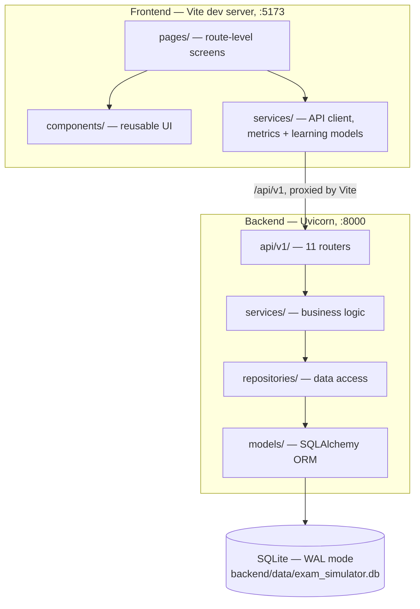

# Architecture

PrepBench is a two-process local application: a FastAPI backend over SQLite, and a Vite-served React frontend that talks to it over `localhost`. There is no third tier, no message broker, and no external service in the running path.

## The shape

Vite proxies `/api` to `127.0.0.1:8000`, so the browser only ever talks to one origin in development. CORS is configured anyway for the cases where it does not — direct `:3000` access and the `tauri://localhost` shell that a future desktop build would use.

## Backend layering

Four layers, each with one job. The rule is that a layer only talks to the one directly beneath it.

| Layer | Directory | Responsibility |
|---|---|---|
| **Router** | `app/api/v1/` | HTTP concerns only — path, status code, request/response schema. No business logic, no queries |
| **Service** | `app/services/` | Business logic. Owns the rules, the orchestration, and anything that needs more than one repository |
| **Repository** | `app/repositories/` | Data access. Owns the queries. The only layer that builds a SQLAlchemy statement |
| **Model** | `app/models/` | ORM table definitions |

`app/schemas/` sits alongside as the Pydantic request/response contract — what crosses the HTTP boundary, which is deliberately not the same shape as the ORM model.

**Why the repository layer exists at all**, given SQLAlchemy already abstracts the database: it keeps query construction out of the services, so a service reads as a sequence of decisions rather than a sequence of queries. It also makes the analytics code testable without a fixture-heavy database — `AnalyticsService` can be reasoned about separately from `AnalyticsRepository`.

### The 11 routers

`questions` · `exams` · `analytics` · `imports` · `export` · `settings` · `system_design` · `recordings` · `interview_questions` · `roadmaps` · `llm`

All registered in `app/api/v1/router.py` and mounted under `/api/v1`.

> [!NOTE]
> Route ordering matters in several routers. A literal path such as `/analytics` must be registered **before** a parameterised sibling such as `/{prompt_id}`, or FastAPI matches the literal as an ID. Follow the existing order when adding routes.

## Data model

Nineteen tables, grouped by the feature that owns them:

| Area | Tables |
|---|---|
| Questions | `questions` · `question_options` |
| Exams | `exam_sessions` · `exam_answers` |
| Spaced repetition | `spaced_repetition` |
| System design | `system_design_prompts` · `system_design_attempts` |
| Interview practice | `interview_questions` · `practice_recordings` · `recording_analyses` |
| Roadmaps | `roadmaps` · `roadmap_phases` · `roadmap_topics` · `roadmap_resources` |
| AI providers | `llm_provider_config` · `llm_task_binding` |
| User content | `user_notes` · `bookmarks` |
| Settings | `app_settings` |

### Schema changes without Alembic

There is no migration tool. Startup does two things in `app/main.py`:

1. `Base.metadata.create_all(bind=engine)` — creates any table that does not exist.
2. `apply_lightweight_migrations()` — adds missing columns and indexes to tables that already exist.

This is a deliberate trade for a single-user local app. Alembic's value is coordinating schema changes across environments and people; here there is one database, on one machine, owned by one person, and a failed migration means a user's study history is gone with no DBA to call. Additive-only column adds cannot destroy data.

**The constraint this puts on you:** schema changes must be *additive*. Adding a nullable column or an index is supported. Renaming a column, changing its type, or dropping one is not — that needs a hand-written migration path, and the existing helper will not do it for you.

## Seeding

Startup also seeds built-in content, but only into an empty table — `seed_system_design_prompts_if_empty` and `seed_interview_questions_if_empty`. Both are no-ops once you have your own content, so a restart never overwrites what you imported.

`import_env_provider_if_absent` runs in the same block: if `GEMINI_API_KEY` is set in the environment and no provider is configured yet, it becomes a visible provider row named *"Gemini (from environment)"*. It runs once and never overwrites an existing configuration.

## Frontend

Standard React 19 + TypeScript, with one structural note worth knowing: `src/services/` holds more than the API client. `services/metrics/` and `services/learning/` are the Chart Sandbox's executable model and learning engine — pure TypeScript with no network calls and no React. See [Chart Sandbox](Chart-Sandbox).

That separation is why the sandbox works offline and why its behaviour is testable without rendering anything: the model is a library, and the page is a view over it.

## What CI enforces

`.github/workflows/ci.yml`, on every push to any branch and every PR:

| Job | Runs |
|---|---|
| **Backend (pytest)** | Python 3.14, installs `requirements.lock`, `pytest -q --cov --cov-report=term-missing` |
| **Frontend** | Node 22, `npm ci`, then **lint → typecheck → test** in that order |

Two details are deliberate:

- **The lock file, not `requirements.txt`.** The lock pins transitives too, so a green CI run means the same dependency tree that is green locally.
- **Lint and types run before tests.** Both fail in seconds and catch a class of breakage the test suite would take three minutes to reach.

Concurrency is set to `cancel-in-progress`, so a new push to a branch abandons the previous run.

## See also

- [Development Guide](Development-Guide) — setup, tests, and how to add things
- [AI Providers](AI-Providers) — the one part of the system that can reach the network
