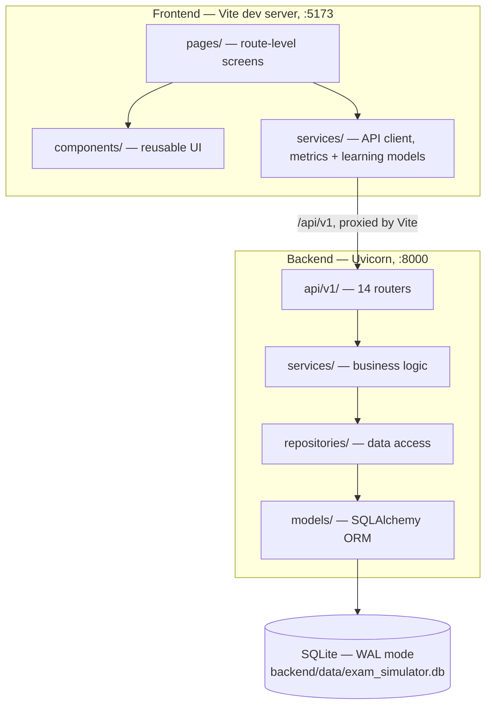

# Architecture

PrepBench is a two-process local application: a FastAPI backend over SQLite, and a Vite-served React frontend that talks to it over `localhost`. There is no third tier, no message broker, and no external service in the running path.

## The shape


```mermaid
flowchart TB
    subgraph fe["Frontend — Vite dev server, :5173"]
        PAGES["pages/ — route-level screens"]
        COMP["components/ — reusable UI"]
        SVC["services/ — API client, metrics + learning models"]
        PAGES --> COMP
        PAGES --> SVC
    end
    subgraph be["Backend — Uvicorn, :8000"]
        API["api/v1/ — 14 routers"]
        SERVICES["services/ — business logic"]
        REPOS["repositories/ — data access"]
        MODELS["models/ — SQLAlchemy ORM"]
        API --> SERVICES
        SERVICES --> REPOS
        REPOS --> MODELS
    end
    DB[("SQLite — WAL mode<br/>backend/data/exam_simulator.db")]
    SVC -->|"/api/v1, proxied by Vite"| API
    MODELS --> DB
```

Vite proxies `/api` to `127.0.0.1:8000`, so the browser only ever talks to one origin in development. CORS is configured anyway for the cases where it does not — direct `:3000` access and the `tauri://localhost` shell that a future desktop build would use.

## Backend layering

Four layers, each with one job. The rule is that a layer only talks to the one directly beneath it.

| Layer | Directory | Responsibility |
|---|---|---|
| **Router** | `app/api/v1/` | HTTP concerns only — path, status code, request/response schema. No business logic, no queries |
| **Service** | `app/services/` | Business logic. Owns the rules, the orchestration, and anything that needs more than one repository |
| **Repository** | `app/repositories/` | Data access. Owns the queries. The only layer that builds a SQLAlchemy statement |
| **Model** | `app/models/` | ORM table definitions |

`app/schemas/` sits alongside as the Pydantic request/response contract — what crosses the HTTP boundary, which is deliberately not the same shape as the ORM model.

**Why the repository layer exists at all**, given SQLAlchemy already abstracts the database: it keeps query construction out of the services, so a service reads as a sequence of decisions rather than a sequence of queries. It also makes the analytics code testable without a fixture-heavy database — `AnalyticsService` can be reasoned about separately from `AnalyticsRepository`.

### The 14 routers

`questions` · `exams` · `analytics` · `imports` · `export` · `settings` · `system_design` · `design_review` · `subjects` · `home` · `recordings` · `interview_questions` · `roadmaps` · `llm`

All registered in `app/api/v1/router.py` and mounted under `/api/v1`.

Three of them are newer than the rest and worth placing: `subjects` and `home` are the readiness spine — what a person is preparing for, and where each one stands. `design_review` is a practice format. See [Readiness](Readiness) and [Design Review](Design-Review).

> [!NOTE]
> Route ordering matters in several routers. A literal path such as `/analytics` must be registered **before** a parameterised sibling such as `/{prompt_id}`, or FastAPI matches the literal as an ID. Follow the existing order when adding routes.

## Data model

Thirty-three tables, grouped by the feature that owns them:

| Area | Tables |
|---|---|
| Preparations | `subjects` · `subject_content_packs` |
| Roles | `roles` · `role_requirements` · `role_diagnostic_attempts` |
| Questions | `questions` · `question_options` |
| Exams | `exam_sessions` · `exam_answers` |
| Review | `review_checks` |
| Spaced repetition | `spaced_repetition` |
| System design | `system_design_prompts` · `system_design_attempts` · `system_design_drafts` |
| Design review | `design_reviews` · `design_options` · `design_review_attempts` |
| Interview practice | `interview_questions` · `interview_sessions` · `practice_recordings` · `recording_analyses` |
| Roadmaps and curriculum | `roadmaps` · `roadmap_phases` · `roadmap_topics` · `roadmap_resources` · `topic_demonstrations` · `topic_guide_sections` |
| Learning Lab | `learning_attempts` · `lab_journal_entries` |
| AI providers | `llm_provider_config` · `llm_task_binding` |
| Seeding | `seeded_content` |
| Settings | `app_settings` |

A preparation (the `subjects` table) is the one thing other features hang off: a certification, a skill, or a role built from a job description. `exam_sessions` gained a nullable `subject_id` and a `session_kind` rather than being split, so historical sessions keep working; see [Readiness](Readiness#mocks-and-drills). Built-in content packs (`backend/app/content/packs/`: the ADF study guide with 21 chapters and 18 written scenarios, and the ADLS guide with 11 chapters) are files, not tables. `subject_content_packs` records which pack, at which version, a preparation has attached.

## Preparation scope

Almost every read and write belongs to one preparation, and the rules for that are the same everywhere:

- **`subject_id` names the preparation asking.** With it, a request answers for that preparation's own rows. Some data is shared on purpose, such as interview questions with no owner, which form the shared library. A preparation then reaches the shared rows and its own.
- **Leaving `subject_id` out never means "all".** It means *no preparation*: shared or unowned rows only. A screen working in a preparation always sends one.
- **Another preparation's row is a 404, exactly like an unknown id.** Knowing an id grants nothing. This holds for:
  - interview questions by id, including updates, deletes and uploading a take;
  - learning attempts;
  - interview sessions. A session's owner is the owner of the questions it holds, so a session holding a preparation's own question is reachable only as that preparation, while a session of shared questions reads anywhere.
- **A preparation is identified by its slug, not its id.** The slug never changes, while SQLite can hand a deleted preparation's id to a new one. The six built-in capability profiles are matched by exact slug. Links between hubs (`/interview?subject=…`, `/certification?subject=…`) carry the slug, and the hubs read a slug before an id.
- **Capabilities come from the record.** Whether a preparation has interview rounds, a roadmap, a study guide or a Learning Lab is read from its own data: its question count, attached packs, linked roadmaps and saved lab questions. Nothing is set by hand for a particular id.

`backend/tests/test_phase8_isolation_matrix.py` checks these rules across every pair of preparations. A few reads are unscoped on purpose (the review queue, analytics, the question and roadmap catalogues, the all-preparations Home overview), and every caller scopes them; `docs/implementation/PHASE-8-REPORT.md` lists them. Separately, the recordings library lists every take; whether it should be per-preparation is an open product decision.

### Schema changes without Alembic

There is no migration tool. Startup does two things in `app/main.py`:

1. `Base.metadata.create_all(bind=engine)` — creates any table that does not exist.
2. `apply_lightweight_migrations()` — adds missing columns and indexes to tables that already exist.

This is a deliberate trade for a single-user local app. Alembic's value is coordinating schema changes across environments and people; here there is one database, on one machine, owned by one person, and a failed migration means a user's study history is gone with no DBA to call. Additive-only column adds cannot destroy data.

**The constraint this puts on you:** schema changes must be *additive*. Adding a nullable column or an index is supported. Renaming a column, changing its type, or dropping one is not — that needs a hand-written migration path, and the existing helper will not do it for you.

## Seeding and the ledger

Startup seeds four built-in content sets: system design prompts, interview questions, design reviews, and subjects. Seeding runs on **every** boot, so it needs an answer to *"should this item be created?"* that is right in all four situations that actually occur.

| Situation | Correct behaviour |
|---|---|
| Fresh install | Create everything |
| Restart, nothing changed | Create nothing |
| Upgrade adds new built-ins | Create only the new ones |
| User deleted a built-in | **Leave it deleted** |

The obvious implementations each get one of these wrong. *Seed only when the table is empty* freezes the bank at whatever shipped the day the database was created, so content added by a later version never arrives. *Match against the bank's current contents* recreates anything the user deleted, which makes deleting a built-in something the app quietly undoes.

Both are answered by recording what has been **offered**, separately from what is currently **present**. That record is the `seeded_content` table, and `app/utils/seed_ledger.py` is the one place the rule is written:

```
seed_missing_content(db, namespace=..., keys=[...], bank_is_empty=..., create=fn)
```

| Seeder | Namespace | Ledger key |
|---|---|---|
| `seed_system_design_prompts` | `system_design_prompt` | Prompt title |
| `seed_interview_questions` | `interview_question` | `round:question_text` |
| `seed_design_reviews` | `design_review` | Review title |
| `seed_subjects` | `subject` | Subject name |

The key is the readable value rather than a hash, deliberately, so the ledger can be inspected directly when a built-in is missing and nobody can work out why.

> [!IMPORTANT]
> **The key is the item's identity.** Renaming a seeded item in its seed file makes the next boot treat it as new and create a second copy. Change the body freely; treat the key as fixed.

Two details in the implementation are load-bearing:

- **A database that predates the ledger** holds content but no record of it, and there is no way to tell *"the user deleted this"* from *"this was never shipped"*. The safer reading is assumed: everything in the current built-in list is marked as already offered, nothing is created on that one boot, and from then on only genuinely new items arrive.
- **Keys are recorded one at a time**, not batched at the end. A crash part-way through leaves the ledger agreeing with the bank; batched, the next boot would find an empty ledger beside a non-empty bank, take the branch above, and permanently skip whatever had not been created yet.

`Settings → Reset` runs the same seeding that startup does, after emptying every table — including the ledger, which is what makes a reset genuinely equivalent to a first install rather than an empty app.

`import_env_provider_if_absent` runs in the same startup block: if `GEMINI_API_KEY` is set in the environment and no provider is configured yet, it becomes a visible provider row named *"Gemini (from environment)"*. It runs once and never overwrites an existing configuration.

## Frontend

Standard React 19 + TypeScript, with one structural note worth knowing: `src/services/` holds more than the API client. `services/metrics/` and `services/learning/` are the Chart Sandbox's executable model and learning engine — pure TypeScript with no network calls and no React. See [Chart Sandbox](Chart-Sandbox).

That separation is why the sandbox works offline and why its behaviour is testable without rendering anything: the model is a library, and the page is a view over it.

### The navigation is four items, and it stays four

`Sidebar.tsx` holds **Home** plus three verb groups — **Practice**, **Learn**, **Review** — with Settings below the divider.

The structure exists because the app grows along two axes at very different rates. **Formats** are a closed set: exams, design review, system design, interview practice, sandboxes. **Subjects** are not — Scrum, Databricks and AI keep arriving. So formats nest under the verb they belong to, and subjects live on Home instead of in the sidebar. Adding a subject changes no navigation at all.

Verbs rather than nouns because a person arrives wanting to *do* something. Settings is not one of those things, which is why it sits outside the groups rather than being filed under "progress".

Route-level pages worth knowing:

| Route | Page |
|---|---|
| `/` | Home — resumable session, headline mock numbers, per-subject readiness, activity |
| `/subjects/:id` | One subject: readiness with its evidence, and coverage across every format |
| `/practice` · `/learn` | Two hubs — a list of doors, not a dashboard |
| `/preparations` · `/preparations/roles/:id` | Your preparations (certifications, skills, roles), and a role's before/after diagnostic |
| `/certification` · `/interview` | Hubs for a preparation's exam readiness and its interview practice. Each says so when the preparation has no such capability, and offers one that does, by slug |
| `/learn/guides/:packId` · `/scenarios` | The Study Library (built-in study guides) and the written incident scenarios |
| `/roadmaps/:id` · `…/topics/:topicId/guide` · `…/demonstrate` | A roadmap, a topic's study guide, and demonstrating the topic (completion is demonstration only) |
| `/interview-practice` · `/interview-practice/sessions/:id` | The interview library, recorded takes, and timed interview sessions (a focus mode, with no sidebar) |
| `/lab` · `/lab/adf` · `/databricks-sandbox` | The Learning Lab hub, the ADF Behaviour Lab, and the Lakehouse Lab; see [Learning Lab](Learning-Lab) |
| `/review` | A bounded review session: the newest unread misses one at a time, then the timeline |
| `/design-reviews` · `/design-reviews/:id` | The design review bank and one review |
| `/workspace` | Workspace: the learner's own work in the chosen preparation (lab runs, case notes, prepared answers, recordings, topic guides and notes), read from the rows the features keep. `GET /api/v1/workspace?subject_id=` |
| `/evidence` | Evidence: what that work demonstrates, each item graded activity / completed / demonstrated / evidenced with its basis. Not readiness. `GET /api/v1/evidence?subject_id=`. Rules in `docs/implementation/PHASE-6-CONTRACT.md` |
| `/dashboard` · `/history` · `/system-design/history` | Redirects. The analytics-style dashboard and the two per-format history pages were deleted; the routes stay so old bookmarks land somewhere real |

## What CI enforces

`.github/workflows/ci.yml`, on every push to any branch and every PR:

| Job | Runs |
|---|---|
| **Backend (pytest)** | Python 3.14, installs `requirements.lock`, `pytest -q --cov --cov-report=term-missing` |
| **Frontend** | Node 22, `npm ci`, then **lint → typecheck → test** in that order |

Two details are deliberate:

- **The lock file, not `requirements.txt`.** The lock pins transitives too, so a green CI run means the same dependency tree that is green locally.
- **Lint and types run before tests.** Both fail in seconds and catch a class of breakage the test suite would take three minutes to reach.

Concurrency is set to `cancel-in-progress`, so a new push to a branch abandons the previous run.

## See also

- [Readiness](Readiness) — subjects, mocks vs drills, and the rule the whole app feeds
- [Design Review](Design-Review) — the newest practice format
- [Development Guide](Development-Guide) — setup, tests, and how to add things
- [AI Providers](AI-Providers) — the one part of the system that can reach the network
