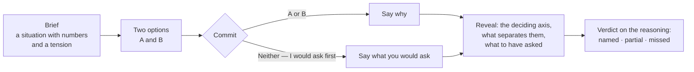

# Design Review

At `/design-reviews`. **Two defensible architectures for one requirement.** You pick one and say why.

What is scored is not which option you picked — often either is right — but whether your reasoning named **the axis the decision actually turns on**. That single narrowing is what makes the format work: grading becomes one answerable question rather than an expert judgement about architecture quality, and the thing being graded is the thing worth learning.

## Why it is shaped this way

A multiple-choice question about architecture teaches you to recognise the answer the author had in mind. A blank-page prompt is closer to the real thing but cannot be graded reliably, and needs a model to have an opinion about your whole design.

A design review sits between the two. The scenario is real, the tension is real, both answers are real — and there is exactly one thing to assess.

> [!IMPORTANT]
> **Both options must be genuinely defensible.** The moment option B is obviously wrong the exercise becomes a quiz, and a quiz stops teaching after the second one.
>
> This is why `holds_when` and `breaks_when` are required columns rather than optional ones. An option with no stated failure mode is not a real alternative — it is the right answer wearing a disguise.

## The flow

The brief is a situation, not an instruction. *"Twelve source systems feed it, and three backdate corrections by up to a week"* — deliberately not *"design a customer profile store"*.

### "Neither — I would ask first"

Present on every review, and a first-class answer rather than an escape hatch. Refusing to commit until you know something is frequently the correct professional move, and it is the skill this format can teach for free.

It has one condition: **you have to name what you would ask.** Otherwise it is the one answer that can be given without thinking, and the exercise quietly acquires an opt-out.

The validator accepts an implied question as well as a punctuated one — *"I would want to know the actual latency budget"* is the same move as asking it outright. A real answer is as often a statement as a sentence ending in a question mark.

## What the client is allowed to see

`deciding_axis`, `reveal` and `elicit_answer` are stripped **server-side** in `get_review`, not merely hidden by the client. This is the same rule the exam endpoints follow for an unanswered question's explanation.

| Shape | Carries the answer key |
|---|---|
| `DesignReviewSummary` (list view) | No — `axis_label` only, which says *which* decision the review is about without saying which way it goes |
| `DesignReviewDetail` (while deciding) | No — brief, both options, concepts. Note the caveat below on the options' own fields |
| `DesignReviewAttemptResponse` | **Yes**, in `reveal` — released once an attempt exists, never before |

The reveal travels back **on the attempt response** rather than needing a second request, so the client never has to re-check the same permission twice.

> [!NOTE]
> `holds_when`, `breaks_when` and `rough_cost` are a weaker case. `DesignReviewDetail` returns them with each option, and `DesignReviewPage.tsx` hides them until an attempt exists — so they are **client-hidden, not server-stripped**, unlike the three fields above. Anyone reading the network response sees them early. Nothing in the format breaks if you do, but it is a different guarantee from the one the answer key gets, and worth knowing before you rely on it.

## Grading

One narrow question, put to the model: *does this reasoning identify the axis?*

| Verdict | Means |
|---|---|
| `named` | They identified the axis, in their words or ours |
| `partial` | They touched a factor that matters but did not reach the deciding one — or named the axis without saying why it decides anything |
| `missed` | The reasoning is about something else entirely, or gives no reason |

Substance is credited over vocabulary. If the axis is about differing freshness requirements and the answer says *"not everyone needs it that fresh"*, that is the axis, phrased their way.

> [!NOTE]
> **The grader is never told that one option is correct, because none is.** Naming a "right" option would make it grade the choice — the exact mistake the format exists to avoid.

### Every failure path returns "not graded"

No provider configured, a gateway error, or a verdict outside the three known words: the attempt still saves, the reveal still shows, and `grading_status` is `not_graded` with **no verdict at all**.

Inventing `missed` would blame the learner for a missing API key. `not_graded` is a real, displayable state, not an error path.

Grading runs on the `design_review_grading` task — bound independently of every other task. See [AI Providers](AI-Providers).

## Axis analytics

`GET /api/v1/design-reviews/analytics` answers *which axes do I keep missing* — in words, not a score.

`axis_label` is the deciding axis as a short name — **Freshness**, **Cost**, **Governance** — which is what makes the tally possible. The ten built-in reviews carry ten distinct labels:

`Freshness` · `Cost` · `Reprocessing` · `Governance` · `Layering` · `Late data` · `Schema evolution` · `Workload fit` · `Ingestion` · `Serving`

Two decisions worth knowing:

- **A `partial` is not a hit.** `named_rate` counts `named` only. Half credit would flatter the learner on exactly the axes they most need to revisit.
- **Ties break toward the axis missed most often**, so "0 of 1" never outranks "1 of 6" as the thing to go and study.

Everything degrades to **empty rather than to zero**. With nothing graded there is no weakest axis, and `named_rate` is `null` rather than `0%` — which would read as a failure the learner has not actually had.

## Data model

Three tables:

| Table | Holds |
|---|---|
| `design_reviews` | Brief, `deciding_axis`, `axis_label`, `reveal`, `elicit_answer`, `concepts`, domain, difficulty |
| `design_options` | Exactly two per review, labelled A and B — name, summary, `flow`, `key_choices`, `holds_when`, `breaks_when`, `rough_cost` |
| `design_review_attempts` | `choice`, `justification`, `grading_status`, `axis_verdict`, `feedback`, time spent |

Exactly two options, labelled A and B, is enforced by a schema validator. One option is a lecture; three is a different exercise with a different failure mode.

`flow` is the pipeline as **ordered stages** — `[{label, detail, emphasis}]` — rendered as boxes and arrows by `DesignFlow.tsx`. Structured rather than a diagram source string, so it needs no diagram library, inherits the app theme for free, and stays writable by hand in the seed file. The `emphasis` flag marks the stage where the option's cost or risk actually sits; it is the difference between a diagram and an even row of boxes.

`rough_cost` always states the assumption it rests on. A bare number would be a coefficient presented as a measurement, which this app does not do.

## Endpoints

All under `/api/v1/design-reviews`:

| Endpoint | Method | Purpose |
|---|---|---|
| `` | GET | List, filtered by domain, axis, difficulty, keyword |
| `/domains` | GET | Distinct domains in the bank |
| `/axes` | GET | Distinct deciding axes, for practising one of them |
| `/analytics` | GET | Axis performance and the weakest axis |
| `/attempts` | GET / POST | History, or submit an attempt |
| `/attempts/{id}` | GET | One attempt with its reveal |
| `/{id}` | GET | Brief and both options — never the answer |
| `/{id}/latest-attempt` | GET | What you said last time, or `null` |

> [!WARNING]
> `/domains`, `/axes`, `/analytics` and `/attempts` are all registered **before** `/{review_id}`. FastAPI matches in declaration order, so a literal path declared after the parameterised one is never reached and `"domains"` is parsed as an integer id. Keep new literal routes above it.

`/{id}/latest-attempt` is what lets reopening a completed review show **your own reasoning beside the reveal**, rather than only the answer — so you can tell whether your thinking has moved.

## The built-in bank

Ten reviews in `app/utils/seed_design_reviews.py`, all currently in the `data_platform` domain. The domain vocabulary is shared with the system design prompt bank so the two features can eventually be filtered together.

### Which subject owns which reviews

Design reviews carry a `domain` string and no `subject_id`, so ownership is an explicit dictionary — `HomeService._DESIGN_REVIEW_DOMAIN_BY_SUBJECT`. This is **acknowledged technical debt with a stated trigger**, not an accident:

- **Replace it when** reviews need to belong to a subject nobody enumerated there — when reviews become user-importable, or a fourth subject ships with its own. At that point `domain` becomes `subject_id` on `design_reviews` and the method goes away.
- **Safe until then because** a subject that is not in the dictionary maps to `None` and runs no query at all, so the only possible error is under-reporting — *"No reviews for this subject"*, a claim a reader can contradict. It used to map to the sentinel string `"__none__"`, which was correct only for as long as no review was ever seeded carrying that value. `tests/test_schema_and_ownership.py` holds both halves.

Vocabulary is introduced **inside the options** rather than defined anywhere. A term attached to a decision it changed is remembered; a glossary entry is not. `concepts` lists what a review introduces, so the terms can be listed and later cross-referenced the way the Chart Sandbox lists its concepts.

Seeding is reconciled through the [seed ledger](Architecture#seeding-and-the-ledger): a review added by a later version reaches an install that has already been seeded, and one deleted by hand stays deleted.

## Adding a review

Append to `SEED_DESIGN_REVIEWS`. The bar is the format's whole value, so check each of these before adding one:

1. **Would a competent engineer propose either option?** If not, it is a quiz question.
2. **Is there exactly one deciding axis**, expressible in one sentence? Two axes make grading ambiguous and the feedback vague.
3. **Does each option have a real `breaks_when`?** Not a token weakness — the situation where you would regret it.
4. **Does `elicit_answer` name something you could actually go and find out?** Not "gather more requirements".
5. **Is `axis_label` short and reusable?** It is a tally key, so *Freshness* rather than *Freshness requirements differ by consumer*.

The title is the ledger key, so **renaming a seeded review makes the next boot create it again** as a second row. Change the body freely; treat the title as its identity.

## See also

- [Readiness](Readiness) — where design review practice sits relative to the exam picture
- [AI Providers](AI-Providers) — configuring the `design_review_grading` task
- [Architecture](Architecture) — the layering and the seed ledger
