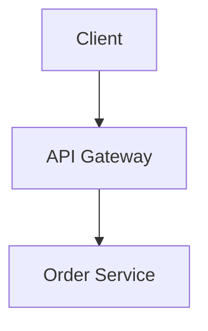
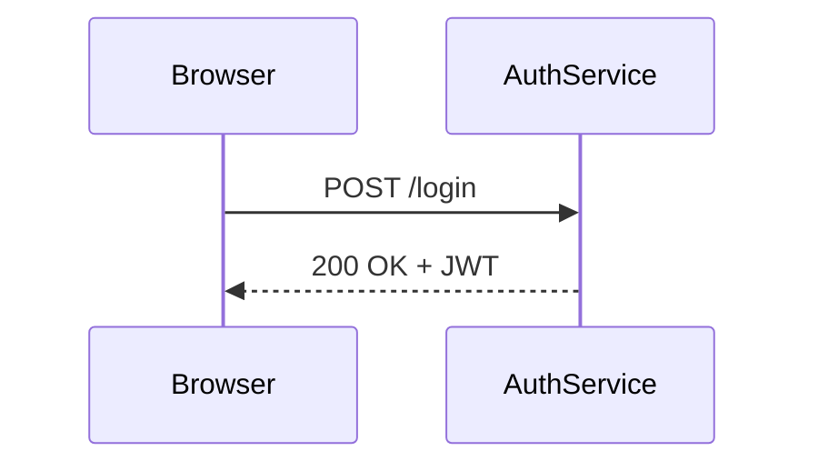

# Importing Content

Two independent import paths: **questions** into the question bank, and **roadmaps** into the curriculum tracker. Neither is locked to a template.

---

# Questions

**Question Bank → Bulk Import.** Handled by `app/services/import_service.py`.

| Extension | Parser |
|---|---|
| `.json` | Structured objects |
| `.csv` | Column-mapped rows |
| `.xlsx` / `.xls` | Same column mapping, via pandas |
| `.md` / `.markdown` | Three different parsers, tried in turn |

## The two-step flow

Import is **validate then commit**, not a single upload:

1. `validate_file()` parses and returns a `QuestionValidationReport` — what was found, what is malformed, what would be skipped.
2. `import_validated_batch()` commits, with `skip_errors=True` by default so one bad row does not lose the batch.

This exists so you see what a file *will* do before it touches your database. A 500-question import that silently drops 40 malformed entries is worse than one that tells you first.

`_check_aggregate_option_counts` runs across the batch: a question with no correct option, or with every option correct, is caught before commit rather than discovered during an exam.

## Markdown, three ways

`parse_questions_from_markdown` dispatches across three shapes, because study material in the wild does not arrive in one:

| Parser | Handles |
|---|---|
| `_parse_inline_question_markdown_objects` | Questions written inline with their options |
| `_parse_study_guide_markdown_objects` | Prose study guides with embedded Q&A |
| `_parse_structured_markdown_objects` | Explicitly structured headings and lists |

`repair_markdown_content` can pre-clean a file whose formatting is close but not quite parseable.

## JSON format

```json
[
  {
    "text": "What is the Sprint Goal?",
    "question_type": "single_choice",
    "difficulty": "medium",
    "domain": "Agile & Scrum",
    "topic": "Sprint",
    "certification": "PSM I",
    "explanation": "The Sprint Goal is the single objective for the Sprint.",
    "options": [
      { "option_text": "A commitment by the Developers", "is_correct": true },
      { "option_text": "A list of Product Backlog items", "is_correct": false }
    ]
  }
]
```

## CSV / Excel columns

```
text, question_type, difficulty, domain, topic, certification, explanation,
option_1, option_1_correct, option_2, option_2_correct, ...
```

See [`data/template_import.csv`](https://github.com/getnimishk/PrepBench/blob/main/data/template_import.csv).

## The audit studio

Optional, and off by default. `validate_content=True` runs the batch through `content_validator.py` before import — checking the questions themselves, not just their structure. `refine_question_batch` can then apply suggested corrections.

This is one of the AI-backed tasks (`content_validation`; the full list is on [AI Providers](AI-Providers)), so it needs a provider configured. Without one it is simply unavailable — see [AI Providers](AI-Providers).

---

# Roadmaps

**Roadmaps → Import Roadmap.** Handled by `app/services/roadmap_import_service.py`.

| Extension | Notes |
|---|---|
| `.xlsx` / `.xlsm` | Multi-sheet workbooks supported |
| `.csv` | Single table |
| `.json` | Structured |
| `.md` / `.markdown` | Heading and checkbox structure |

## Detection is by column shape, not sheet name

This is the design decision that makes the feature usable. `_score_header` scores each candidate header row against known token sets, and `_classify_sheet` decides what a sheet *is* from that score — so any workbook with a Phase/Topic-shaped table imports without renaming anything to match a template.

### Recognised columns

| Any of these names | Becomes |
|---|---|
| Phase / Module / Section | The phase a topic belongs to |
| Topic / Title / Skill | The topic |
| Learning Objective / Goal | What you are aiming to understand |
| Success Criteria / Outcome | How you will know you have it |
| Est. Hours / Effort | Feeds the projected schedule |
| Status / Progress % | Existing progress, if you were already tracking |

### Two things it deliberately does not discard

**Narrow sheets become Reference tabs.** A two-to-four column sheet — a CLI cheat sheet, a glossary, a mental-model table — is not a syllabus, but it is not junk either. It is preserved as a Reference tab rather than dropped.

**`TOTAL` rows are recognised as summaries.** `_is_summary_row` catches trailing aggregate rows so they do not import as a phantom topic called "TOTAL" with 340 estimated hours.

## Preview before commit

Same two-step shape as questions:

| Endpoint | Does |
|---|---|
| `POST /api/v1/roadmaps/import/validate` | Builds a `RoadmapImportPreview` — what was detected, sheet by sheet |
| `POST /api/v1/roadmaps/import/confirm` | Commits the reviewed result |

## Markdown format

```markdown
# Kubernetes Mastery
## Fundamentals
- [x] Pods and Deployments (3h)
- [ ] Services and Ingress (4h)
## Operations
- [ ] Observability (5h)
```

Headings become phases, checkboxes become topics, and a trailing `(3h)` becomes estimated hours.

## The schedule

Once imported, **Schedule** projects a Gantt from estimated hours ÷ your weekly study budget. Set both in Schedule settings.

> [!NOTE]
> The projection runs from **today**, not from your original start date. When you fall behind, it shows where you will actually land rather than redrawing a plan you have already missed. With either input missing it says which one, rather than drawing an empty chart.

---

# Study Guide Content (Markdown & Diagrams)

Study-guide section bodies, common mistakes, and check answers support client-side, offline Markdown with interactive and accessible diagrams. Content authors can write rich explanations without needing external network access or backend rendering.

### Supported blocks

1. **Markdown & CommonMark**:
   - Headings: Use `### Heading 3` or `#### Heading 4` (rendered as `h3` and `h4` to preserve section title hierarchy).
   - Paragraphs, bold/italic emphasis, unordered lists (`-`), ordered lists (`1.`), blockquotes (`>`).
   - Inline code (` `code` `), fenced code blocks, and GFM tables.
   - Links: Standard `http://` or `https://` links automatically open in a new tab with `rel="noopener noreferrer"`.
   - Raw HTML: Rendered as plain text for security (scripts and event handlers are never executed).

2. **Mermaid Diagrams**:
   - Use fenced code blocks with language `mermaid`.
   - Supported diagram types: `flowchart`, `graph`, `sequenceDiagram`, `stateDiagram-v2`, `stateDiagram`, `classDiagram`, and `erDiagram`.
   - Include `accTitle:` and `accDescr:` inside the diagram for accessible screen-reader descriptions.
   - A collapsible "Diagram source" drawer is automatically included beneath each diagram for review and copying.

3. **Inline SVG Diagrams**:
   - Use fenced code blocks with language `svg`.
   - Must contain a standalone `<svg>...</svg>` root element with a `<title>` tag for accessibility.
   - Validated and rendered safely as a sandboxed data-URI image (scripts, external resources, and event handlers are rejected).

4. **Bundled Guide Images**:
   - Use `` to reference bundled assets from `frontend/src/assets/guide/`.
   - External image URLs are intentionally blocked to ensure 100% offline functionality and learner privacy.

### Authoring Examples

#### 1. Markdown with GFM Table
```markdown
### Key Characteristics
| Metric | Kafka | RabbitMQ |
|---|---|---|
| Model | Append-only log | Smart broker queue |
| Replay | By offset | Not supported |
```

#### 2. Mermaid Flowchart
````markdown

````

#### 3. Mermaid Sequence Diagram
````markdown

````

#### 4. Inline SVG Diagram
````markdown
```svg
<svg viewBox="0 0 200 60" xmlns="http://www.w3.org/2000/svg">
  <title>Cache Layer Layout</title>
  <rect x="10" y="10" width="80" height="40" rx="4" fill="#3157d5" />
  <text x="50" y="35" fill="#fff" font-size="12" text-anchor="middle">Redis L1</text>
  <rect x="110" y="10" width="80" height="40" rx="4" fill="#3157d5" />
  <text x="150" y="35" fill="#fff" font-size="12" text-anchor="middle">Postgres</text>
</svg>
```
````

#### 5. Bundled Guide Image
```markdown

```

## See also

- [Architecture](Architecture) — the service and repository layers these sit in
- [AI Providers](AI-Providers) — required for the optional content audit

